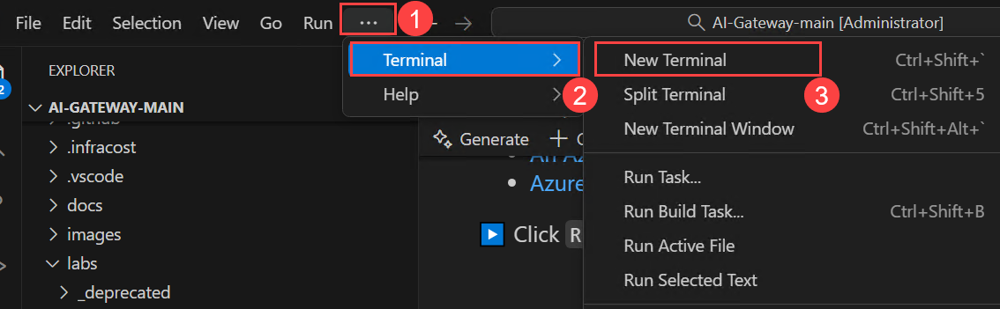
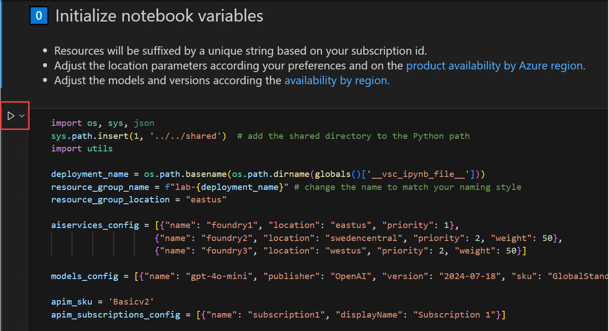
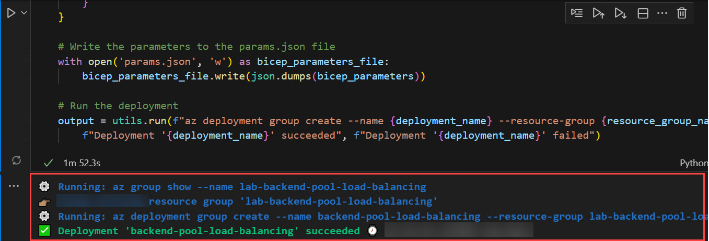
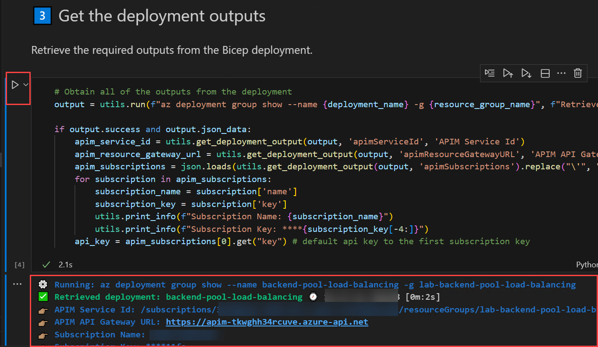
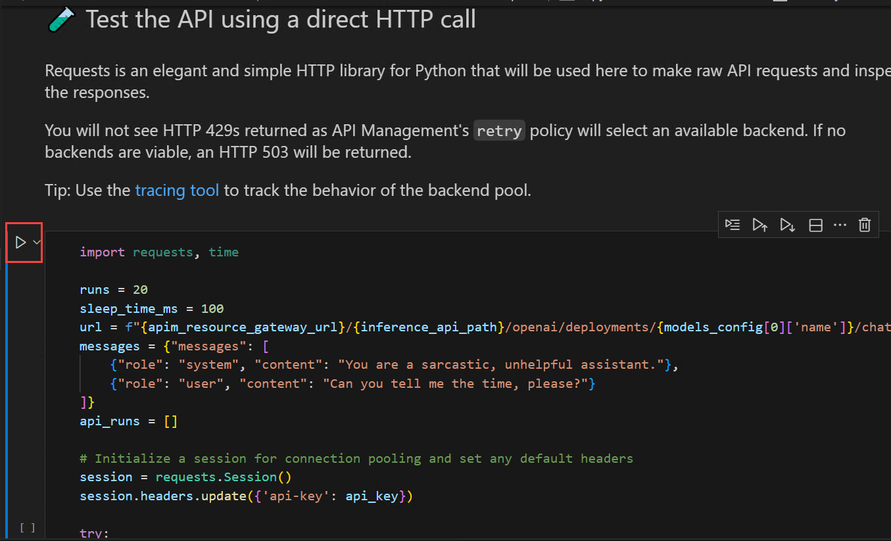
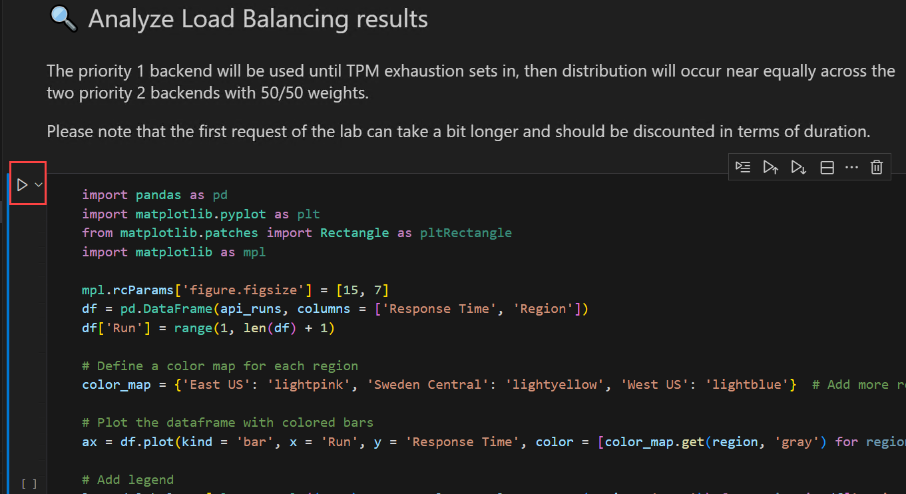
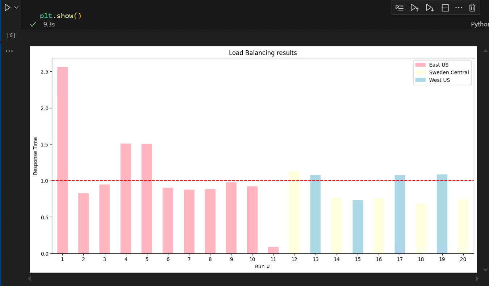
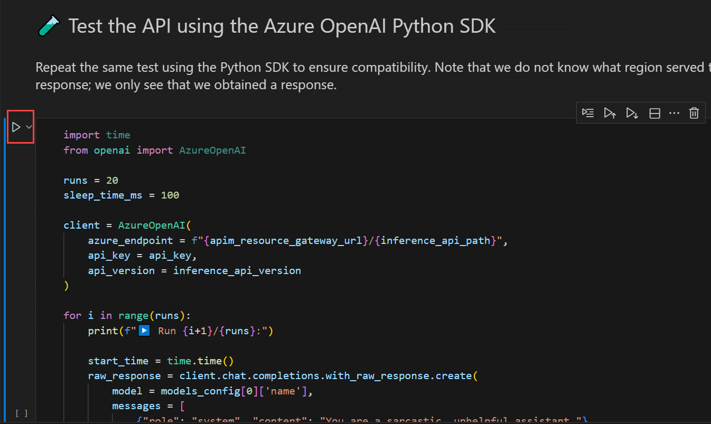
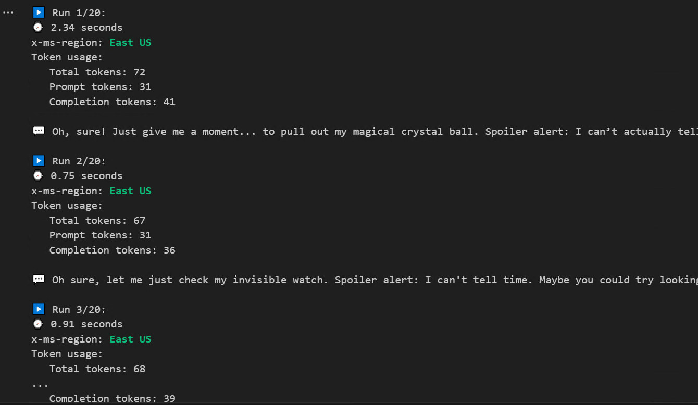

# Exercise 1: Load Balancing and Model Routing 

### Lab Overview

This lab demonstrates how to use Azure API Management (APIM) to load balance requests across multiple Azure AI Foundry model endpoints. You will configure a backend pool with priority and weight-based routing to ensure reliable, scalable AI traffic management. The lab simulates throttling and automatic failover between regional endpoints using APIM’s built-in retry logic.

By the end, you will visualize how APIM intelligently distributes load across AI services for optimal performance and resilience.


## Task 1: Configure load balancing across AOAI resource pools

1. Open Visual Studio Code using the desktop shortcut in the labvm.

2. Click on **File (1)** and select **Open Folder (2)**.

   

3. Navigate to **C:\LabFiles (1)**, select the **AI-Gateway (2)** folder, and click **Select Folder (3)**.

4. If you receive a Do you trust the authors of the files in folder warning, select the **checkbox (1)** and click **Yes, I trust the authors (2)**.

   

4. From the top menu, click the **… (1)** (ellipsis) button, then select **Terminal → New Terminal (2) (3)**.

    
   
6. Run the Command to Create the Virtual Environment

   ```
   python -m venv venv
   ```

 7. Activate the Virtual Environment:

    ```
    .\venv\Scripts\Activate.ps1
    ```

8. Install Lab Dependencies

   ```
   pip install --upgrade pip

   pip install -r requirements.txt
   ```

   > This installs all Python packages needed for the lab inside the virtual environment, leaving your system Python untouched.

5. In Visual Studio Code, from the left navigation pane, select **Explorer (1)**, then expand the **lab (2)** folder and **backend-pool-load-balancing (3)**, and finally click on **backend-pool-load-balancing.ipynb (4)**.

   

6. Once you’re in the **backend-pool-load-balancing.ipynb** file, take a moment to review each session and read its description. You will see how we deploy multiple AI endpoints, configure API Management for intelligent routing, and test load balancing and failover, giving you a clear understanding of how APIM manages AI traffic across regions.

7. Now, you will run each cell in the notebook one by one, following the instructions and observing the outputs for each step.

8. Scroll down to **0️⃣ Initialize notebook variables**. Click on **Run** in this session, we set up all the necessary variables and configurations, including resource names, regions, AI endpoints, and APIM details. This prepares the notebook for deploying resources and running the lab steps.

   

9. Go to **1️⃣ Verify the Azure CLI and the connected Azure subscription**. Click on **Run**, in this session, we check that the Azure CLI is installed, up-to-date, and connected to your subscription. This ensures we can deploy and manage resources in your Azure account. Review the output.

    

10. In the **2️⃣ Create deployment using 🦾 Bicep**. Here, we use Bicep to define and deploy all necessary Azure resources, including the AI endpoints and APIM service. Running this sets up the infrastructure needed for the lab.

     

     
    
12. **3️⃣ Get the deployment outputs**. This session retrieves key information from the deployment, such as API URLs, subscription keys, and resource IDs. We use these outputs to connect and test the AI endpoints in later steps.

    
    
14. **🧪 Test the API using the Azure OpenAI Python SDK**. Finally, we test the deployed AI endpoints using the Python SDK to send requests, check responses, and observe which backend region served each request. This demonstrates load balancing and routing in action.

    

    

15. **🔍 Analyze Load Balancing results**. In this session, we analyze the load balancing results to see how traffic is distributed across the AI endpoints. The priority 1 backend handles requests first, and once it reaches its limit, traffic is shared between the two priority 2 backends.

      

      

16. **🧪 Test the API using the Azure OpenAI Python SDK**. In this session, we test the deployed AI endpoints using the Azure OpenAI Python SDK. This ensures that the API requests work correctly and responses are received, regardless of which backend region handles them.

    

    
    
