# Exercise 1: Load Balancing and Model Routing 

### Estimated Duration: 120 Minutes

## Lab Overview

In this exercise, you will learn how to efficiently distribute and manage AI traffic across multiple Azure OpenAI backends using Azure API Management (APIM). You will configure load balancing to route requests between multiple AI endpoints for improved performance and resilience, set up model routing to direct user requests to specific AI models based on task requirements, and implement session affinity to ensure consistent responses across multi-turn conversations. Using Visual Studio Code and Bicep templates, you’ll deploy multi-region Azure resources, configure APIM for intelligent traffic management, and validate that requests are properly balanced, routed, and maintained across sessions.

## Lab Objectives
In this exercise, you will be performing the following tasks:

- Task 1: Configure load balancing across AOAI resource pools

- Task 2: Set up model routing for directing requests to different models

- Task 3: Implement session affinity to keep responses consistent for agent interactions

## Task 1: Configure load balancing across AOAI resource pools

In this task, you will learn how to distribute incoming AI requests across multiple Azure OpenAI (AOAI) endpoints deployed in different regions. You will configure Azure API Management (APIM) to intelligently route traffic, ensuring high availability, efficient utilization of resources, and seamless failover when one endpoint reaches capacity or becomes unavailable.

### Architecture Diagram

Here’s the architecture diagram to help you better understand the scenario.

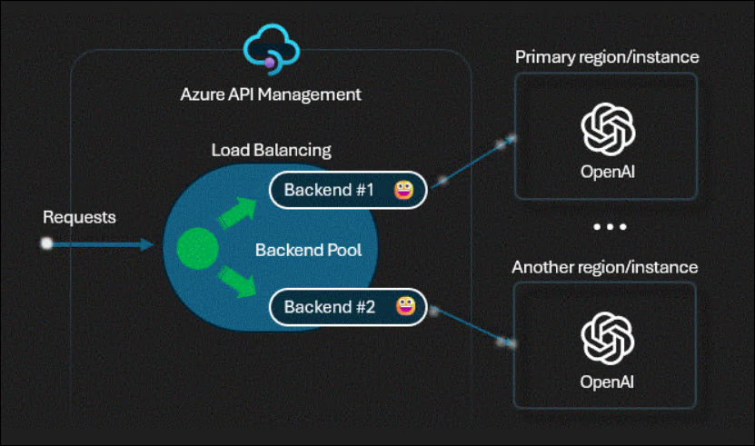

1. Open **Visual Studio Code** using the desktop shortcut in the labvm.

   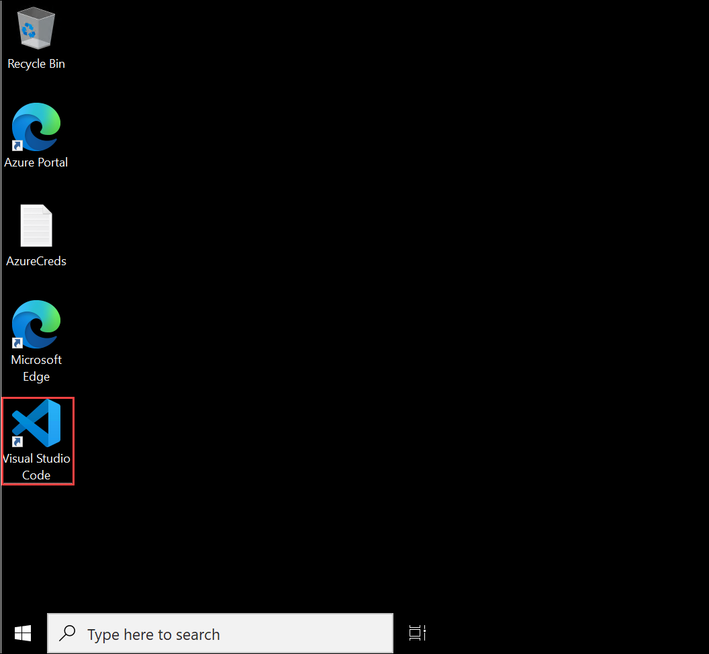

2. Click on **File (1)** and select **Open Folder (2)**.

   

3. Navigate to **`C:\LabFiles` (1)**, select the **AI-Gateway-main (2)** folder, and click **Select Folder (3)**.

   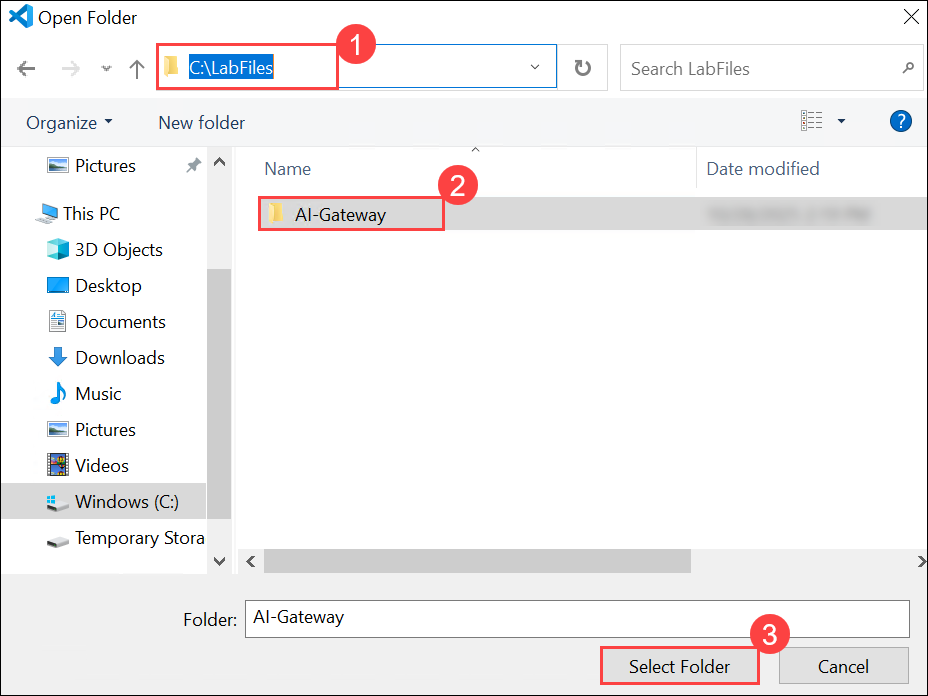

4. If you receive a Do you trust the authors of the files in the folder warning, select the **checkbox (1)** and click **Yes, I trust the authors (2)**.

   

4. Scroll down in the Explorer pane and right-click on the **requirements.txt (1)** file, and select **Open in Integrated Terminal (2)**.

    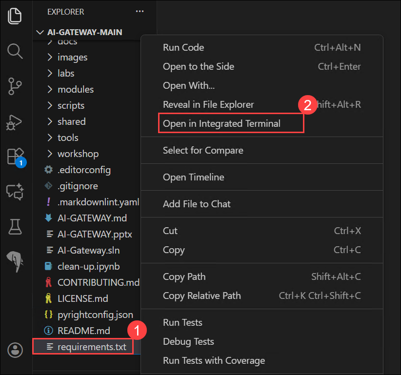

8. Run the following command in the terminal to install Lab Dependencies.

   ```
   pip install -r requirements.txt
   ```

1. While the packages are being installed, click the **+** icon to open a new terminal.

   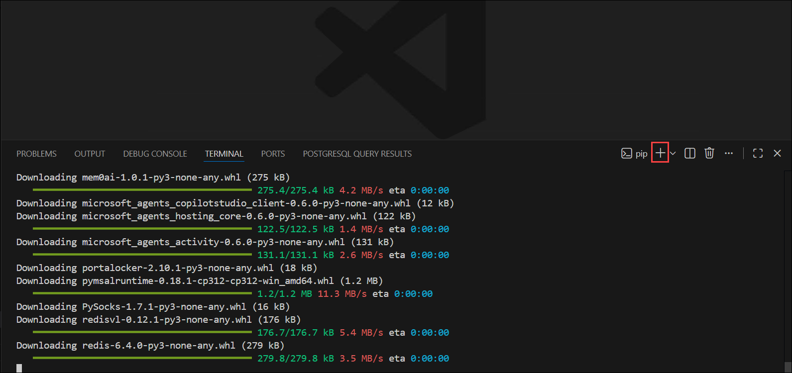

1. Now, on the new terminal, run the following command to sign in to Azure from the terminal:

   ```
   az login
   ```

   .png)

   >**Note:** Minimize VS Code to access the Sign-in window.

1. In the **Sign in** pop-up window, under **Let's get you signed in** select **Work or school account (1)** and then click **Continue (2)**.

   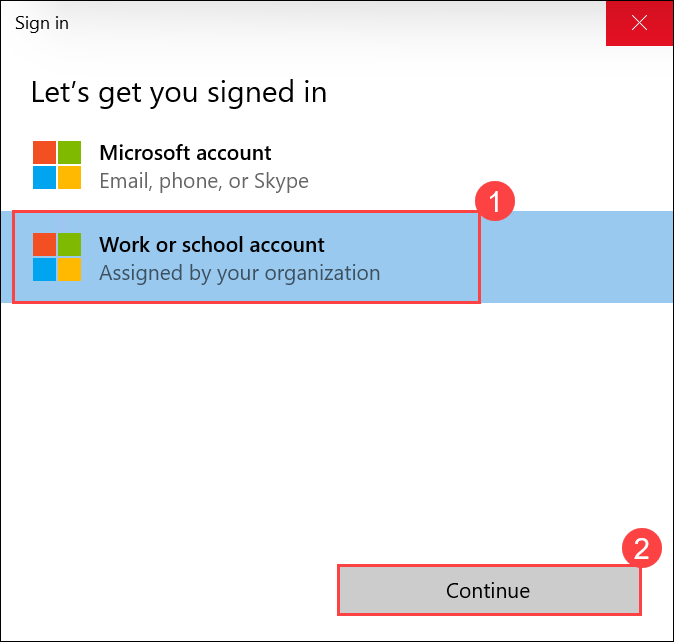

1. Enter the **email address (1)** shown below, then select **Next (2)**.

   - **Email:** <inject key="AzureAdUserEmail"></inject>

      .png)

1. Enter the **Temporary Access Pass (1)** provided below, then click **Sign in (2)**.

   - **Password:** <inject key="AzureAdUserPassword"></inject>

      .png)

1. In the **Sign in to all apps, websites, and services on this device?** pop-up, click on **Yes**.

   

1. On the **Account added to this device** pop-up, click **Done**.

   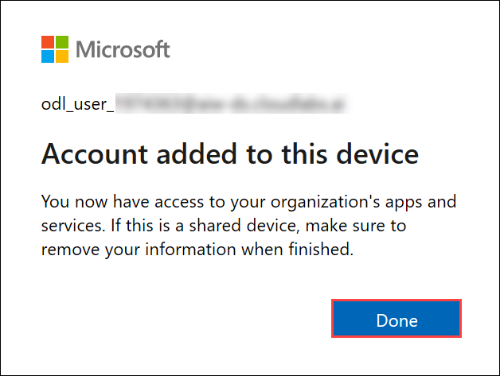

1. Go back to the VS Code terminal and press **Enter** to choose the default subscription.

   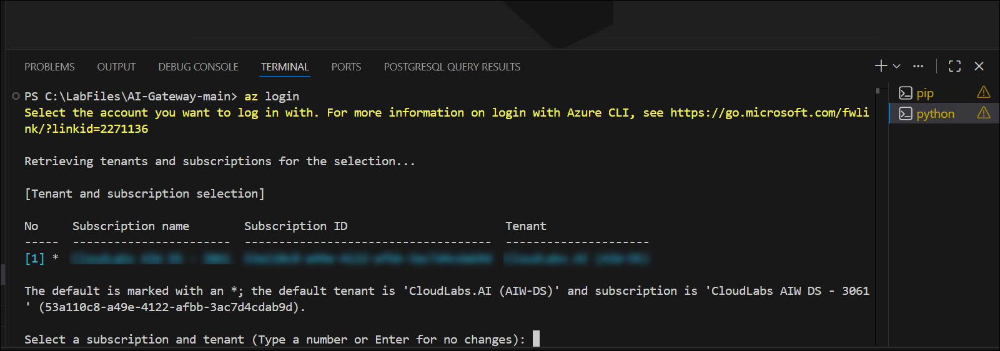

9. Once the required packages are installed, from the left navigation pane, select **Explorer (1)**, then expand the **lab (2)** folder and **backend-pool-load-balancing (3)**, and finally click on **backend-pool-load-balancing.ipynb (4)**.

   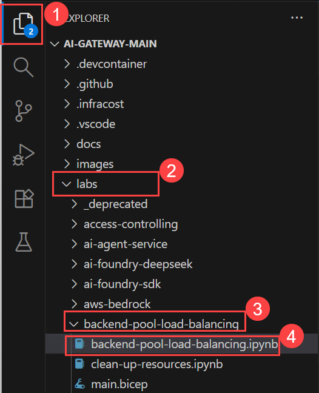

6. Once you’re in the **backend-pool-load-balancing.ipynb** file, take a moment to review each section and read its description. You will see how we deploy multiple AI endpoints, configure API Management for intelligent routing, and test load balancing and failover, giving you a clear understanding of how APIM manages AI traffic across regions.

7. Now, you will run each cell in the notebook one by one, following the instructions and observing the outputs for each step.

8. Scroll down to **Initialize notebook variables** and enter the following details:

   - resource_group_name: **Q2a-APIM-RG-<inject key="DeploymentID" enableCopy="false"/>**

   - aiservices_config:

      - **foundry1-<inject key="DeploymentID" enableCopy="false"/>**

      - **foundry2-<inject key="DeploymentID" enableCopy="false"/>**

      - **foundry3-<inject key="DeploymentID" enableCopy="false"/>**

      - **foundry4-<inject key="DeploymentID" enableCopy="false"/>**

   - apim_name: **apim-<inject key="DeploymentID" enableCopy="false"/>**

      >**Note:** Ensure that the correct name is entered in the respective section.

1. Click on **Run** in this section, we set up all the necessary variables and configurations, including resource names, regions, AI endpoints, and APIM details. This prepares the notebook for deploying resources and running the lab steps.

   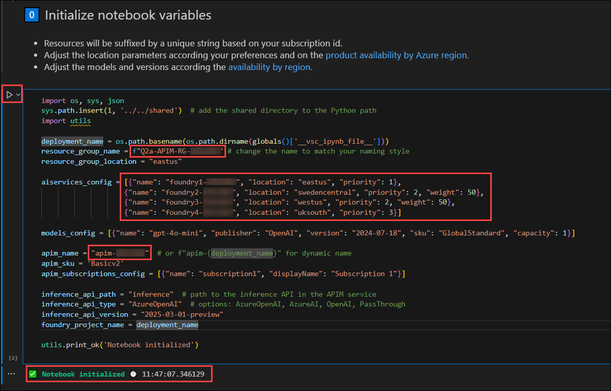

9. Go to **Verify the Azure CLI and the connected Azure subscription**. Click on **Run**, in this section, we check that the Azure CLI is installed, up-to-date, and connected to your subscription. This ensures we can deploy and manage resources in your Azure account. Review the output.

    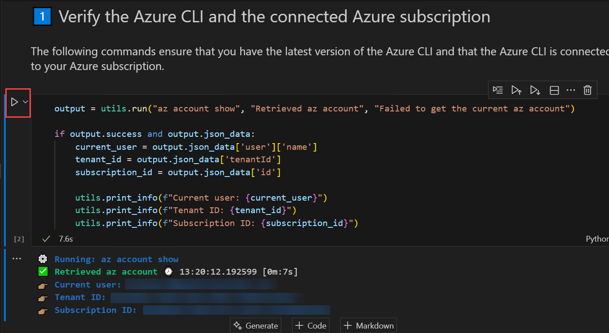

10. Run the **Create deployment using 🦾 Bicep** cell. Here, we use Bicep to define and deploy all necessary Azure resources, including the AI endpoints and APIM service. Running this sets up the infrastructure needed for the lab.

     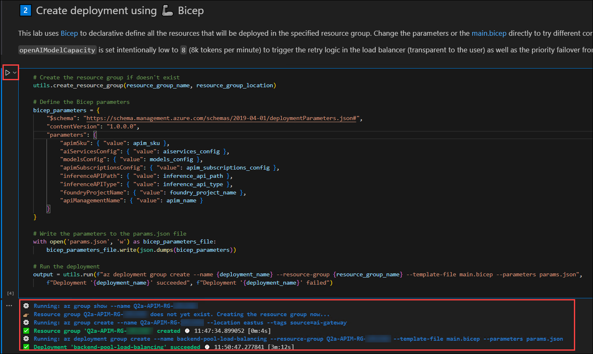

1. Open the Azure portal from the desktop. 

   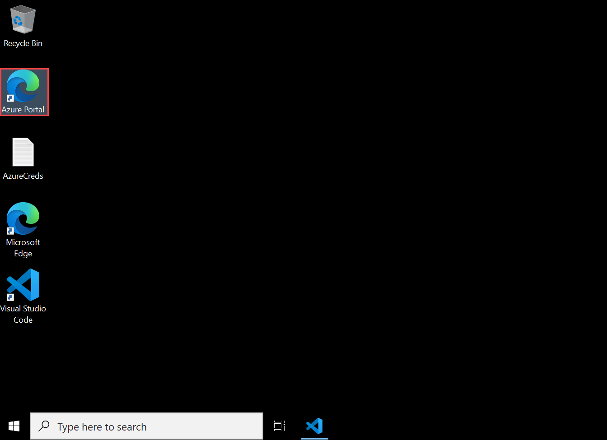

   >**Note:** If you see the dialog stating **We are now syncing your browsing data across all your devices**, select **Got it** to continue.

   .png)

1. On the Azure portal home page, scroll down to the **Navigate** section and click on **Resource groups**.

   .png)

1. Select the **Q2a-APIM-RG-<inject key="DeploymentID" enableCopy="false"/>** resource group from the list.

   .png)

1. In the **Overview** section, you can view the resources that were deployed when the **Create deployment using Bicep** cell was executed.

   .png)
    
12. Now, go back to the VS Code and run the cell **Get the deployment outputs**. This section retrieves key information from the deployment, such as API URLs, subscription keys, and resource IDs. We use these outputs to connect and test the AI endpoints in later steps.

    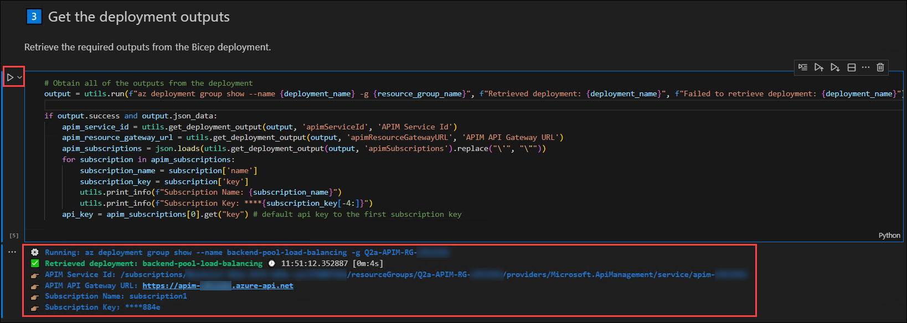
    
14. Run the **Test the API using a direct HTTP call** cell to send multiple requests to the APIM endpoint. Observe the response headers, specifically x-ms-region to verify which Azure AI Foundry backend region handles each request. This demonstrates APIM's load-balanced pool behavior in action.

      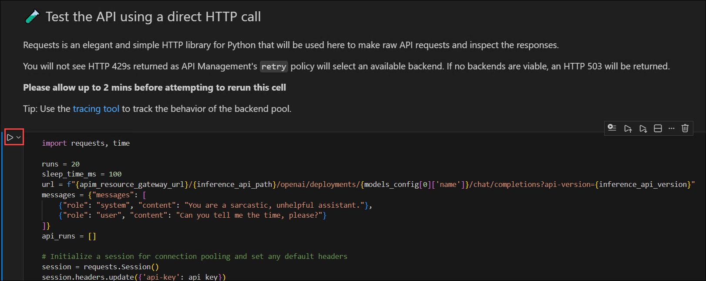

      .png)

15. Run the cell **Analyze Load Balancing results**. In this section, we analyze the load balancing results to see how traffic is distributed across the AI endpoints. The priority 1 backend handles requests first, and once it reaches its limit, traffic is shared between the two priority 2 backends.

      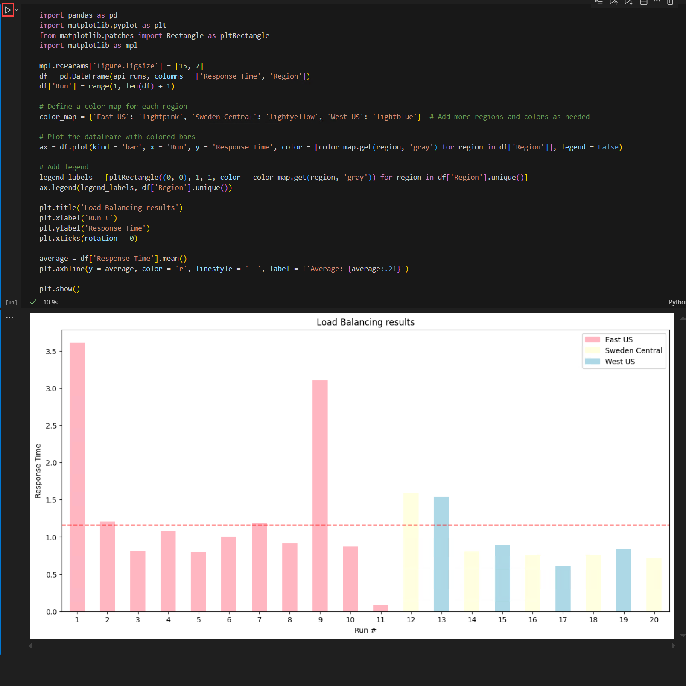

      >**Note:** The results you see may differ from the screenshot shown above.

16. Run the cell **Test the API using the Azure OpenAI Python SDK**. In this section, we test the deployed AI endpoints using the Azure OpenAI Python SDK. This ensures that the API requests work correctly and responses are received, regardless of which backend region handles them.

    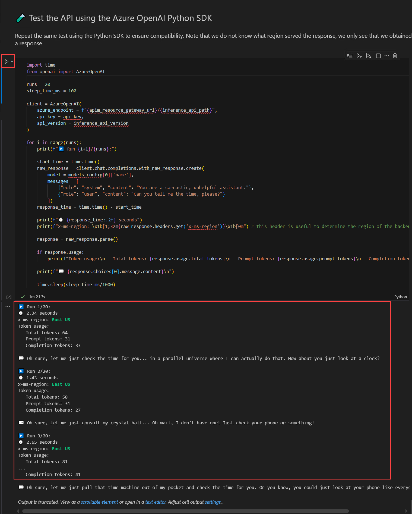


> **Congratulations** on completing the task! Now, it's time to validate it. Here are the steps:
> - If you receive a success message, you can proceed to the next task.
> - If not, carefully read the error message and retry the step, following the instructions in the lab guide. 
> - If you need any assistance, please contact us at cloudlabs-support@spektrasystems.com. We are available 24/7 to help you out.

<validation step="ee707a97-4889-4783-8244-f43776d0e345" />

## Task 2: Set up model routing for directing requests to different models

In this task, you will configure APIM to route incoming requests to the appropriate Azure OpenAI model based on predefined model mappings. You’ll initialize model and service configurations, deploy routing rules using Bicep, and test the setup to verify that each request is correctly directed to its designated backend model.

1. In Visual Studio Code, from the left navigation pane, select **Explorer (1)**, then expand **model-routing (2)** click on **model-routing.ipynb (3)**.

   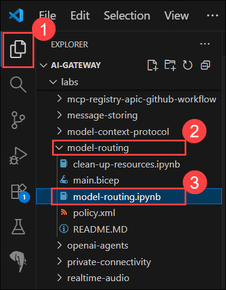

8. Scroll down to **Initialize notebook variables** and enter the following details:

   - resource_group_name: **Q2a-APIM-RG-<inject key="DeploymentID" enableCopy="false"/>**

   - aiservices_config: 
      - **foundry1-<inject key="DeploymentID" enableCopy="false"/>**

      - **foundry2-<inject key="DeploymentID" enableCopy="false"/>**

      - **foundry3-<inject key="DeploymentID" enableCopy="false"/>**

   - models_config: 

      - gpt-4.1: **foundry1-<inject key="DeploymentID" enableCopy="false"/>**

      - gpt-4.1-mini: **foundry2-<inject key="DeploymentID" enableCopy="false"/>**

      - gpt-4.1-nano: **foundry3-<inject key="DeploymentID" enableCopy="false"/>**

      - model-router: **foundry2-<inject key="DeploymentID" enableCopy="false"/>**

      - o4-mini: **foundry3-<inject key="DeploymentID" enableCopy="false"/>**

      - DeepSeek-R1: **foundry3-<inject key="DeploymentID" enableCopy="false"/>**

   - apim_name: **apim-<inject key="DeploymentID" enableCopy="false"/>**

      >**Note:** Ensure that the correct name is entered in the respective section.

1. Now **Run** the cell **Initialize Notebook Variables**. Sets up all deployment variables, model configs, APIM settings, and inference API info. At the end, all parameters are ready in memory, no resources are created yet.

   

2. Run the cell **Verify Azure CLI and Subscription**. Checks that Azure CLI is connected and retrieves current user, tenant, and subscription info.
At the end, you know the deployment will run in the correct subscription.

   .png)
   
4. Run the cell **Create Deployment using Bicep**. Creates the resource group if needed, writes params.json, and deploys resources using Bicep.
At the end, APIM, AI services, and model routing are provisioned.

   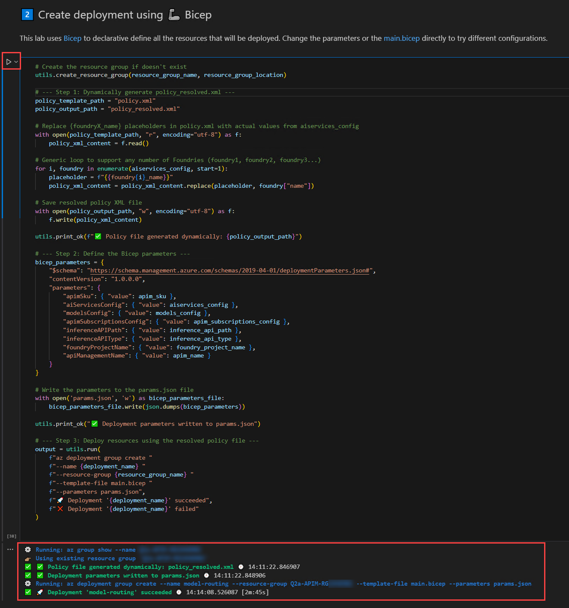
   
6. Run the cell **Get Deployment Outputs**. Fetches outputs like APIM URLs, subscription keys, and workspace IDs from the deployment.
At the end, all resource identifiers and API keys are available for testing the deployed services.

    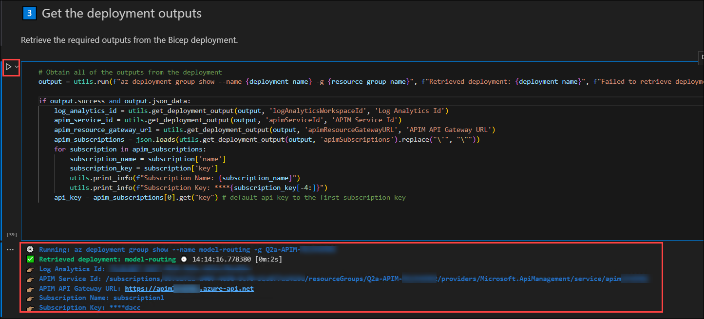
   
8. Run the cell **Test the API using Azure OpenAI Python SDK**. Connects to APIM and sends messages to multiple models to verify routing and responses.

    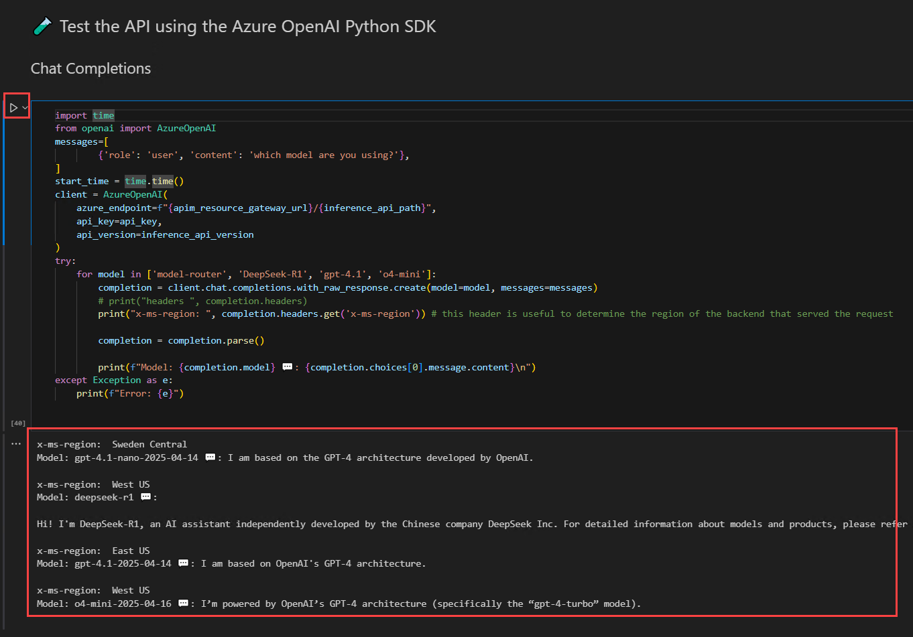

   >**Note**: At the end, model responses and backend regions are printed to confirm deployment and load balancing.

1. Run the cell **Responses API**. 

   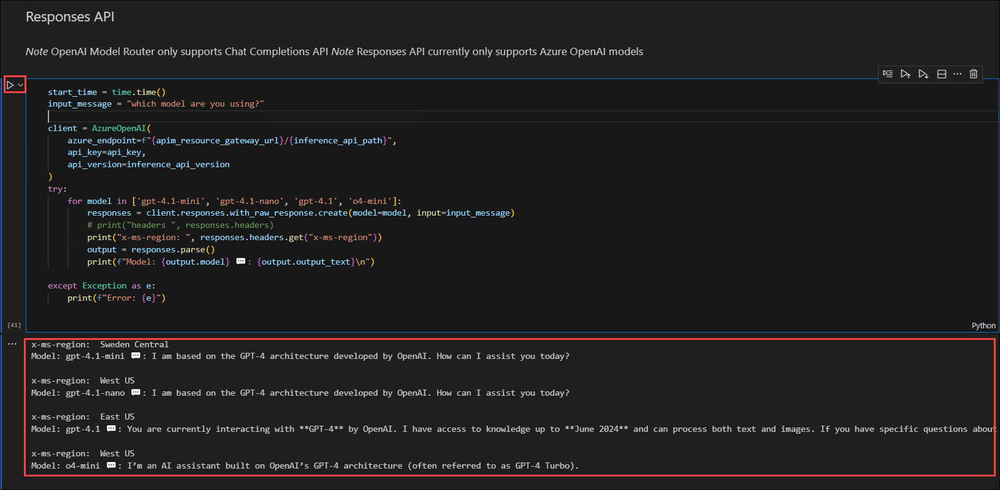

## Task 3: Implement session affinity to keep responses consistent for agent interactions

In this task, you will deploy and validate a multi-region Azure setup using Bicep and API Management. You will initialize configuration variables, verify your Azure CLI connection, deploy AI Foundry instances and an API Management gateway, and then test how session affinity affects conversation continuity across backends. By the end, you will see how enabling cookie-based affinity ensures requests from the same client maintain a consistent state across sessions.

1. In Visual Studio Code, under **labs (1)** folder, expand **session-awareness (1)** and then click on **session-awareness.ipynb (2)**.

   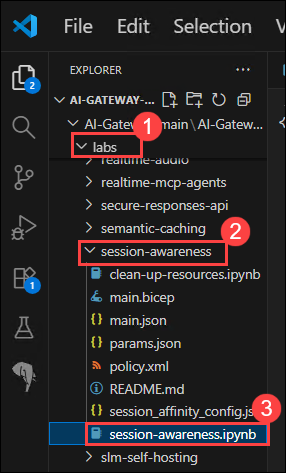

1. Scroll down to **Initialize notebook variables** and enter the following details:

   - resource_group_name: **Q2a-APIM-RG-<inject key="DeploymentID" enableCopy="false"/>**

   - aiservices_config: 
   
      - **foundry1-<inject key="DeploymentID" enableCopy="false"/>**

      - **foundry3-<inject key="DeploymentID" enableCopy="false"/>**

   - apim_name: **apim-<inject key="DeploymentID" enableCopy="false"/>**

      >**Note:** Ensure that the correct name is entered in the respective section.

1. Run the cell **Initialize notebook variables**. By running this cell, you’ll initialize key environment variables used throughout the lab. These include the resource group name and region, AI service configurations, model versions, and API Management settings. Running this cell ensures all necessary parameters are defined before deploying Azure resources and executing the following steps in the notebook.

   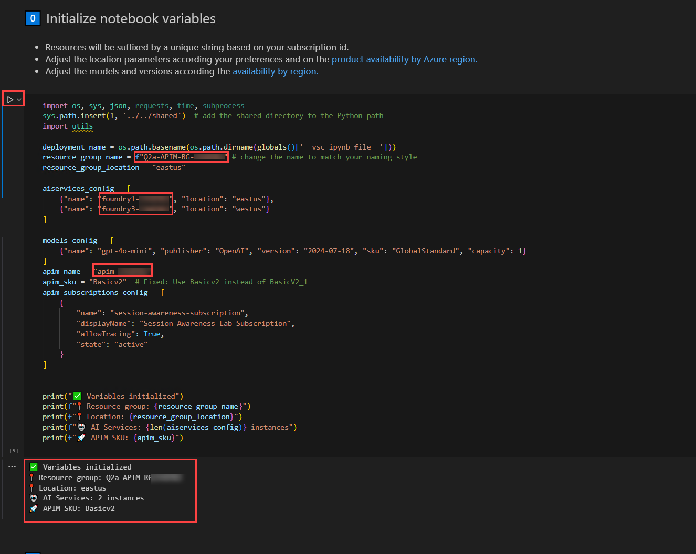

1. Run the **Verify the Azure CLI and the connected Azure subscription** cell to confirm the Azure CLI is connected and authenticated. It displays your current user, tenant ID, and subscription ID.

   

1. Run the **Create deployment using 🦾 Bicep** cell to deploy all required Azure resources using a Bicep template. This cell creates the resource group (if it doesn’t exist), generates deployment parameters, and provisions two AI Foundry instances, a GPT-4o-mini model in each, an API Management instance, and a backend pool. It sets up the initial environment for the lab, which you’ll later update to enable session affinity.

   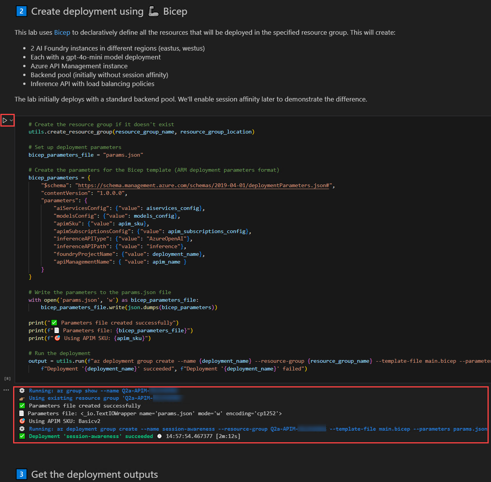

1. Run the **Get the deployment outputs** cell to retrieve details from the completed Bicep deployment. This cell fetches key outputs such as the API Management gateway URL, service name, subscription keys, and deployed AI Foundry instances. It verifies that all resources were successfully created and confirms readiness for testing session affinity in later steps.

   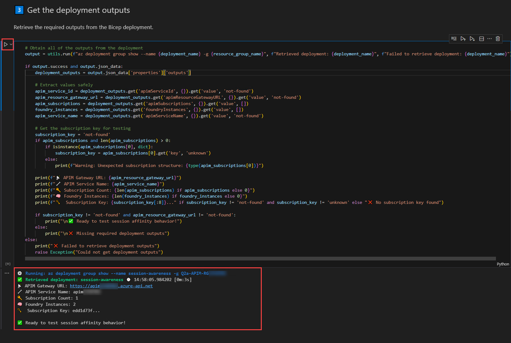

1. Run the **Test Session Awareness Without Affinity** cell to check how requests behave without session affinity. It sends two consecutive OpenAI API calls and logs backend regions, cookies, and response continuity to show whether sessions break across different backends.

   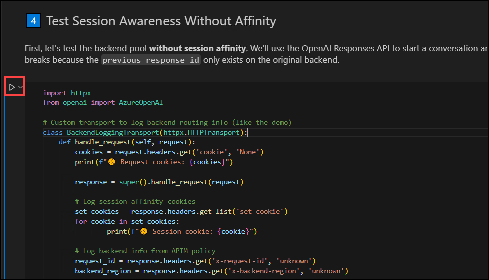

   .png)

1. Run the **Enable Session Affinity on Backend Pool** cell to activate cookie-based session affinity. This ensures all requests from the same client are routed to the same backend, maintaining conversation state. The cell updates the backend pool configuration to enable the `APIM-Backend-Affinity` cookie for session stickiness.

   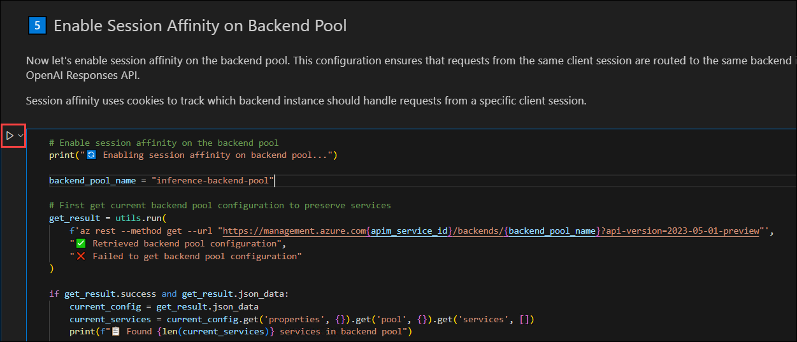

   .png)

1. Run the **Test Session Affinity** cell to verify that session affinity is working. With affinity enabled, both API requests should be routed to the same backend, preserving the conversation state. The logs will confirm a consistent backend region and successful session continuity.

   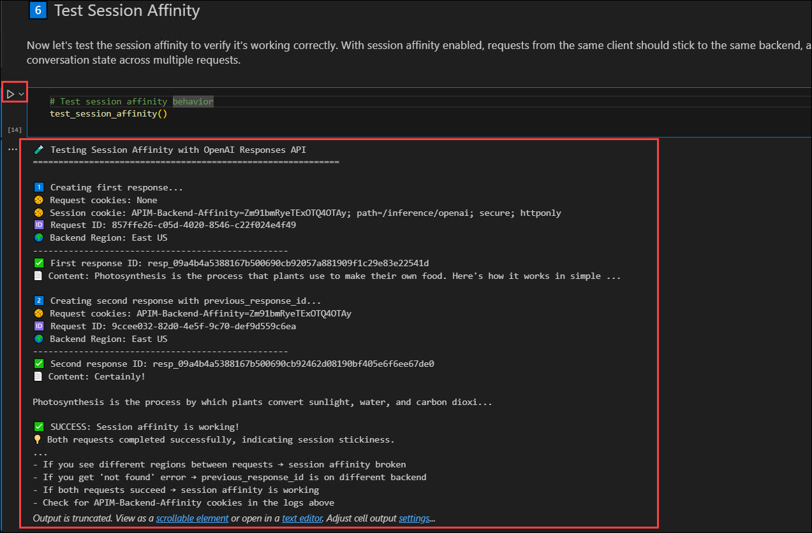


> **Congratulations** on completing the task! Now, it's time to validate it. Here are the steps:
> - If you receive a success message, you can proceed to the next task.
> - If not, carefully read the error message and retry the step, following the instructions in the lab guide. 
> - If you need any assistance, please contact us at cloudlabs-support@spektrasystems.com. We are available 24/7 to help you out.

<validation step="749d86a4-d16a-4261-b711-59898051100c" />

## Summary

In this exercise, you successfully configured load balancing, model routing, and session affinity for Azure OpenAI endpoints using Azure API Management. You deployed multiple AI backends across regions, verified that APIM evenly distributed traffic among available endpoints, and confirmed that routing rules correctly directed requests to specific models. Finally, you enabled session affinity to maintain conversation context by ensuring that requests from the same client were consistently routed to the same backend. By completing this lab, you gained hands-on experience in designing a scalable, reliable, and context-aware AI Gateway capable of handling large-scale workloads while maintaining high availability and consistent AI interactions.

### You have successfully completed the exercise. Click on Next >> to proceed with the next exercise.


