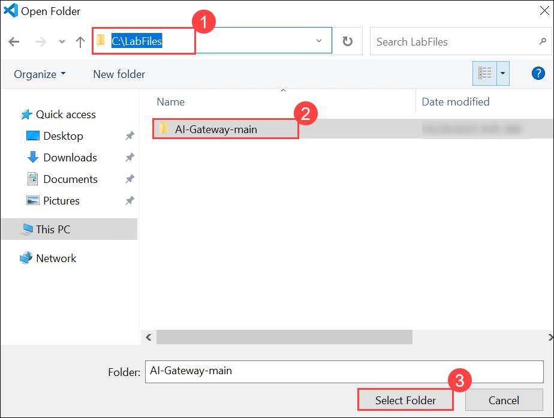
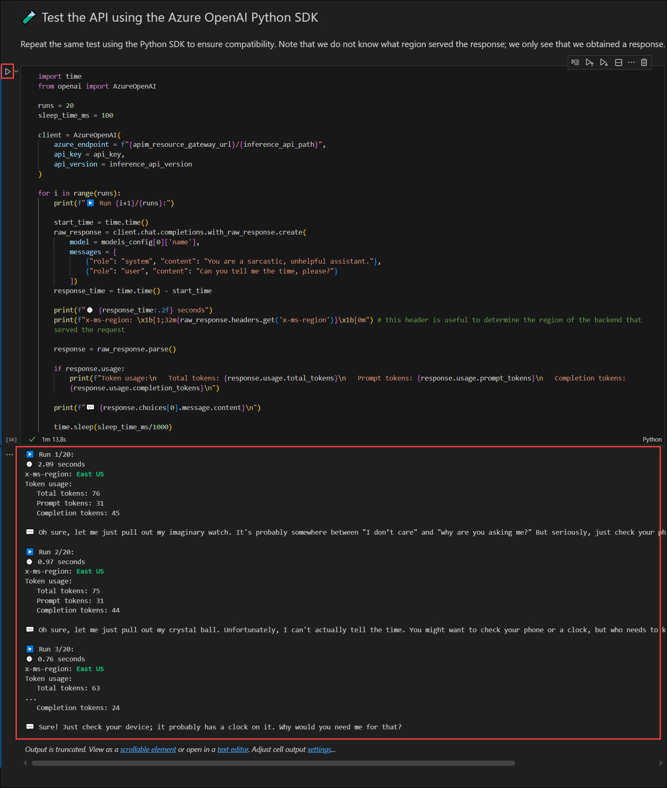

# Exercise 1: Load Balancing and Model Routing 

### Eestimated Duration: 60 Minutes

## Lab Overview

In this exercise, you will learn how to efficiently distribute AI requests across multiple Azure OpenAI (AOAI) backends to ensure high availability and balanced traffic, route requests to the appropriate AI models based on user or application requirements, and implement session affinity to maintain consistent, coherent responses for multi-turn interactions with AI agents. This will give you practical experience in managing scalable, reliable, and context-aware AI deployments.

By the end, you will visualize how APIM intelligently distributes load across AI services for optimal performance and resilience.

## Lab Objectives

- Task 1: Configure load balancing across AOAI resource pools

- Task 2: Set up model routing for directing requests to different models

- Task 3: Implement session affinity to keep responses consistent for agent interactions

## Task 1: Configure load balancing across AOAI resource pools

In this task, you will learn how to distribute incoming AI requests across multiple Azure OpenAI (AOAI) endpoints deployed in different regions. You will configure Azure API Management (APIM) to intelligently route traffic, ensuring high availability, efficient utilization of resources, and seamless failover when one endpoint reaches capacity or becomes unavailable.

1. Open **Visual Studio Code** using the desktop shortcut in the labvm.

   

2. Click on **File (1)** and select **Open Folder (2)**.

   

3. Navigate to **`C:\LabFiles` (1)**, select the **AI-Gateway-main (2)** folder, and click **Select Folder (3)**.

   

4. If you receive a Do you trust the authors of the files in folder warning, select the **checkbox (1)** and click **Yes, I trust the authors (2)**.

   

4. From the top menu, click the **Ellipsis (…) (1)**  button, then select **Terminal (2) → New Terminal (3)**.

    

8. Run the following command in the terminal to Install Lab Dependencies.

   ```
   pip install -r requirements.txt
   ```

9. In Visual Studio Code, from the left navigation pane, select **Explorer (1)**, then expand the **lab (2)** folder and **backend-pool-load-balancing (3)**, and finally click on **backend-pool-load-balancing.ipynb (4)**.

   

6. Once you’re in the **backend-pool-load-balancing.ipynb** file, take a moment to review each session and read its description. You will see how we deploy multiple AI endpoints, configure API Management for intelligent routing, and test load balancing and failover, giving you a clear understanding of how APIM manages AI traffic across regions.

7. Now, you will run each cell in the notebook one by one, following the instructions and observing the outputs for each step.

8. Scroll down to **0️⃣ Initialize notebook variables**. 
Enter the following details:


1. Click on **Run** in this session, we set up all the necessary variables and configurations, including resource names, regions, AI endpoints, and APIM details. This prepares the notebook for deploying resources and running the lab steps.

   

1. Now, run the following command to sign in to Azure from the terminal:

   ```
   az login
   ```

   >**Note:** Minimize VS Code to access the Sign-in window.

1. In the **Sign in** pop-up window, under **Let's get you signed in** select **Work or school account (1)** and then click **Continue (2)**.

   

1. Enter the **email address (1)** shown below, then select **Next (2)**.

   - **Email:** <inject key="AzureAdUserEmail"></inject>

      .png)

1. Enter the **password (1)** provided below, then select **Sign in (2)**.

   - **Password:** <inject key="AzureAdUserPassword"></inject>

      .png)

1. In the **Automatically sign in to all desktop apps and websites on this device?** pop-up, click on **Yes, all apps**.

   .png)

1. On the **Account added to this device** pop-up, click **Done**.

   .png)

1. Go back to the VS Code terminal and press **Enter** to choose the default subscription.

   .png)

9. Go to **1️⃣ Verify the Azure CLI and the connected Azure subscription**. Click on **Run**, in this session, we check that the Azure CLI is installed, up-to-date, and connected to your subscription. This ensures we can deploy and manage resources in your Azure account. Review the output.

    

10. Run the **2️⃣ Create deployment using 🦾 Bicep**. Here, we use Bicep to define and deploy all necessary Azure resources, including the AI endpoints and APIM service. Running this sets up the infrastructure needed for the lab.

     
    
12. Run the cell **3️⃣ Get the deployment outputs**. This session retrieves key information from the deployment, such as API URLs, subscription keys, and resource IDs. We use these outputs to connect and test the AI endpoints in later steps.

    
    
14. Run the cell **🧪 Test the API using the Azure OpenAI Python SDK**. Finally, we test the deployed AI endpoints using the Python SDK to send requests, check responses, and observe which backend region served each request. This demonstrates load balancing and routing in action.

      

15. Run the cell **🔍 Analyze Load Balancing results**. In this session, we analyze the load balancing results to see how traffic is distributed across the AI endpoints. The priority 1 backend handles requests first, and once it reaches its limit, traffic is shared between the two priority 2 backends.

      

16. Run the cell **🧪 Test the API using the Azure OpenAI Python SDK**. In this session, we test the deployed AI endpoints using the Azure OpenAI Python SDK. This ensures that the API requests work correctly and responses are received, regardless of which backend region handles them.

    

## Task 2: Set up model routing for directing requests to different models

This task focuses on directing requests to specific AI models based on parameters such as model type or workload. You will configure APIM to route each request to the correct backend AI model and test the responses, gaining an understanding of how model routing can optimize performance, resource usage, and cost efficiency.

1. In Visual Studio Code, from the left navigation pane, select **Explorer (1)**, then expand **model-routing (2)** click on **model-routing.ipynb (3)**.

   

1. Run the cell **0️⃣ Initialize Notebook Variables**. Sets up all deployment variables, model configs, APIM settings, and inference API info. At the end, all parameters are ready in memory, no resources are created yet.

   

2. Run the cell **1️⃣ Verify Azure CLI and Subscription**. Checks that Azure CLI is connected and retrieves current user, tenant, and subscription info.
At the end, you know the deployment will run in the correct subscription.

   .png)
   
4. Run the cell **2️⃣ Create Deployment using Bicep**. Creates the resource group if needed, writes params.json, and deploys resources using Bicep.
At the end, APIM, AI services, and model routing are provisioned (or an error is returned).

   
   
6. Run the cell **3️⃣ Get Deployment Outputs**. Fetches outputs like APIM URLs, subscription keys, and workspace IDs from the deployment.
At the end, all resource identifiers and API keys are available for testing the deployed services.

    
   
8. Run the cell **🧪 Test the API using Azure OpenAI Python SDK**. Connects to APIM and sends messages to multiple models to verify routing and responses.

    

   >**Note**: At the end, model responses and backend regions are printed to confirm deployment and load balancing.

1. Run the cell **Responses API**. 

   


## Task 3: Implement session affinity to keep responses consistent for agent interactions (In Progress)

> Session Affinity, also known as sticky sessions, is a technique used in load-balanced systems to ensure that all requests from a specific user or session are consistently routed to the same backend server or model instance.

In this task, you’ll deploy and validate a multi-region Azure setup using Bicep and API Management. You’ll initialize configuration variables, verify your Azure CLI connection, deploy AI Foundry instances and an API Management gateway, and then test how session affinity affects conversation continuity across backends. By the end, you’ll see how enabling cookie-based affinity ensures requests from the same client maintain consistent state across sessions.


1. In Visual Studio Code, from the left navigation pane, select **Explorer**, then expand **session-awareness (1)** click on **session-awareness.ipynb (2)**.

   

1. Scroll down to **0️⃣ Initialize notebook variables**. Click on **Run**. By running this cell, you’ll initialize key environment variables used throughout the lab. These include the resource group name and region, AI service configurations, model versions, and API Management settings. Running this cell ensures all necessary parameters are defined before deploying Azure resources and executing the following steps in the notebook.

   

1. Run the **1️⃣ Verify the Azure CLI and the connected Azure subscription** cell to confirm the Azure CLI is connected and authenticated. It displays your current user, tenant ID, and subscription ID.

   

1. Run the **2️⃣ Create deployment using 🦾 Bicep** cell to deploy all required Azure resources using a Bicep template. This cell creates the resource group (if it doesn’t exist), generates deployment parameters, and provisions two AI Foundry instances, a GPT-4o-mini model in each, an API Management instance, and a backend pool. It sets up the initial environment for the lab, which you’ll later update to enable session affinity.

1. Run the **3️⃣ Get the deployment outputs** cell to retrieve details from the completed Bicep deployment. This cell fetches key outputs such as the API Management gateway URL, service name, subscription keys, and deployed AI Foundry instances. It verifies that all resources were successfully created and confirms readiness for testing session affinity in later steps.

1. Run the **4️⃣ Test Session Awareness Without Affinity** cell to check how requests behave without session affinity. It sends two consecutive OpenAI API calls and logs backend regions, cookies, and response continuity to show whether sessions break across different backends.

1. Run the **5️⃣ Enable Session Affinity on Backend Pool** cell to activate cookie-based session affinity. This ensures all requests from the same client are routed to the same backend, maintaining conversation state. The cell updates the backend pool configuration to enable the `APIM-Backend-Affinity` cookie for session stickiness.

1. Run the **6️⃣ Test Session Affinity** cell to verify that session affinity is working. With affinity enabled, both API requests should be routed to the same backend, preserving the conversation state. The logs will confirm consistent backend region and successful session continuity.

1. In the **Clean up resources** cell, click on **clean-up-resources notebook**.

   

1. In the new tab, **Run** the cell to clean up the resources that we have created.

   

## Summary


