# Exercise 2: Managing LLM Traffic

### Estimated Duration: Minutes

## Lab Overview

This Exercise demonstrates how to capture token usage metrics and apply token rate limiting policies for Azure AI Foundry endpoints through Azure API Management (APIM). You will learn to monitor token consumption, visualize trends, and prevent spikes in usage by configuring the azure-openai-token-limit policy.

## Lab Objectives

- Task 1: Capture token usage metrics from AI Gateway traffic. 
- Task 2: Apply rate limiting policies to control token consumption.

## Task 1: Capture token usage metrics from AI Gateway traffic. 

In this task, you will deploy APIM and Azure AI Foundry endpoints, set up models and subscriptions, and prepare the environment for testing. You will then capture, analyze, and visualize token usage metrics to monitor API consumption patterns.

1. In Visual Studio Code, from the left navigation pane, select **Explorer (1)**, then expand the **labs (2)** folder and **token-metrics-emitting (3)**, and finally click on **token-metrics-emitting.ipynb (4)**.

     
   
1. Navigate to **0️⃣ Initialize notebook variables** cell and click on **Run**. Prepare the environment, define resources, models, and subscriptions so everything is ready for deployment.

   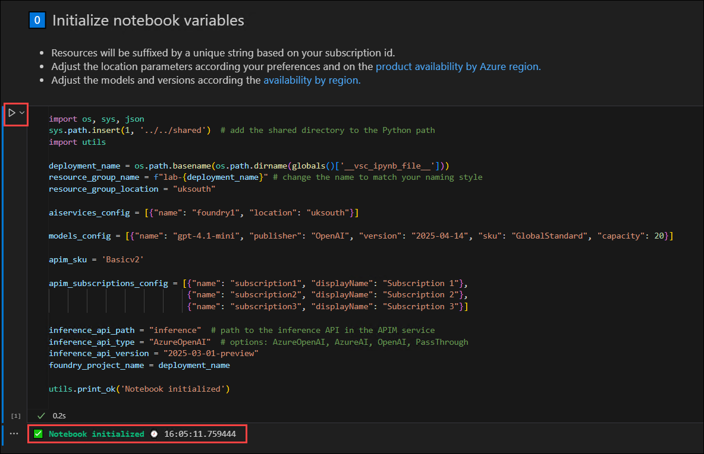

2. Next go to **1️⃣ Verify the Azure CLI and the connected Azure subscription** and click on Run. This ensure the commands will run in the correct Azure subscription and that we have permissions to create resources.

   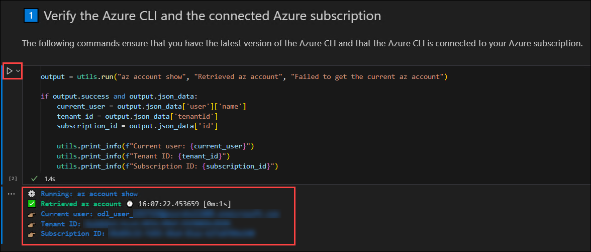
   
3. Next **2️⃣ Create deployment using 🦾 Bicep*** click on Run. This cell Automate the creation of APIM, AI Foundry endpoints, and model deployments so that the environment is consistent and reproducible.

   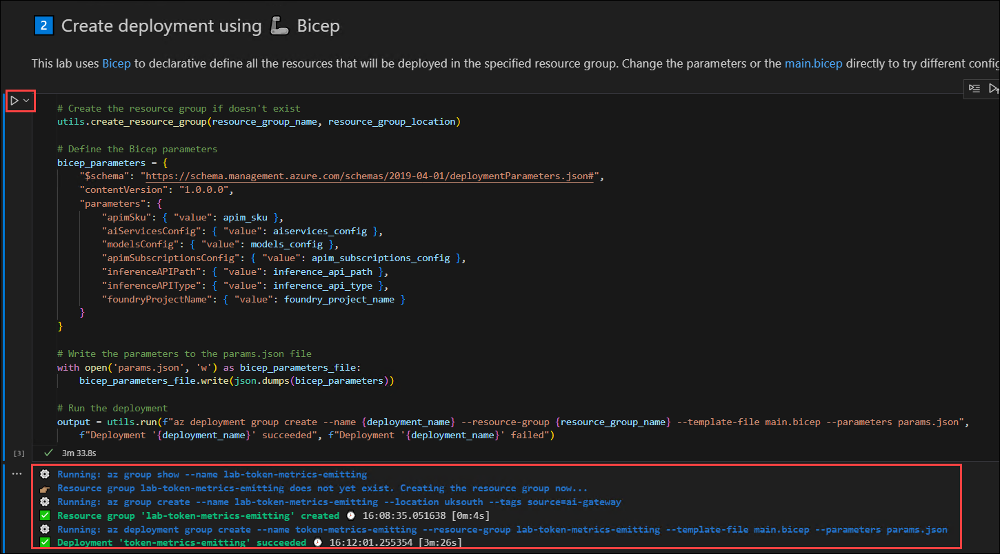

4. Run the cell **3️⃣ Get the deployment outputs**. This rRetrieve URLs, keys, and Application Insights names that are needed to interact with the deployed AI endpoints.

   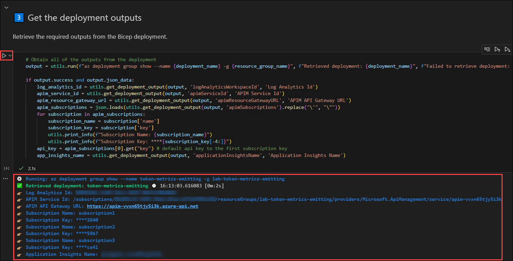
   
5. Run the cell **🧪 Test the API using a direct HTTP call**. Simulate real API requests to ensure that the token metrics are emitted correctly and that the agent responds as expected.

   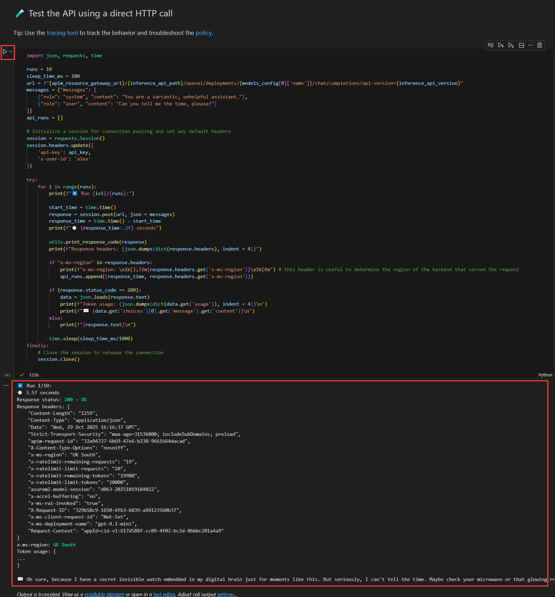

6. Run the cell **🧪 Execute multiple runs for each subscription using the Azure OpenAI Python SDK**. Verify that metrics are tracked consistently across multiple subscriptions and API keys using the official Azure OpenAI SDK.

   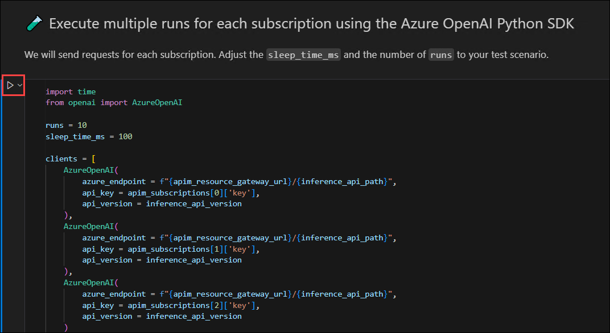

   .png)

7. Run the cell **🔍 Analyze Application Insights custom metrics with a KQL query**, this Query and extract token usage data to monitor consumption and identify patterns.

    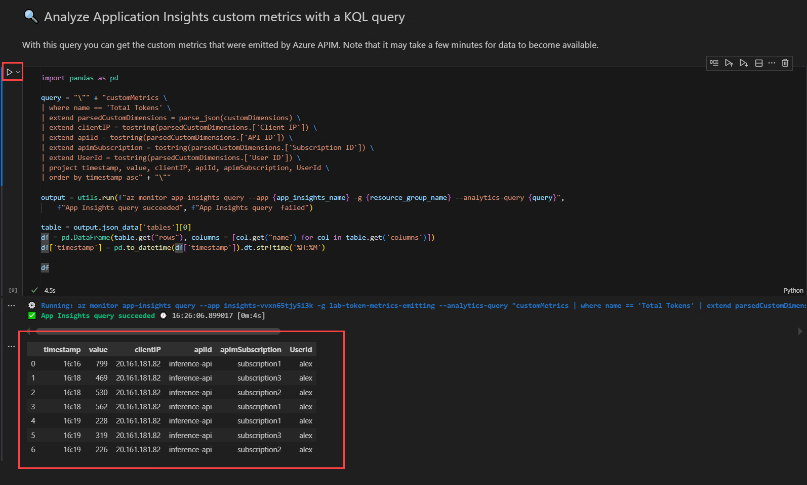

    >**Note:** If you get an error or the table doesn’t appear, wait a few minutes and run the cell again.

8. Run the cell **🔍 Plot the custom metrics results**, this Visualize token usage over time to see trends, spikes, or anomalies.

    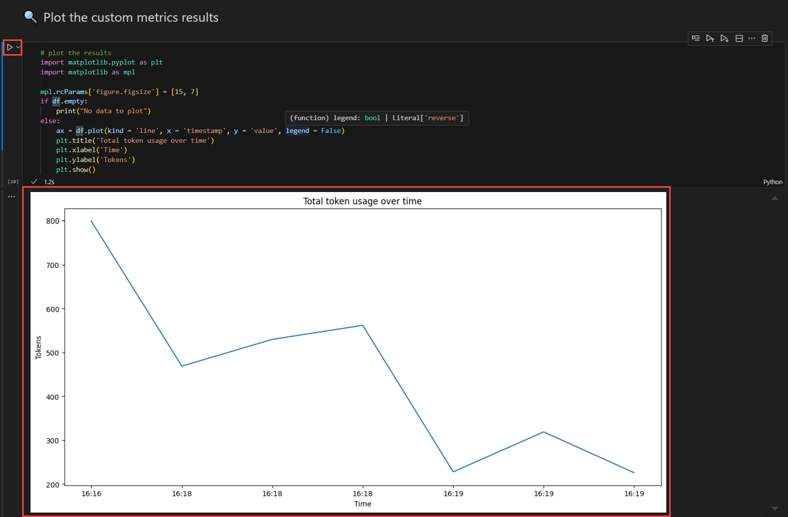

9. Next **🔍 See the metrics on the Azure Portal**. Validate the token consumption visually for each subscription in Application Insights for easier monitoring.
    
    

1. Open the Azure Portal and sign in with the credentials provided in the **Environment** tab.

1. Click on the **Resource groups** from the homepage.

   .png)

1. Under the **Resource Manager | Resource groups** blade, **lab-token-metrics-emitting**.

   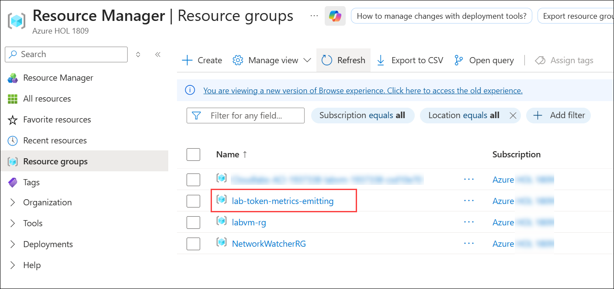

1. Select the **Application Insights** resource.

   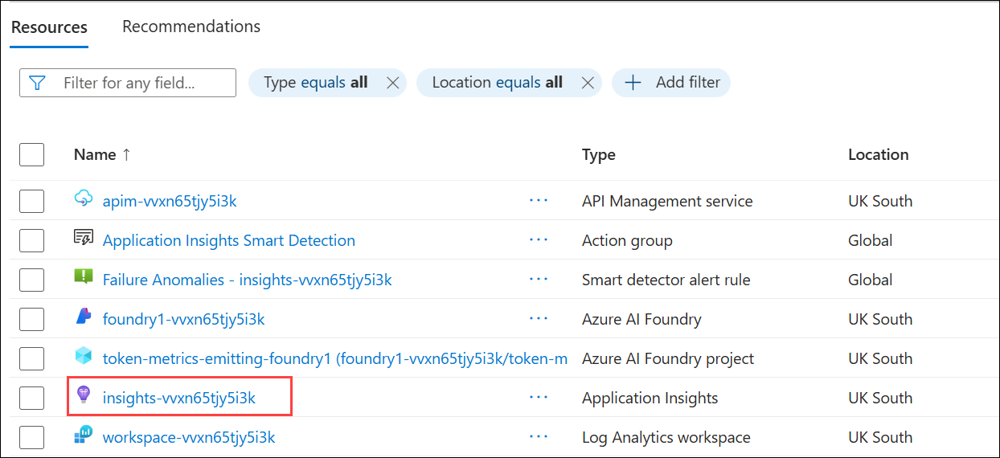

1. In the left navigation pane, go to **Monitoring (1)** and then select **Metrics (2)**.

   .png)

1. Enter the following values in the respective fields:

   - Metric Namespace: **openai (1)**
   - Metric: **Total Tokens (2)**
   - Aggregation: **Sum (3)**
   - Click on **Apply splitting (4)**.
   
      .png)

   - Values: **Subscription ID (5)**

      .png)

1. Go back to the VS code, and scroll down to **Clean up resources** section, and click on **clean-up-resources notebook**.

   

1. In the new tab, **Run** the cell to clean up the resources that we have created.

   

## Task 2: Apply rate limiting policies to control token consumption. 

In this task, you will deploy APIM, AI Foundry endpoints, and model subscriptions, and configure token rate limiting policies. You will test API requests, monitor token usage, and verify that the rate limiting enforces consumption limits correctly.

https://github.com/Azure-Samples/AI-Gateway/blob/main/labs/token-rate-limiting/README.MD

1. In Visual Studio Code, from the left navigation pane, select **Explorer (1)**, then expand the **lab (2)** folder and select **token-rate-limiting (3)**, and click on **token-rate-limiting.ipynb (4)**.

   

1. Navigate to **0️⃣ Initialize Notebook Variables**. Click on **Run** this set up all lab variables, including resource group, location, AI services, models, APIM SKU, subscriptions, API paths, and utility functions. Prepares the environment for deployment.

   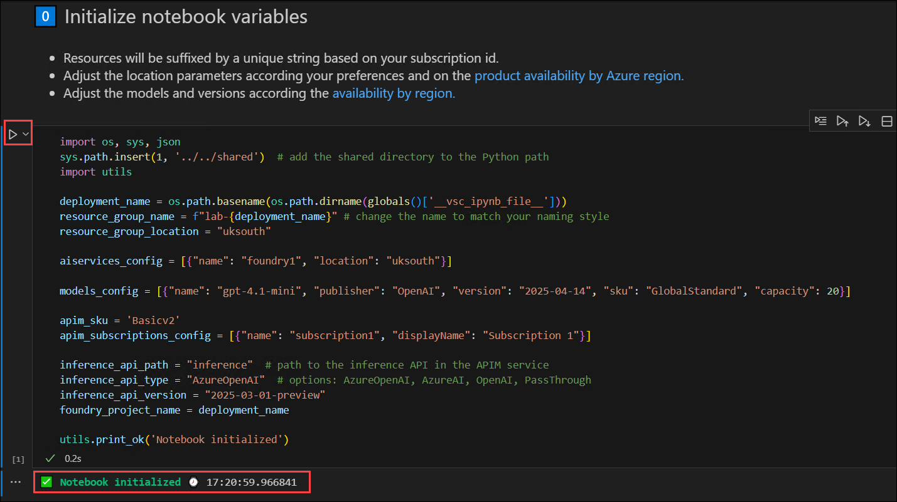
   
1. Run **1️⃣ Verify Azure CLI and Subscription**. Check that Azure CLI is installed and connected. Retrieve and display current user, tenant ID, and subscription ID to confirm correct access.
   
   

2. Run the cell **2️⃣ Create Deployment Using Bicep**. Deploy APIM, AI Foundry endpoints, and model subscriptions using Bicep. Automates resource provisioning and writes parameters to params.json.

   

3. Run the cell **3️⃣ Get Deployment Outputs**. Retrieve APIM Service ID, API Gateway URL, subscription keys, and other deployment outputs. These values are required for testing and API calls.
  
   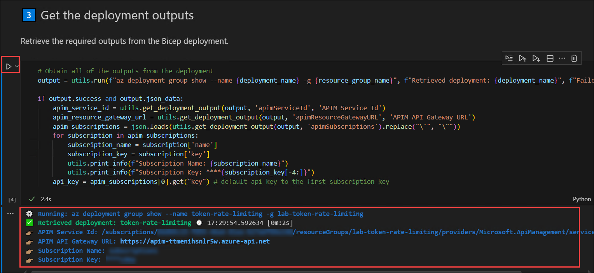

4. Run the cell **🧪 Test API Using Direct HTTP Calls**. Send repeated requests to the deployed AI endpoint using Python requests. Monitor response time, status codes, and token usage to verify token limiting behavior.

   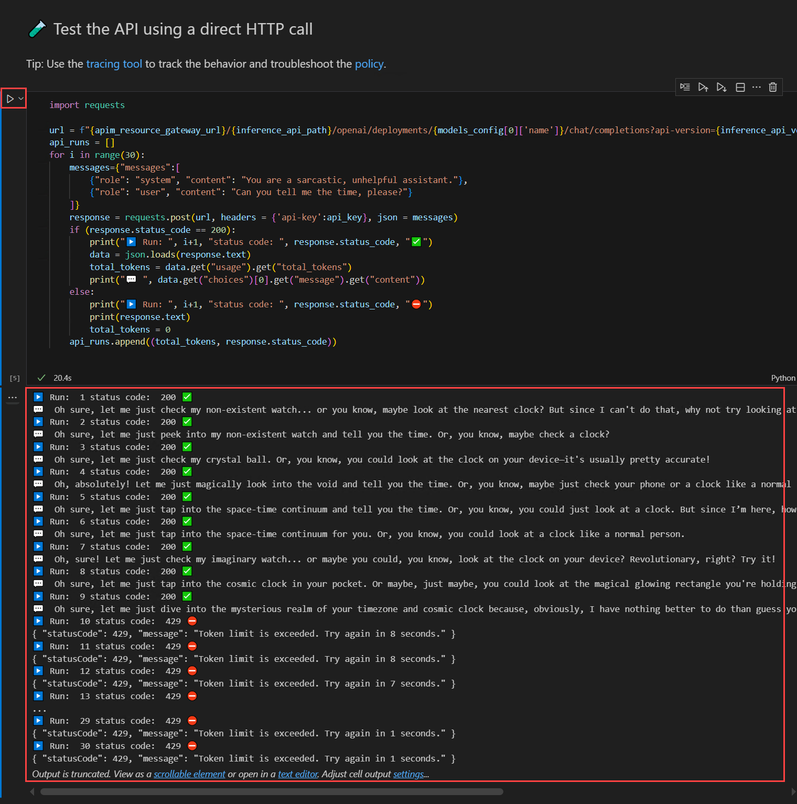

5. Run the cell **🔍 Analyze Token Rate limiting results**. Convert API run results into a DataFrame and plot tokens per request. Helps visualize rate limiting and identify when 429 errors occur.

   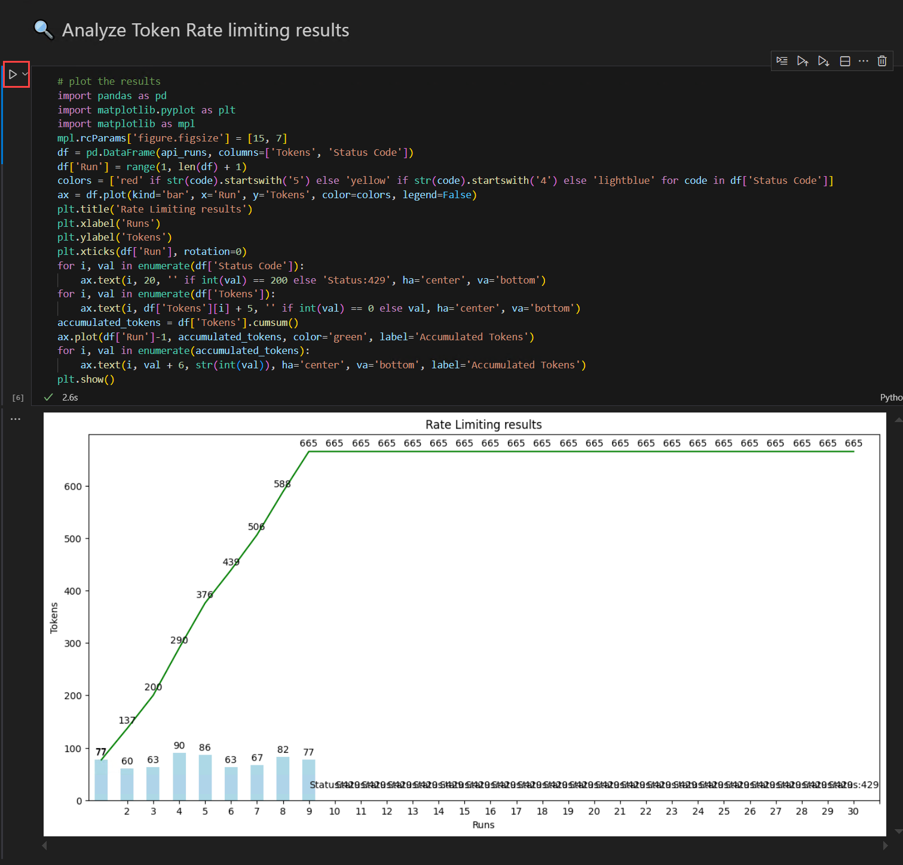

   >**Note:** Result you get may vary from the image above.

6. Run the cell **🧪 Test the API Using Azure OpenAI Python SDK**. Send requests using the Azure OpenAI SDK to confirm retries and proper handling of token limits. Observes consistent behavior across SDK calls.

   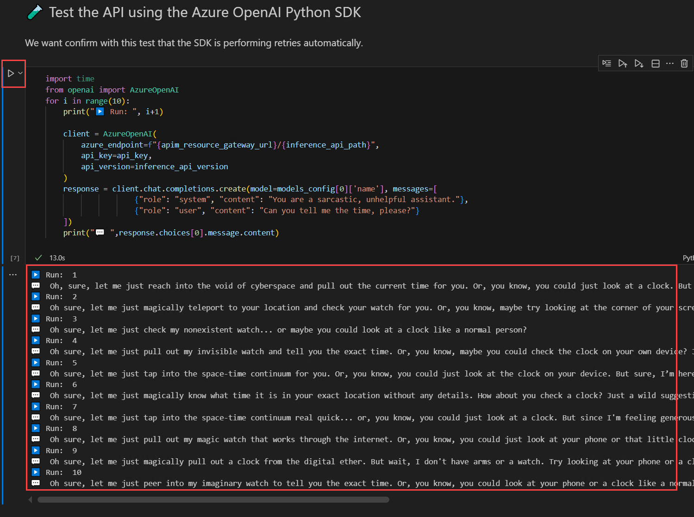

1. Go back to the VS code, and scroll down to **Clean up resources** section, and click on **clean-up-resources notebook**.

   

1. In the new tab, **Run** the cell to clean up the resources that we have created.

   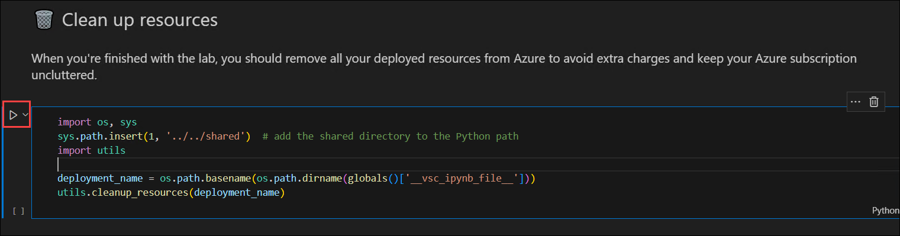

## Summary

In these labs, you will deploy Azure API Management and AI Foundry endpoints with models and subscriptions, then capture and monitor token usage metrics. You will also apply token rate limiting policies to control API consumption, test the endpoints, and analyze results to ensure proper enforcement of usage limits.
