# Exercise 2: Managing LLM Traffic

### Estimated Duration: 60 Minutes

## Lab Overview

In this exercise, you’ll manage and optimize Large Language Model (LLM) traffic using Azure API Management (APIM) and Azure AI Foundry. You’ll first capture and analyze token usage metrics from API requests to monitor consumption trends and identify spikes in activity. Then, you’ll apply token rate limiting policies using APIM to control traffic and prevent overuse of Azure OpenAI resources. Using Visual Studio Code and Bicep templates, you’ll deploy the required infrastructure, run tests with Python SDKs, and visualize token data in Application Insights. Confirm that token usage metrics are emitted correctly and that rate-limiting policies enforce consumption limits effectively.

## Lab Objectives

- Task 1: Capture token usage metrics from AI Gateway traffic 

- Task 2: Apply rate limiting policies to control token consumption

## Task 1: Capture token usage metrics from AI Gateway traffic 

In this task, you will deploy APIM and Azure AI Foundry endpoints, set up models and subscriptions, and prepare the environment for testing. You will then capture, analyze, and visualize token usage metrics to monitor API consumption patterns.

1. In Visual Studio Code, expand the **labs (1)** folder and then select **token-metrics-emitting (2)**, and finally click on **token-metrics-emitting.ipynb (3)**.

     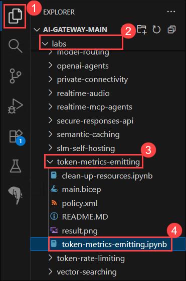

8. Scroll down to **Initialize notebook variables** and enter the following details:

   - resource_group_name: **Q2a-APIM-RG-<inject key="DeploymentID" enableCopy="false"/>**

   - aiservices_config: **foundry4-<inject key="DeploymentID" enableCopy="false"/>**

   - apim_name: **apim-<inject key="DeploymentID" enableCopy="false"/>**

      >**Note:** Ensure that the correct name is entered in the respective section.

1. Run the cell **Initialize notebook variables**. Prepare the environment, define resources, models, and subscriptions so everything is ready for deployment.

   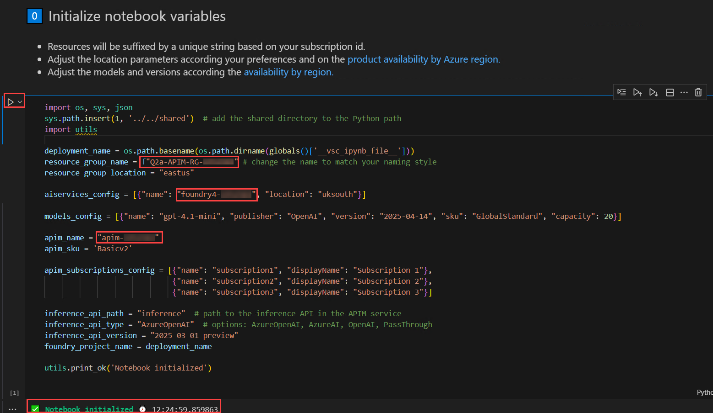

2. Next go to **Verify the Azure CLI and the connected Azure subscription** and click on Run. This ensure the commands will run in the correct Azure subscription and that we have permissions to create resources.

   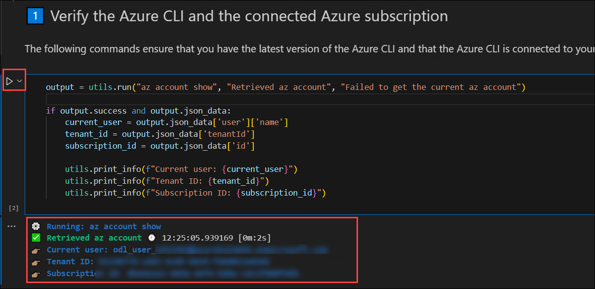
   
3. Run the cell **Create deployment using 🦾 Bicep**. This cell Automate the creation of APIM, AI Foundry endpoints, and model deployments so that the environment is consistent and reproducible.

   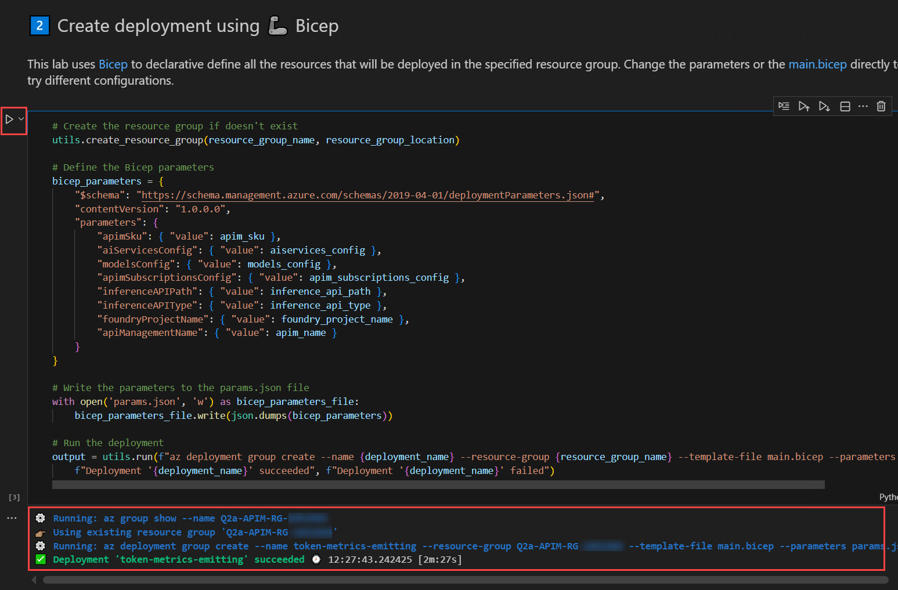

4. Run the cell **Get the deployment outputs**. This rRetrieve URLs, keys, and Application Insights names that are needed to interact with the deployed AI endpoints.

   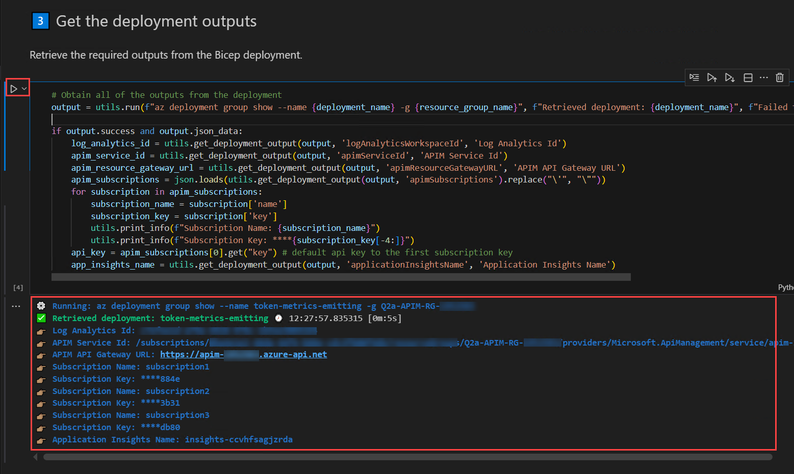
   
5. Run the cell **Test the API using a direct HTTP call**. Simulate real API requests to ensure that the token metrics are emitted correctly and that the agent responds as expected.

   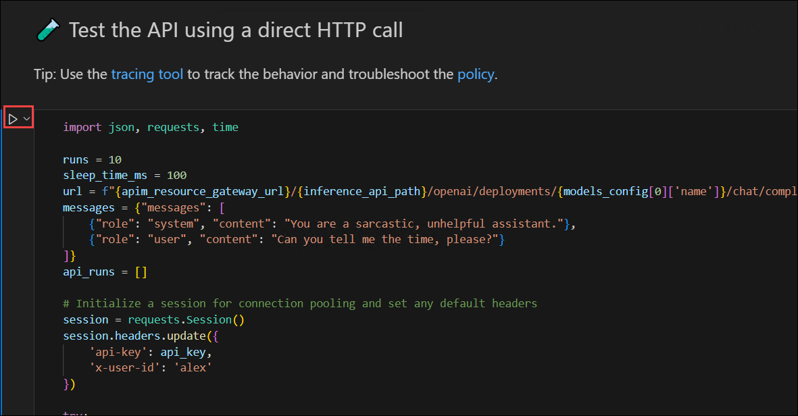

   .png)

6. Run the cell **Execute multiple runs for each subscription using the Azure OpenAI Python SDK**. Verify that metrics are tracked consistently across multiple subscriptions and API keys using the official Azure OpenAI SDK.

   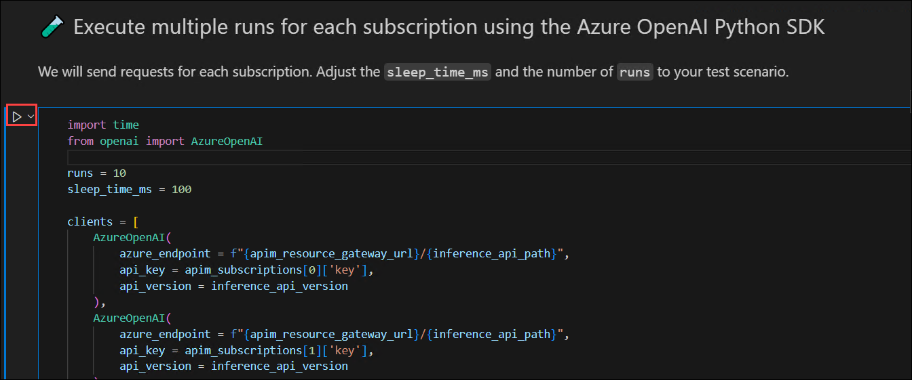

   .png)

7. Run the cell **Analyze Application Insights custom metrics with a KQL query**, this Query and extract token usage data to monitor consumption and identify patterns.

    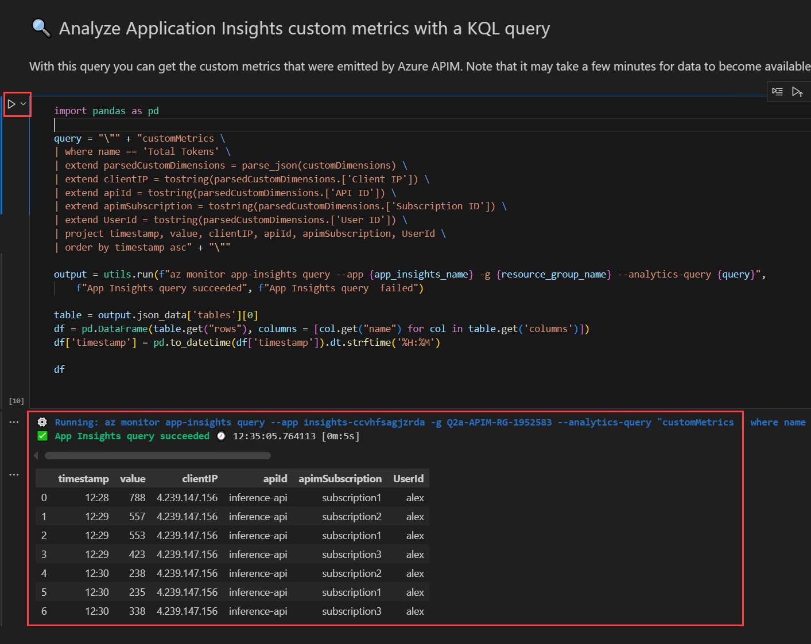

    >**Note:** If you get an error or the table doesn’t appear, wait a few minutes and run the cell again.

8. Run the cell **Plot the custom metrics results**, this Visualize token usage over time to see trends, spikes, or anomalies.

    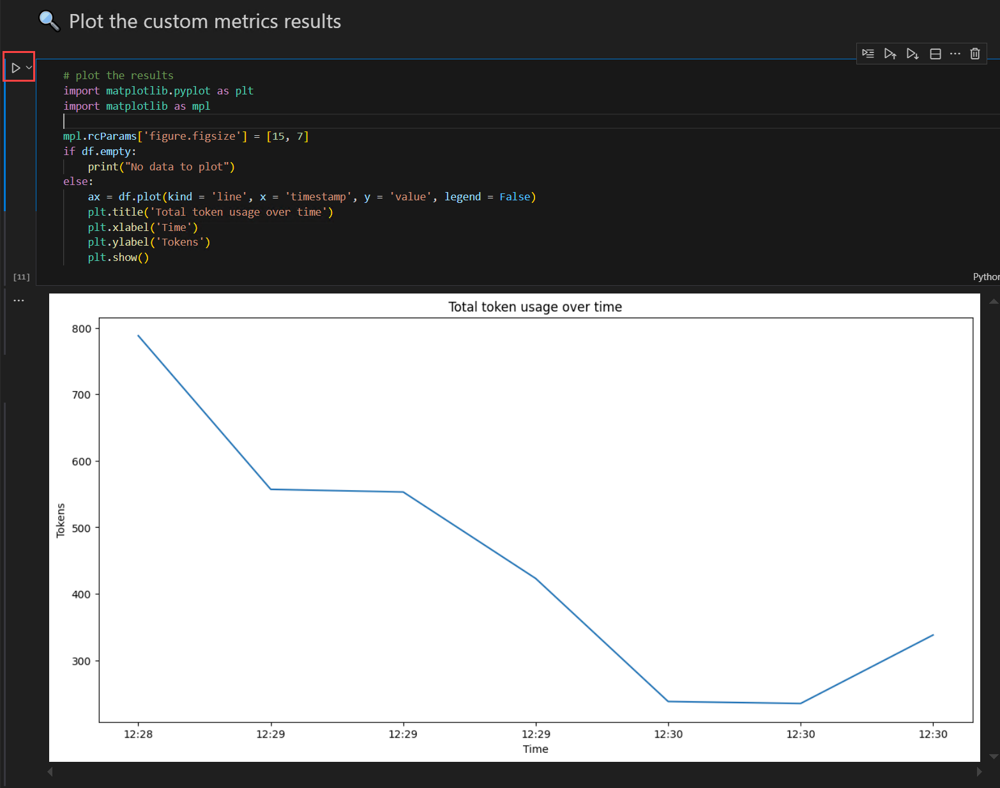

    >**Note:** The results you see may vary from the screenshot shown above.

9. Next **See the metrics on the Azure Portal**. Validate the token consumption visually for each subscription in Application Insights for easier monitoring.
    
    

1. Open the Azure Portal in the browser and sign in with the credentials provided in the **Environment** tab.

1. Click on the **Resource groups** from the homepage.

   .png)

1. Under the **Resource groups** blade, select **Q2a-APIM-RG-<inject key="DeploymentID" enableCopy="false"/>**.

   .png)

1. Select the **Application Insights** resource.

   .png)

1. In the left navigation pane, go to **Monitoring (1)** and then select **Metrics (2)**.

   .png)

1. Enter the following values in the respective fields:

   - Metric Namespace: **openai (1)**
   - Metric: **Total Tokens (2)**
   - Aggregation: **Sum (3)**
   - Click on **Apply splitting (4)**.
   
      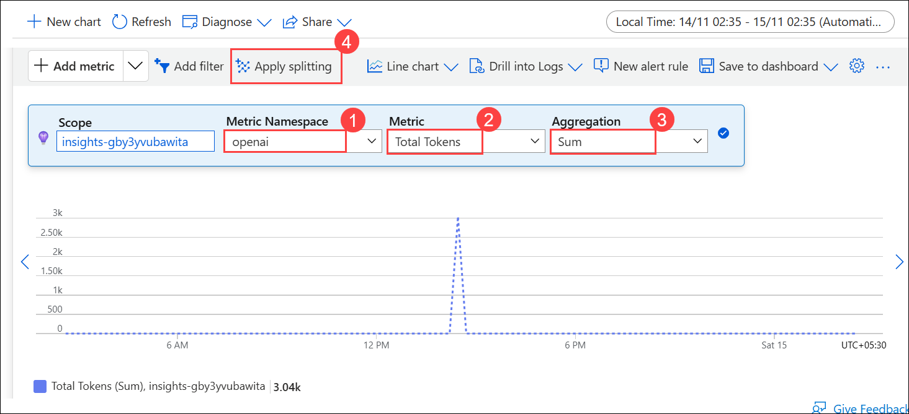

   - Values: **Subscription ID (5)**

      .png)

      >**Note:** If the **openai** Metric Namespace isn’t visible, select **Log-based metrics** instead.

## Task 2: Apply rate limiting policies to control token consumption

In this task, you will deploy APIM, AI Foundry endpoints, and model subscriptions, and configure token rate limiting policies. You will test API requests, monitor token usage, and verify that the rate limiting enforces consumption limits correctly.

1. In Visual Studio Code, from the left navigation pane, select **Explorer (1)**, then expand the **lab (2)** folder and select **token-rate-limiting (3)**, and click on **token-rate-limiting.ipynb (4)**.

   

8. Scroll down to **Initialize notebook variables** and enter the following details:

   - resource_group_name: **Q2a-APIM-RG-<inject key="DeploymentID" enableCopy="false"/>**

   - aiservices_config: **foundry4-<inject key="DeploymentID" enableCopy="false"/>**

   - apim_name: **apim-<inject key="DeploymentID" enableCopy="false"/>**

      >**Note:** Ensure that the correct name is entered in the respective section.

1. Run the cell **Initialize Notebook Variables**. This set up all lab variables, including resource group, location, AI services, models, APIM SKU, subscriptions, API paths, and utility functions. Prepares the environment for deployment.

   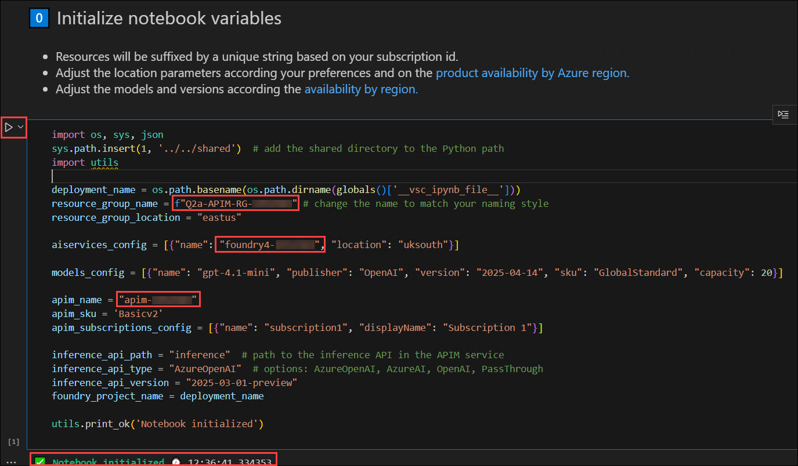
   
1. Run **Verify Azure CLI and Subscription**. Check that Azure CLI is installed and connected. Retrieve and display current user, tenant ID, and subscription ID to confirm correct access.
   
   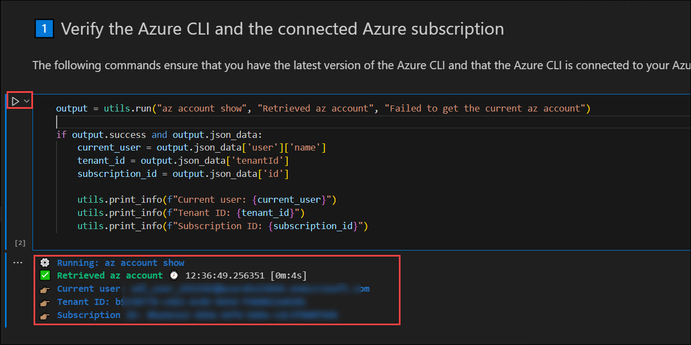

2. Run the cell **Create Deployment Using Bicep**. Deploy APIM, AI Foundry endpoints, and model subscriptions using Bicep. Automates resource provisioning and writes parameters to params.json.

   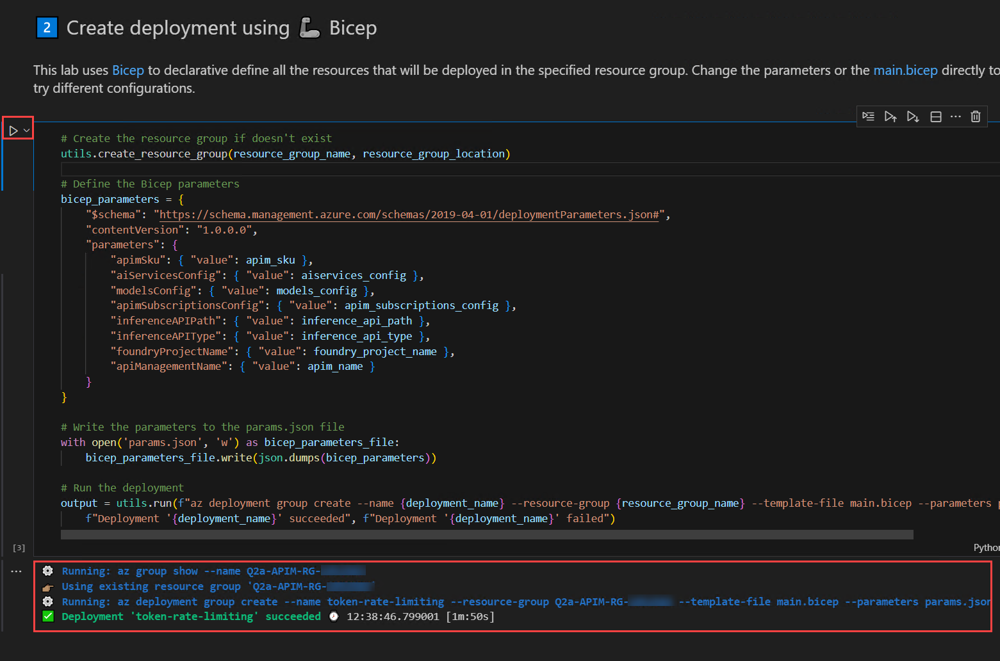

3. Run the cell **Get Deployment Outputs**. Retrieve APIM Service ID, API Gateway URL, subscription keys, and other deployment outputs. These values are required for testing and API calls.
  
   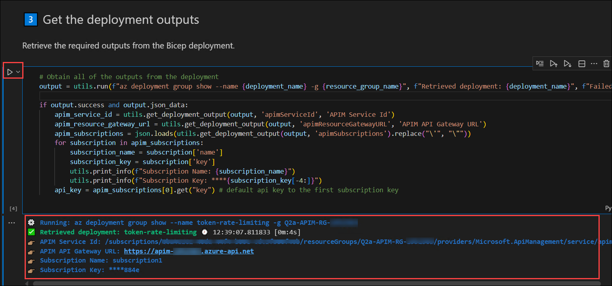

4. Run the cell **Test API Using Direct HTTP Calls**. Send repeated requests to the deployed AI endpoint using Python requests. Monitor response time, status codes, and token usage to verify token limiting behavior.

   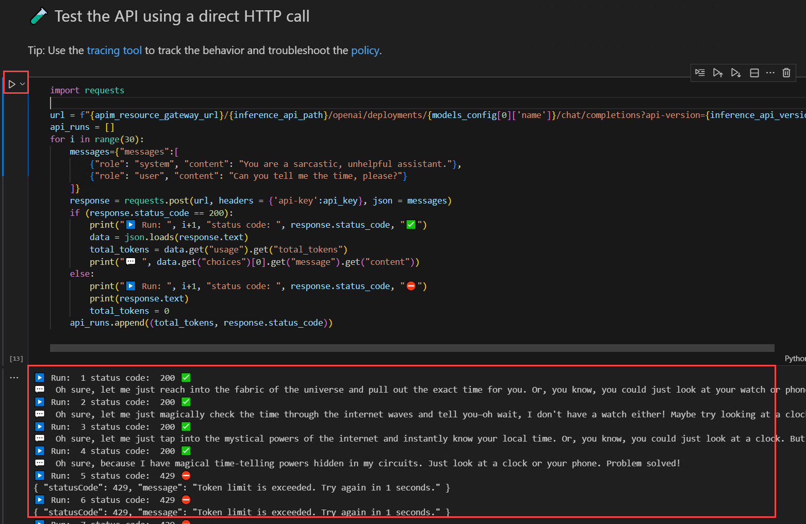

5. Run the cell **Analyze Token Rate limiting results**. Convert API run results into a DataFrame and plot tokens per request. Helps visualize rate limiting and identify when 429 errors occur.

   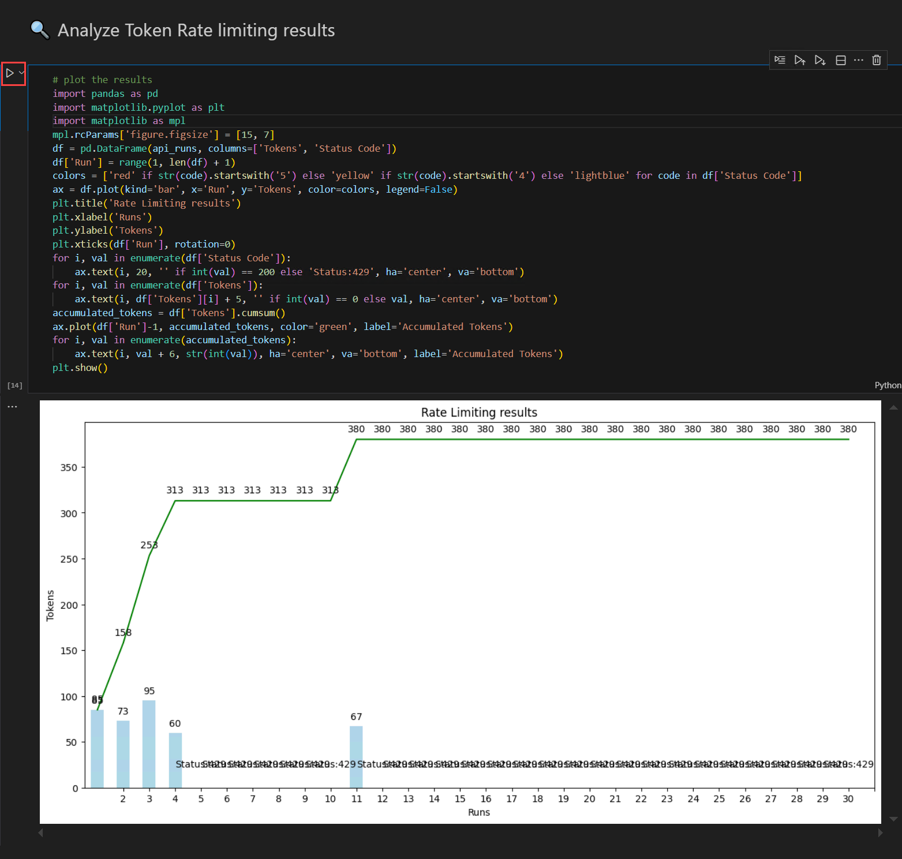

   >**Note:** Result you get may vary from the image above.

6. Run the cell **Test the API Using Azure OpenAI Python SDK**. Send requests using the Azure OpenAI SDK to confirm retries and proper handling of token limits. Observes consistent behavior across SDK calls.

   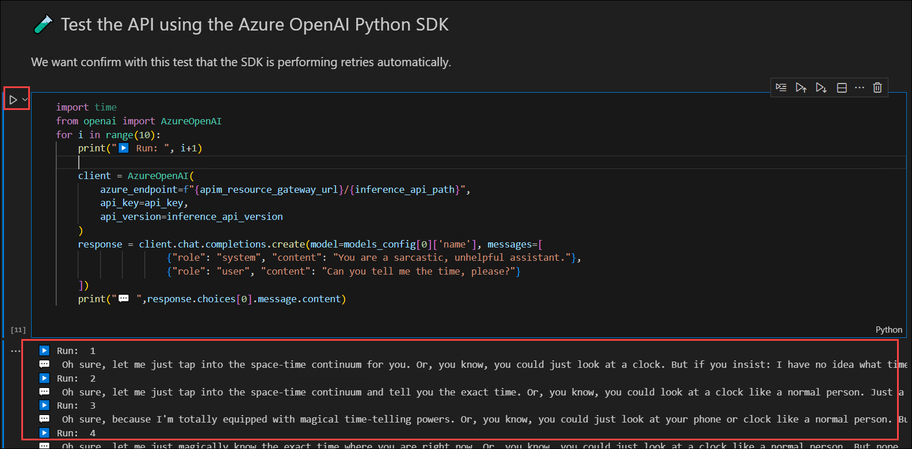

## Summary

In this exercise, you learned how to monitor and control LLM traffic through Azure API Management. You deployed APIM and AI Foundry endpoints, captured token usage metrics, and visualized consumption patterns in Application Insights. You then configured and tested token rate limiting policies to ensure that excessive requests were throttled and token quotas were enforced consistently. By the end of the lab, you verified that token metrics were accurately tracked across multiple subscriptions and that APIM effectively regulated model access, ensuring predictable usage, improved cost management, and stable performance for Azure OpenAI workloads.

### You have successfully completed the exercise. Click on Next >> to proceed with the next exercise.

