# Exercise 3: Exposing MCP Tools via API Management 

### Estimated Duration: 60 Minutes

## Lab Overview

In this exercise, you will learn how to expose Model Context Protocol (MCP) tools and servers through Azure API Management (APIM) to securely integrate AI agents with backend services. MCP allows large language models (LLMs) to interact with external tools and data sources in a structured, governed way. Through this lab, you will explore how to configure API Management as a central gateway for MCP-based communication, enabling features such as rate limiting, OAuth-based authentication, and secure token handling. You’ll also learn how to publish REST APIs as MCP tools, connect AI agents to MCP endpoints, and test end-to-end authorization flows with Microsoft Entra ID. By the end of this exercise, you will understand how to expose, secure, and manage MCP servers and REST APIs using Azure’s enterprise-grade management and security capabilities.

## Lab Objectives

In this exercise, you will be performing the following tasks:

- Task 1: Expose existing MCP Servers in API Management

- Task 2: Publish REST APIs as MCP tools in API Management

- Task 3: Implement client authorization and secure access for MCP servers


## Task 1: Expose existing MCP Servers in API Management

In this task, you will expose existing MCP (Model Context Protocol) servers through Azure API Management (APIM). You’ll learn how to deploy and validate the full MCP architecture, securely connect AI agents with backend services (such as ServiceNow, GitHub Issues, and Weather APIs), and test the integration using tools like MCP Inspector. You will also execute multiple AI agents via APIM to confirm secure and unified communication using OAuth 2.0 and token validation policies.

1. In Visual Studio Code, open the **lab (1)** folder, expand the **model-context-protocol (2)** folder, and click **model-context-protocol.ipynb (3)**.

    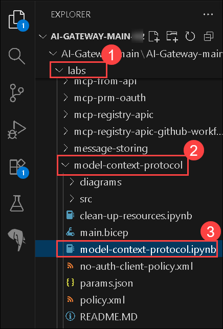

1. Once the notebook opens, take a moment to review its structure and descriptions to understand the workflow, initialization, resource deployment, server build, and validation.

1. Scroll down to **Initialize notebook variables** and enter the following details:

   - resource_group_name: **Q2a-APIM-RG-<inject key="DeploymentID" enableCopy="false"/>**

    - aiservices_config: **foundry1-<inject key="DeploymentID" enableCopy="false"/>**

   - apim_name: **apim-<inject key="DeploymentID" enableCopy="false"/>**

        >**Note:** Ensure that the correct name is entered in the respective section.

1. **Run** the cell **Initialize notebook variables**. This step initializes environment variables used for the entire deployment. It defines resource group names, Azure region, container registry, deployment identifiers, AI Foundry configuration, and APIM settings.

    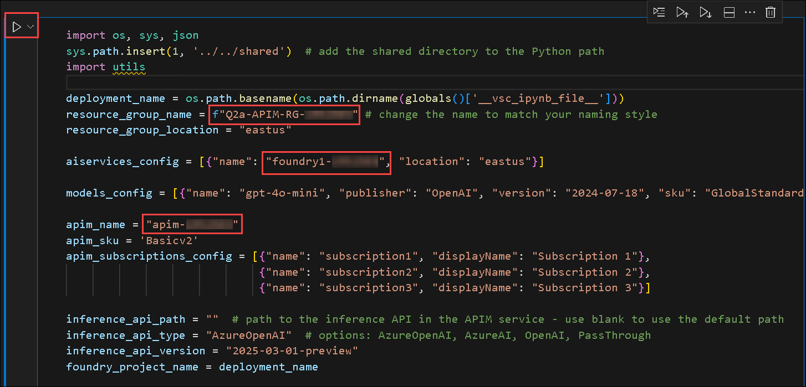

    .png)

1. Next, **run** the cell that installs or updates the Azure AI Projects package and the Agent Framework library.

    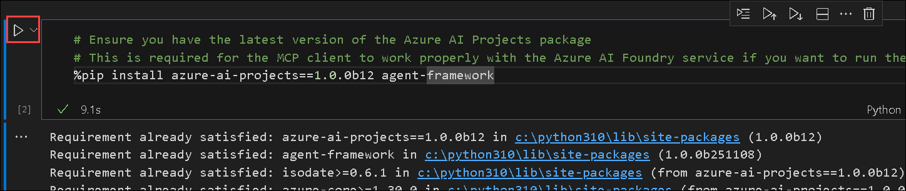

1. Scroll down to **Verify the Azure CLI and the connected Azure subscription** and **Run** the cell. This command verifies that the Azure CLI is installed and authenticated to the correct subscription. It retrieves your User Email, Tenant ID, and Subscription ID to confirm that you’re working in the intended Azure environment.

    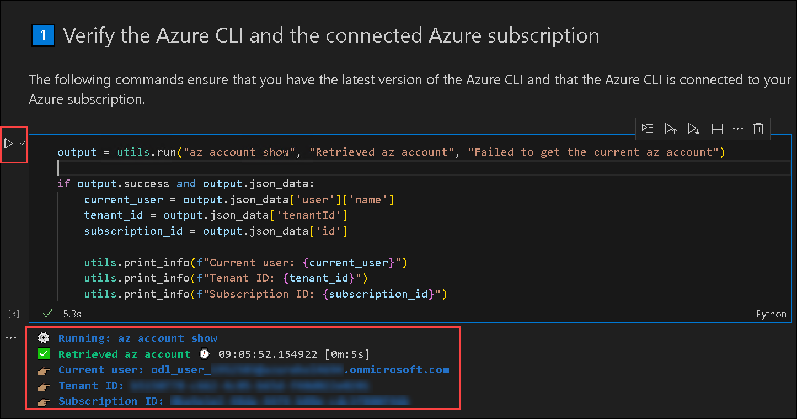

1. Next, scroll to **Create deployment using 🦾 Bicep** and **Run** the cell to deploy all the resources required for the MCP setup.

    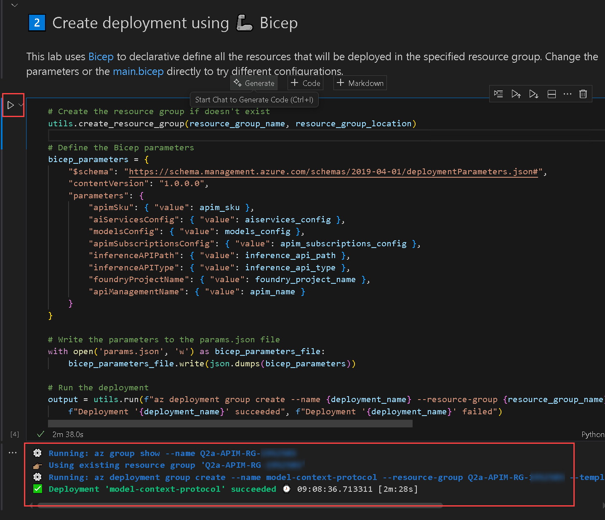

    >**Note:** If the deployment does not succeed, please rerun the cell.

1. After the Bicep deployment completes, scroll down to **Get the deployment outputs** and **Run** the cell.

    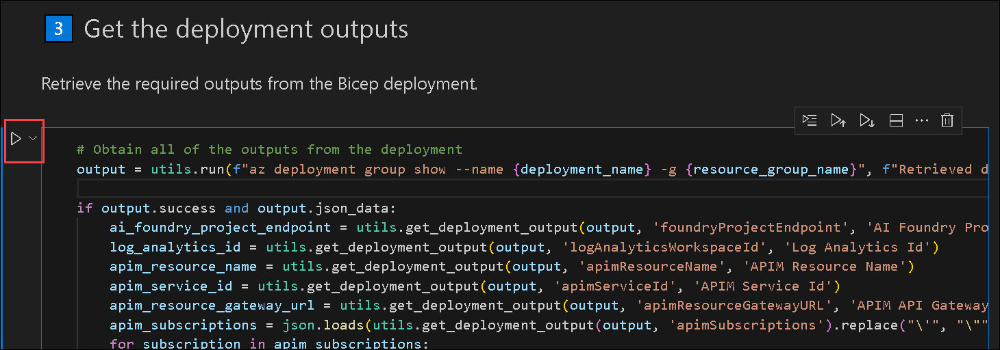

    .png)

1. Next, scroll down to **Build and deploy the MCP Servers** and **Run** the cell. This step compiles and publishes multiple MCP servers (for example, Weather, Oncall, and GitHub Issues) using your Azure Container Registry.

    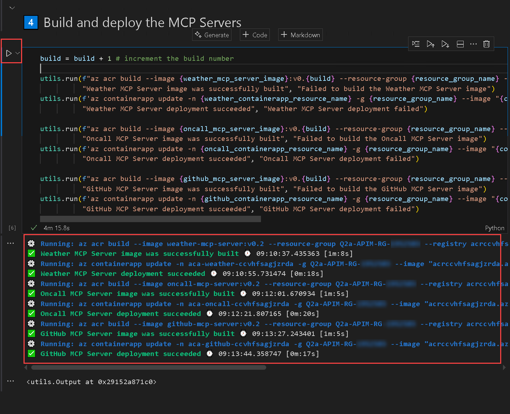

1. Next, scroll down to **Test the connection to the MCP servers and List Tools** and **Run** the cell.

    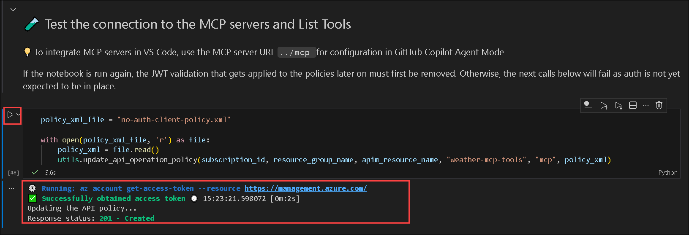

1. Now, **Run** the next cell in row.

    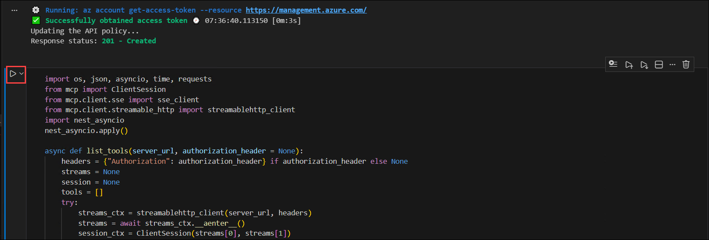

    .png)

1. Now we will try to Use the **MCP Inspector** for testing and debugging the MCP Servers. 

    .png)

1. From the Start menu search bar, search for **PowerShell (1)**, then right-click on **Windows PowerShell (2)** and select **Run as administrator (3)**.

    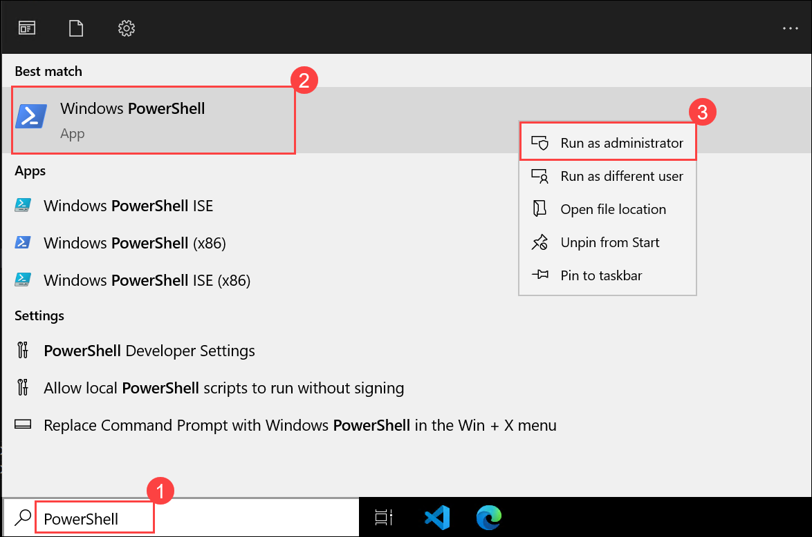

1. Run the command below **(1)** in PowerShell. When prompted to install the required package, type `y` **(2)** and press **Enter** to proceed.

    ```
    npx @modelcontextprotocol/inspector
    ```

    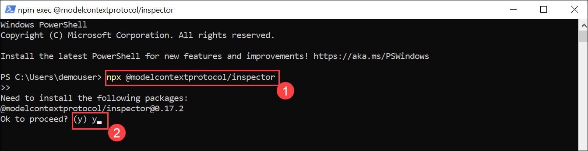

1. A new browser tab will automatically open, directing you to the **MCP Inspector**.

    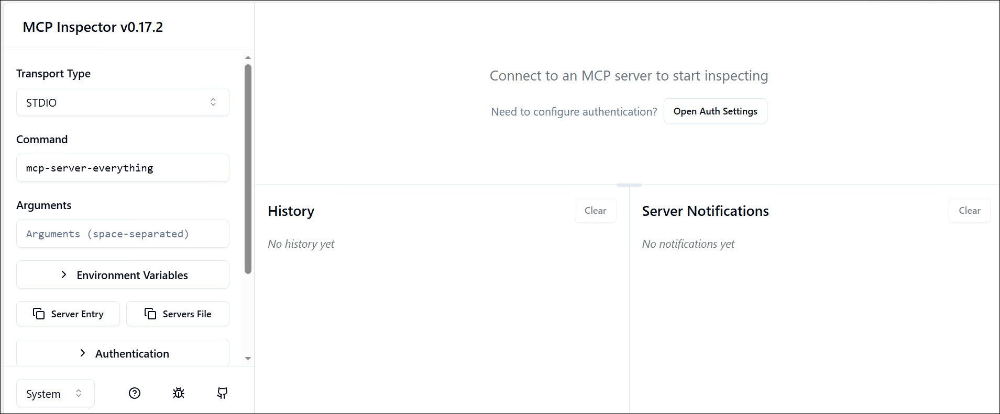

1. Now, go to resource group **Q2a-APIM-RG-<inject key="DeploymentID" enableCopy="false"/>** and then select the resource **apim-<inject key="DeploymentID" enableCopy="false"/>**.

    .png)

1. Within the API Management resource, select **MCP Servers (preview) (1)** from the left navigation pane under **APIs**, and then use the **Copy to clipboard (2)** icon to copy the Server URL of **weather-mcp-tools**.

    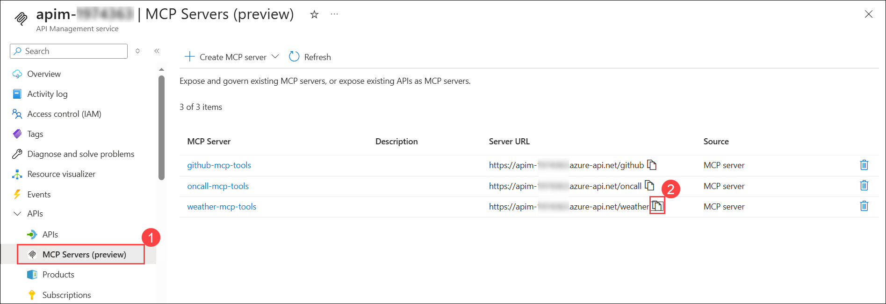

1. Go back to the MCP Inspector tab, and enter the following information:

    - Transport Type: **Streamable HTTP (1)**
    - URL: Paste the **Server URL (2)** you copied in the previous step.
    - Click on **Connect (3)**.

        

1. Once connected, click on the **Tools (1)** tab, and then click on **List Tools (2)**. 

    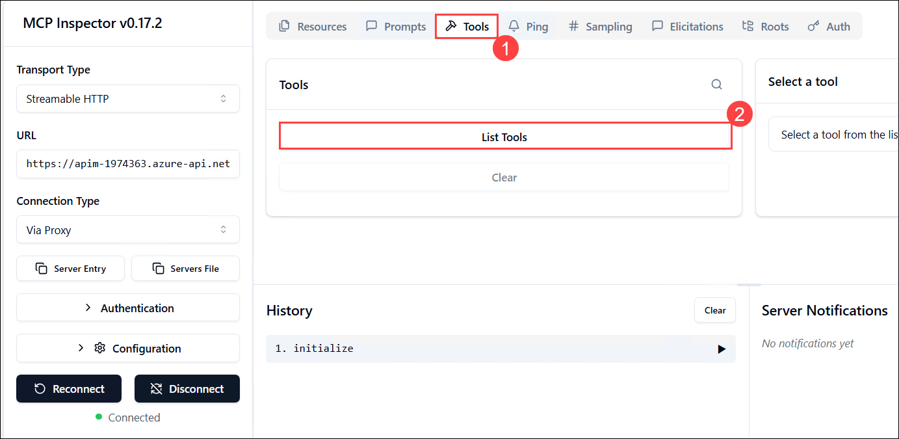

1. Select the **get_weather (1)** tool, in the city field enter **London (2)**.

    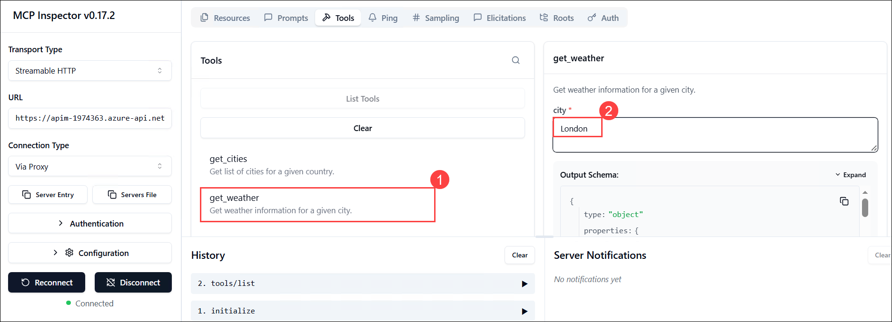

1. Scroll down, click **Run Tool (1)**, and review the resulting output **(2)**.

    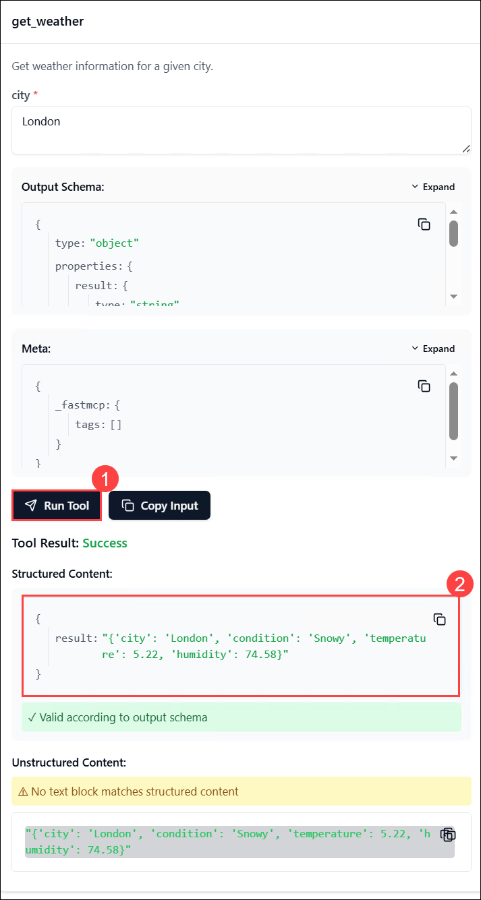

1. Now, go back to the VS Code and scroll to **Run an OpenAI compeletion with MCP tools** cell and click on **Run**.

    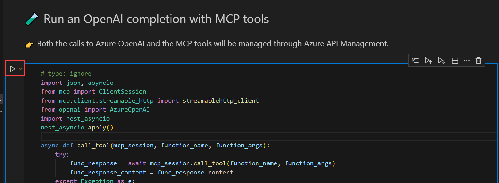

    .png)

1. Scroll down to **Execute an Agent Framework Agent using MCP Tools via Azure API Management** cell and click on **Run**.

    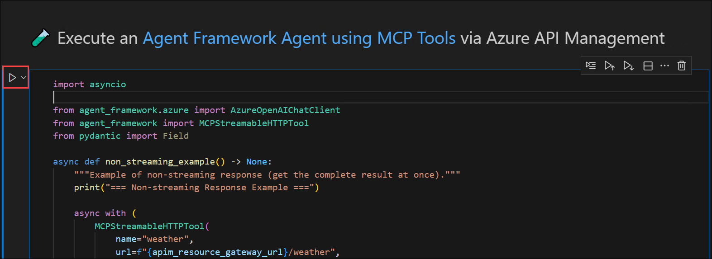

    .png)

1. Scroll down to **Execute an Azure Al Foundry Agent using MCP Tools via Azure API Management** cell and click on **Run**.

    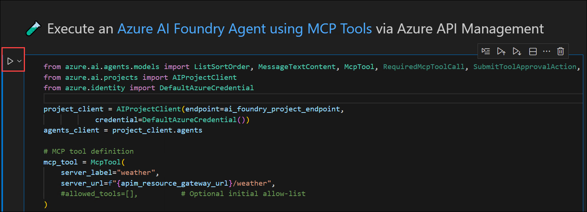

    .png)

1. Scroll down to **Execute a Semantic Kernel Agent using MCP Tools via Azure API Management** cell and click on **Run**.

    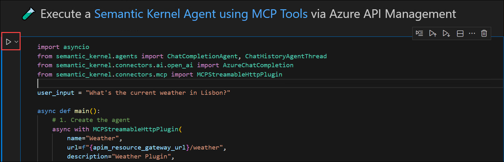

    .png)

1. **Run** the cell **Execute an AutoGen Agent using MCP Tools via Azure API Management**.

    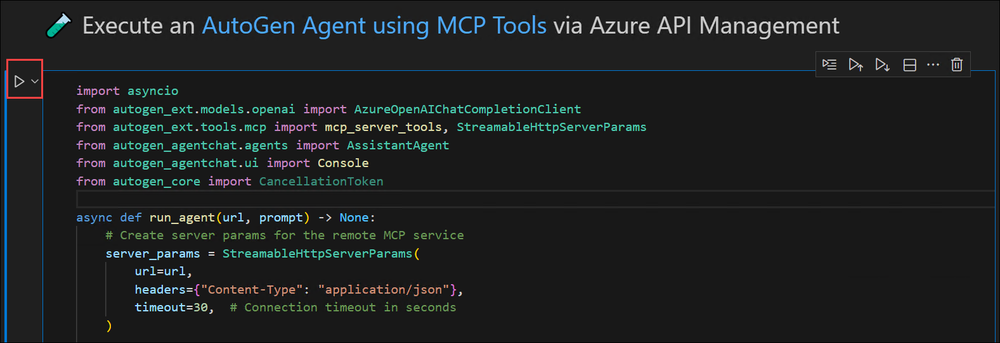

    .png)


> **Congratulations** on completing the task! Now, it's time to validate it. Here are the steps:
> - If you receive a success message, you can proceed to the next task.
> - If not, carefully read the error message and retry the step, following the instructions in the lab guide. 
> - If you need any assistance, please contact us at cloudlabs-support@spektrasystems.com. We are available 24/7 to help you out.

<validation step="4b7af6d6-842d-472b-9f39-0ec7dca00a2a" />

## Task 2: Publish REST APIs as MCP tools in API Management

In this task, you will deploy and test the Model Context Protocol (MCP) using Azure API Management (APIM). You will initialize environment variables, deploy the required infrastructure using Bicep, and verify MCP server connectivity using Python SDK commands.

1. In Visual Studio Code, expand the **lab (1)** folder, then select **mcp-from-api (2)**, and click **mcp-from-api.ipynb (3)** to open the notebook.

    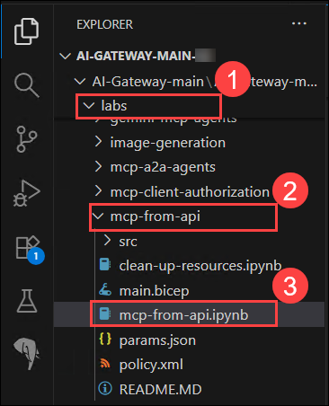

1. Once the notebook opens, review all the sections and their descriptions. The notebook is divided into initialization, deployment, and verification steps that guide you through the process of configuring an MCP-enabled API gateway.

1. Scroll down to **Initialize notebook variables** and enter the following details:

   - resource_group_name: **Q2a-APIM-RG-<inject key="DeploymentID" enableCopy="false"/>**

   - aiservices_config: **foundry4-<inject key="DeploymentID" enableCopy="false"/>**

   - apim_name: **apim-<inject key="DeploymentID" enableCopy="false"/>**

        >**Note:** Ensure that the correct name is entered in the respective section.

1. **Run** the cell **Initialize notebook variables** to set up environment variables. This step defines your resource names, Azure region, and other configuration details required for consistent and automated deployment across subscriptions.

    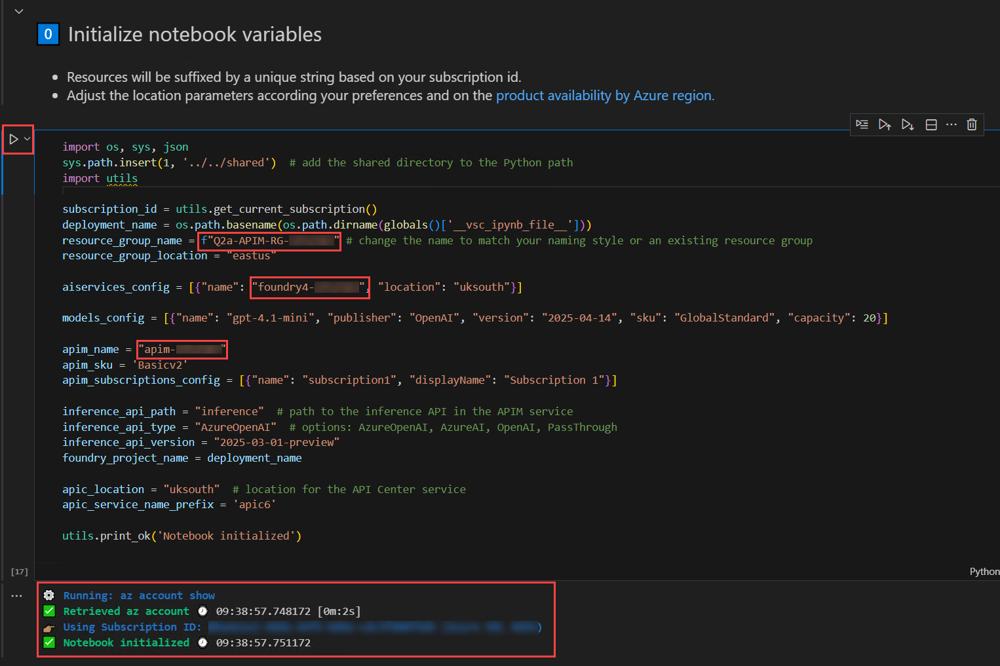

1. Next, scroll down to **Create deployment using 🦾 Bicep** and **Run** the cell to deploy all required Azure resources. The Bicep template provisions services like Azure API Management, Azure OpenAI, and related components needed for the MCP setup. Wait for the deployment process to complete successfully. The cell output will show status messages confirming that the resource group, API Management instance, and supporting components were created.

    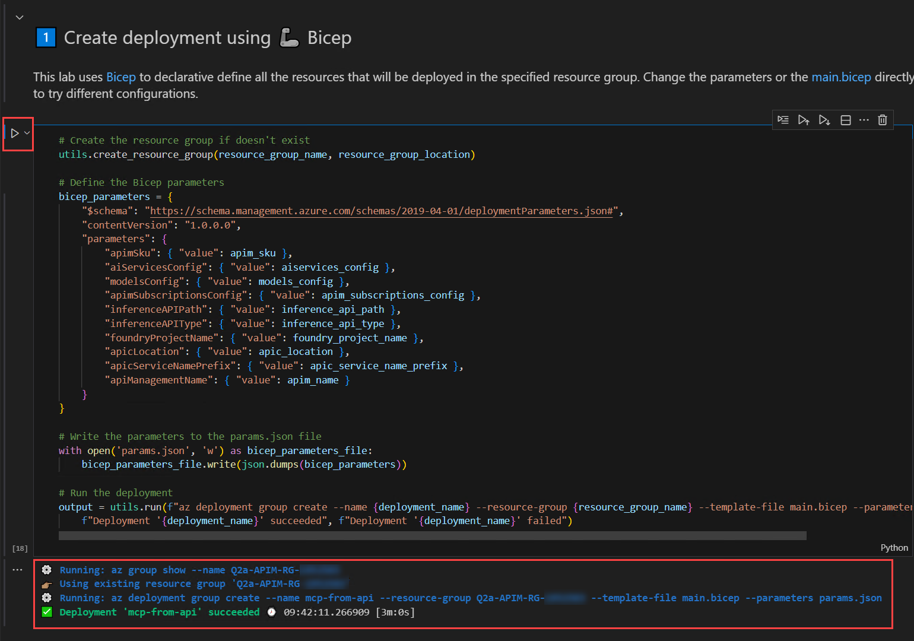

1. Next, scroll to **Get the deployment outputs** and **Run** the cell to retrieve key configuration details such as the Log Analytics Workspace ID, APIM URL, and MCP endpoint. These outputs will be used later to connect and test your MCP-enabled service.

    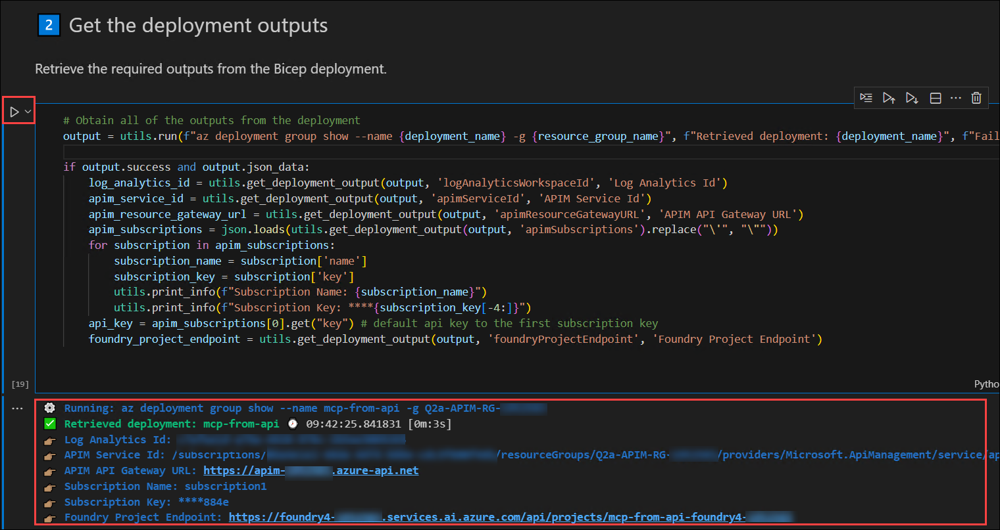

1. Next, scroll to the **Test the connection to the MCP servers and List Tools** section and **Run** the cell to test your MCP setup. This command initiates a connection to the deployed MCP servers, validates network communication, and retrieves a list of available tools that your MCP service exposes. If the connection test is successful, the output will display the list of MCP tools, confirming that the API Management instance has been successfully transformed into an MCP-compatible service endpoint.

    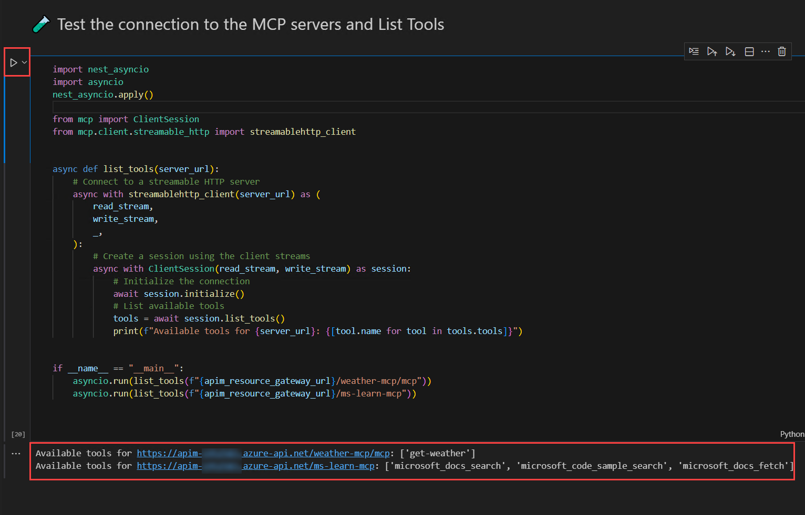

1. Next, scroll down to **Execute an Azure AI Foundry Agent using MCP Tools** and **Run** the cell to demonstrate how an Azure AI Agent can use MCP tools published via API Management. This step sets up an asynchronous connection between Azure OpenAI, MCPServerStreamableHttp, and the deployed MCP endpoints, allowing the AI Agent to invoke tools exposed through APIM. You can observe the agent interacting with MCP tools, retrieving data, or performing operations through the configured MCP service.

    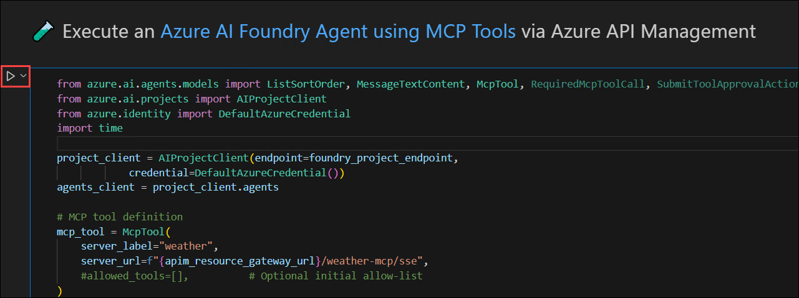

    .png)

    >**Note:** If you run into an error, open the **mcp-from-api (1)** folder, right-click the generated **params.json (2)** file and click on **Delete (3)**. Then click on **Restart (4)** and rerun the notebook from the beginning.

     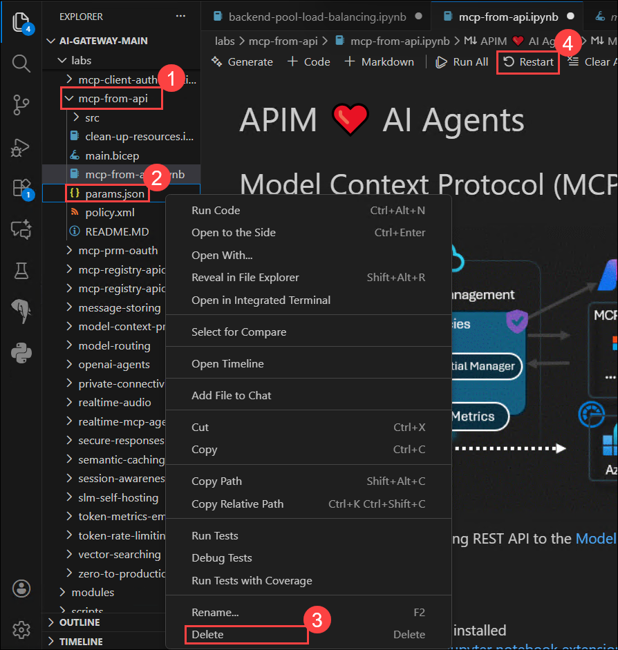

1. Next, scroll down to **Test the rate limit on Microsoft Learn MCP pass-through** and **Run** the cell to verify that rate-limiting policies applied in API Management are functioning correctly. This test sends multiple requests through the APIM-managed MCP endpoint to ensure that requests exceeding the defined threshold are properly throttled. You’ll notice that after a certain number of requests, the API Management service returns a `429` "Too Many Requests response", confirming that the rate-limit policy is working as expected.

    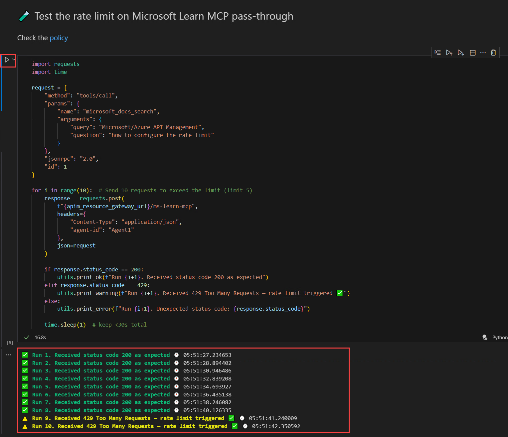

1. Next, scroll down to **Test the Product Catalog MCP Authorization WITHOUT a valid token** and **Run** the cell. This test attempts to call the Product Catalog MCP endpoint without authorization headers, simulating an unauthenticated client request. You should observe a 401 Unauthorized response, verifying that the security policy in policy.xml correctly blocks requests lacking valid tokens.

    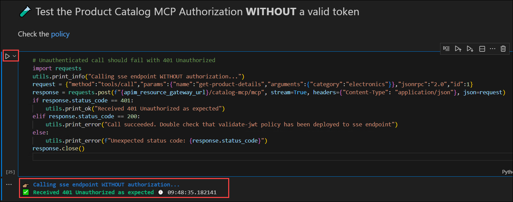

1. Next, scroll down to **Test the Product Catalog MCP Authorization WITH a valid token** and **Run** the cell. This test sends a request to the same Product Catalog MCP endpoint, but this time includes a valid authorization token in the request headers. The request should succeed, returning a valid response from the backend service (e.g., product information). This demonstrates that the authorization policy is functioning correctly, allowing only authenticated users to access MCP-protected APIs.

    

1. Next, scroll down to **Test the Place Order MCP Authorization WITH a valid token** and **Run** the cell to verify authenticated access to the order placement MCP endpoint. This step sends a valid, authorized request to the Place Order MCP API via API Management. The request includes a valid bearer token in the headers, ensuring that only authenticated users can perform order operations.

    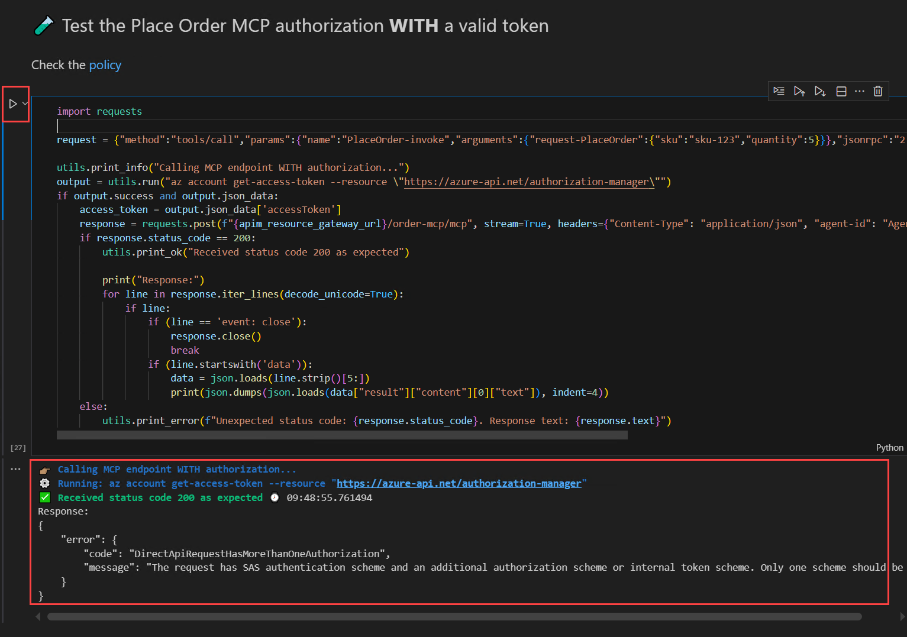

> **Congratulations** on completing the task! Now, it's time to validate it. Here are the steps:
> - If you receive a success message, you can proceed to the next task.
> - If not, carefully read the error message and retry the step, following the instructions in the lab guide. 
> - If you need any assistance, please contact us at cloudlabs-support@spektrasystems.com. We are available 24/7 to help you out.

<validation step="801278ec-d303-4427-912c-b81dc6edf5c8" />

## Task 3: Implement client authorization and secure access for MCP servers

In this lab, you will configure and test the Model Context Protocol (MCP) client authorization flow using Azure API Management and Microsoft Entra ID (Azure AD).

1. In Visual Studio Code, expand the **lab (1)** folder, then select **mcp-client-authorization (2)**, and click **mcp-client-authorization.ipynb (3)** to open it.

    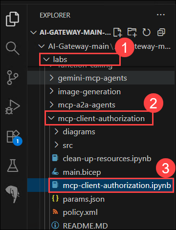

1. Once the notebook is open, review all the sections to understand the flow of the lab. The notebook is divided into sequential sections that include initialization, app registration, deployment, and testing.

1. Scroll down to **Initialize notebook variables** and enter the following details:

   - resource_group_name: **Q2a-APIM-RG-<inject key="DeploymentID" enableCopy="false"/>**

   - apim_name: **apim-<inject key="DeploymentID" enableCopy="false"/>**

   - app_registration name: **mcp-app-registration-<inject key="DeploymentID" enableCopy="false"/>**

        >**Note:** Ensure that the correct name is entered in the respective section.

1. **Run** the cell **Initialize notebook variables**. This step initializes the core environment variables for your deployment, including the resource group name, deployment identifiers, subscription details, and Azure region configuration.

    .png)

1. After initializing the variables, scroll to **Verify the Azure CLI and the connected Azure subscription** and **Run** the cell. This cell ensures that the Azure CLI is installed and that you are signed into the correct subscription. It retrieves and displays your current user account, tenant ID, and subscription ID to verify that you are working within the intended Azure environment. Seeing these values confirms that your local setup is correctly authenticated and ready for the deployment phase.

    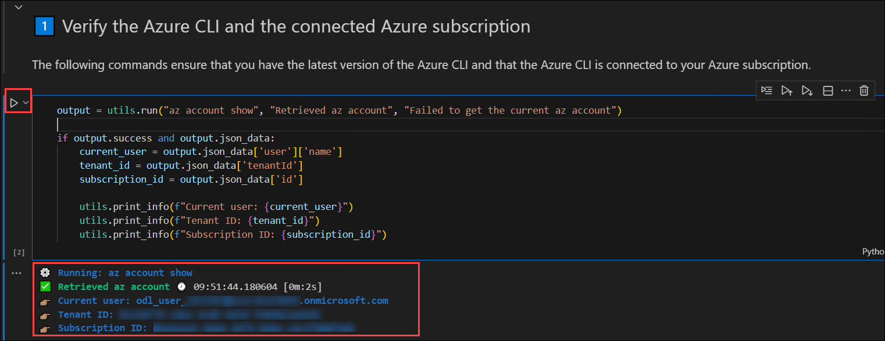

1. Next, scroll down to **Create the App Registration in Microsoft Entra ID** and **run** the cell to automatically create an app registration.

    .png)

1. Next, scroll to **Create deployment using 🦾 Bicep** and click **Run**. This command triggers the deployment of the infrastructure defined in your main.bicep template. During this step, a new resource group will be created if one does not already exist. The script then defines all required parameters dynamically and deploys key Azure services such as Azure API Management, Log Analytics, and supporting resources required for the MCP client authorization lab. Wait for this cell to complete before proceeding, as this deployment forms the foundation of your environment.

    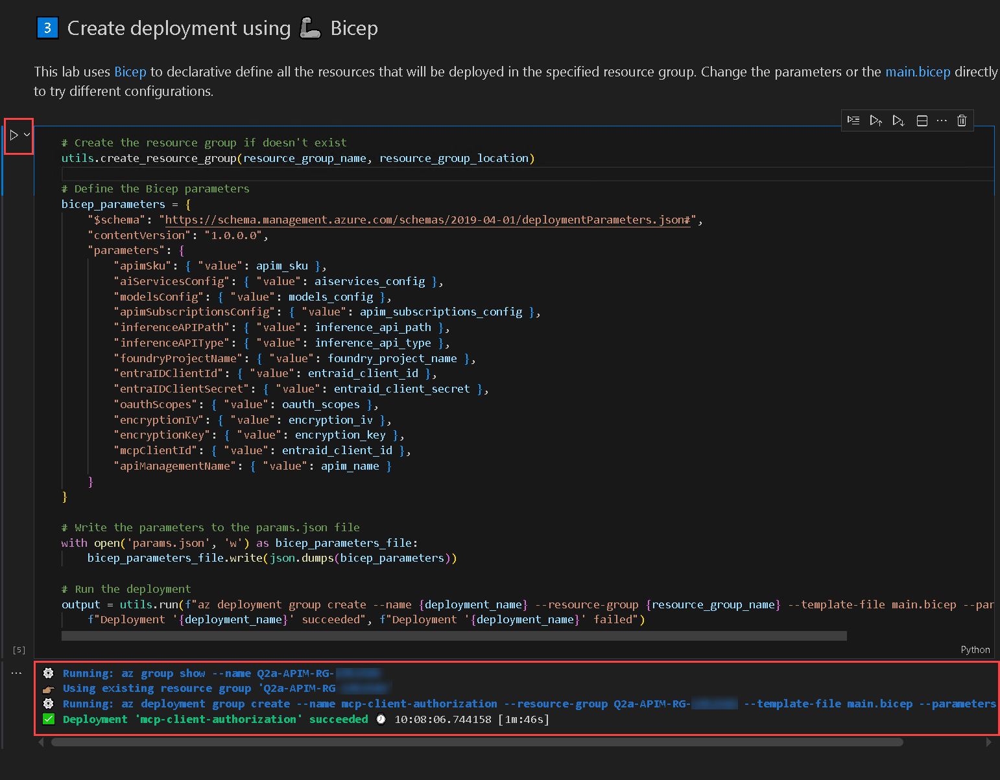

1. Once the deployment is complete, scroll down to **Get the deployment outputs** and **run** the cell. This step retrieves all important configuration details from your Bicep deployment, including the APIM Gateway URL, Client Authorization Endpoint, Log Analytics Workspace ID, and any relevant identifiers or secrets.

    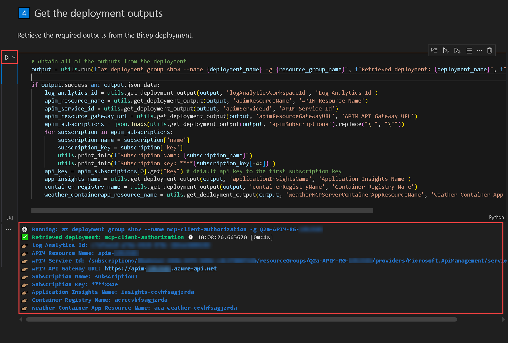

1. Next, scroll down to **Update the App Registration with the Redirect URI from APIM** and **Run** the cell to apply the required changes to the Microsoft Entra (Azure AD) app you created earlier.

    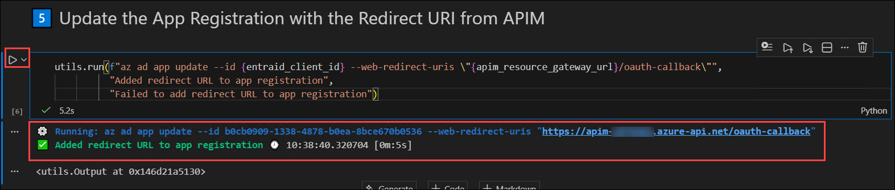

1. Now, scroll down to **Test the authorization WITHOUT a valid token** and **Run** the cell.

    .png)

> **Congratulations** on completing the task! Now, it's time to validate it. Here are the steps:
> - If you receive a success message, you can proceed to the next task.
> - If not, carefully read the error message and retry the step, following the instructions in the lab guide. 
> - If you need any assistance, please contact us at cloudlabs-support@spektrasystems.com. We are available 24/7 to help you out.

<validation step="854a01ef-200d-4ac7-a683-3af83e3d6e3b" />

## Summary

In this exercise, you implemented a complete workflow for managing and securing Model Context Protocol (MCP) integrations using Azure API Management (APIM). You began by deploying MCP servers and testing their connectivity through APIM, gaining insight into how AI agents can interact with backend systems such as GitHub, ServiceNow, and weather APIs. Next, you published REST APIs as MCP tools, enabling LLMs to discover and invoke them through the standardized MCP interface. Finally, you configured client authorization using Microsoft Entra ID (Azure AD) to ensure that only authenticated clients could access protected MCP endpoints. Throughout the lab, you validated your setup using real API calls, OAuth flows, and rate-limiting policies.

### You have successfully completed the exercise. Click on Next >> to proceed with the next exercise.


