# Exercise 4: Semantic Caching for Performance Optimization 

## Lab Overview 

This exercise focuses on implementing semantic caching to improve the performance of applications that use Azure OpenAI. Unlike traditional caching that matches exact text, semantic caching works based on meaning, reducing latency and token usage while delivering faster AI responses.


### Task 1: Understand semantic caching principles. 

In this task, you will learn how semantic caching enhances AI performance by comparing the meaning of prompts using embeddings. When two prompts have similar meanings, the cached response is reused instead of sending a new request to the model. This process significantly speeds up responses and lowers API usage costs

### Introduction

Semantic caching is an advanced caching technique that improves the performance and efficiency of large language model (LLM) applications, such as those using Azure OpenAI.
Unlike traditional caching, which matches requests based on exact text or URLs, semantic caching uses meaning (semantics) to identify whether two queries are similar enough to reuse a previous response.

This approach enables faster responses, lower latency, and reduced token consumption by avoiding redundant calls to the backend Azure OpenAI service.

### How Semantic Caching Works

- When a user submits a prompt to an AI service, the system:

   - Generates a vector embedding of the input text using an embedding model (for example, text-embedding-ada-002).

   - Compares this embedding with vectors from previously cached requests.

      1. If the new prompt is semantically similar (based on a similarity score threshold) to a cached one, the cached response is returned.

      2. If not, the request is sent to the OpenAI model, and the new response is stored in the cache for future use.

- This technique ensures that responses for similar or repeated questions can be served instantly from the cache without reprocessing the entire request.

### Key Concepts

   | **Concept**                         | **Description**                               |
   | ----------------------------------- | --------------------------------------- |
   | Semantic Similarity                 | Measures how close two pieces of text are in meaning using vector embeddings.                  |
   | Embedding                           | A numerical vector representation of text that captures its semantic meaning.                  |
   | Similarity Threshold                | A configurable value (e.g., 0.9) determining how similar two inputs must be for a cache hit.   |
   | Cache Lookup                        | The process of searching for semantically similar previous prompts before calling the AI model.|
   | Cache Store                         | Saving the new prompt and its response to the cache for future reuse. |


### Benefits of Semantic Caching

- Reduces latency: Cached responses are returned almost instantly.

- Lowers token costs: Avoids unnecessary calls to Azure OpenAI models.

- Improves scalability: Decreases backend workload and bandwidth usage.

- Enhances user experience: Provides consistent and faster AI responses.


### Example Scenario

1. If one user asks:

   ```
   What is Azure Cognitive Search?
   ```

2. And another later asks:

   ```
   Can you explain what Azure Cognitive Search does?
   ```
   
Although the two prompts are worded differently, semantic caching identifies them as semantically similar and retrieves the earlier cached response — saving time and tokens.


## Task 2: Configure semantic caching in the AI Gateway environment. 

In this task, you will configure and test semantic caching within the AI Gateway using Visual Studio Code. You will initialize environment variables, deploy necessary resources using Bicep, and execute Python SDK calls to observe cache behavior. By analyzing Redis metrics, you will confirm performance gains through reduced response times and increased cache hits.

1. In Visual Studio Code, from the left navigation pane,  expand **lab (1)** folder and **semantic-caching (2)**, and finally click on **semantic-caching.ipynb (3)**.

    

1. Once you’re in the **semantic-caching.ipynb** file, take a moment to review each session and read its description.

1. Go to 0️⃣ Initialize notebook variables and click on **Run**. This step sets up environment variables for the deployment, including the resource group name, region, AI Foundry configuration, OpenAI model details, Redis cache SKU, and API Management parameters. These variables ensure consistent and automated deployments across regions and subscriptions.

    

1. Once you execute the cell **Initialize notebook variables**, you should see the output displayed as shown in the screenshot.

    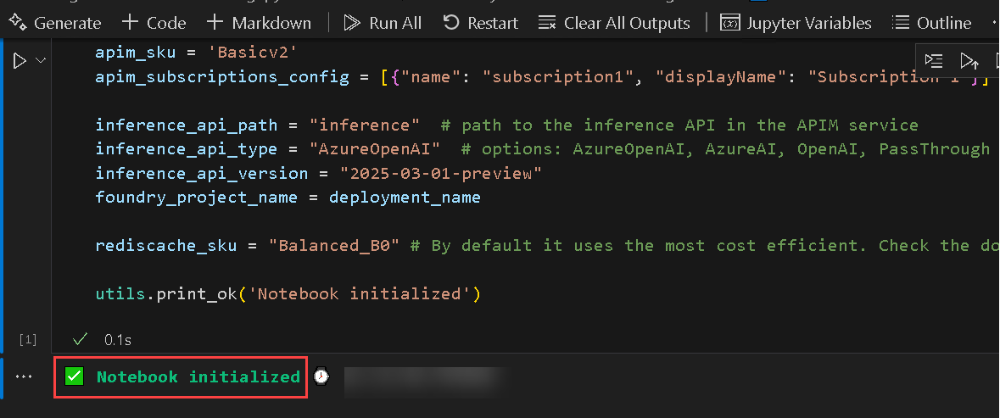

1. Next, Run **1️⃣ Verify the Azure CLI and the connected Azure subscription**. This cell checks that the Azure CLI is properly installed and signed in to your Azure subscription. It retrieves details like the current user, tenant ID, and subscription ID to confirm the correct environment before proceeding with resource creation.

   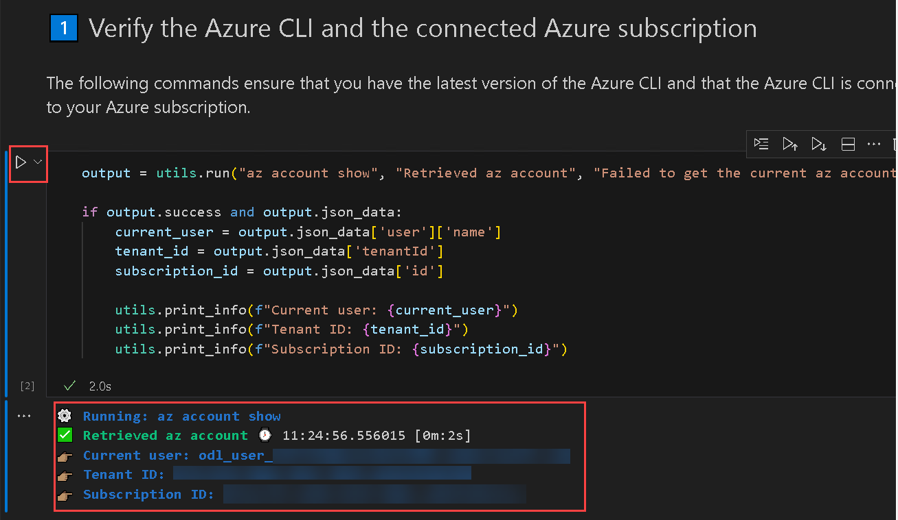

1. Run **2️⃣ Create deployment using 🦾 Bicep**. Here, the Bicep template automatically deploys all required resources including APIM, Azure OpenAI models, and Managed Redis Cache into the resource group. The parameters are dynamically generated and written to a JSON file before executing the deployment command.

    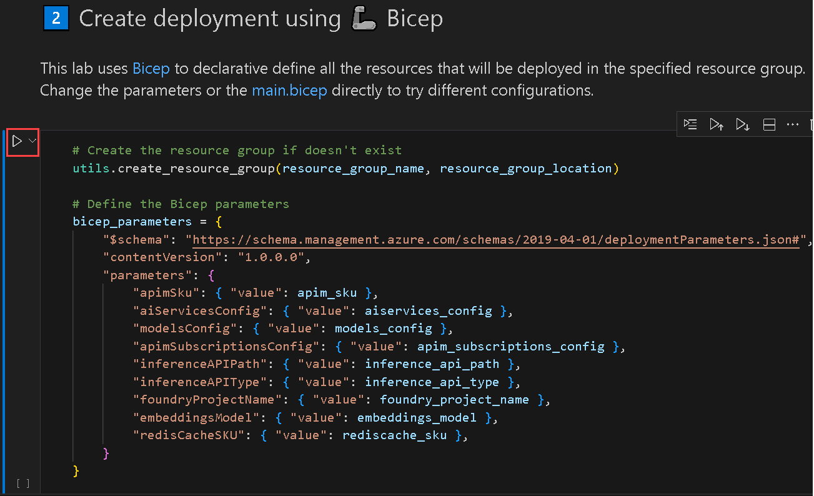

    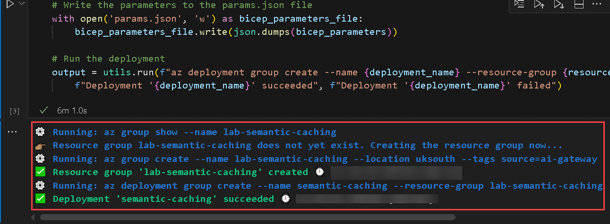

1. Run **3️⃣ Get the deployment outputs**. After deployment, the script retrieves and displays key outputs such as the APIM Gateway URL, subscription keys, and Redis connection information. These details are required for connecting to the API endpoint and managing cache operations in the next steps.
    
    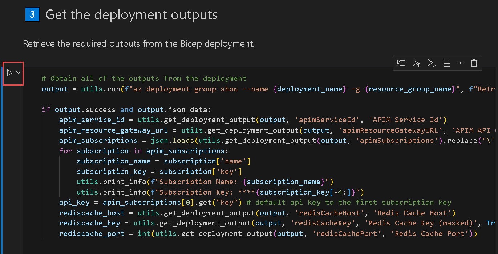

    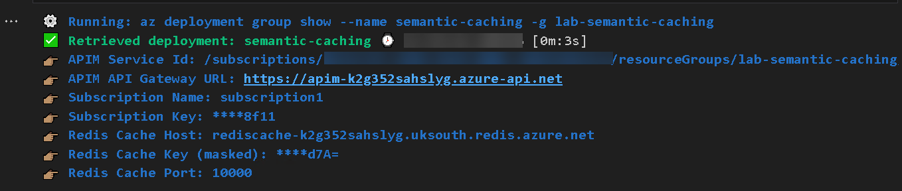

1. Run **🧪 Make multiple calls using the Azure OpenAI Python SDK**. This section sends multiple requests with semantically similar prompts (e.g., different ways of asking about coffee making) to test caching behavior. The first call is slower since it reaches the backend model, while subsequent ones are faster as they are served from the cache.

   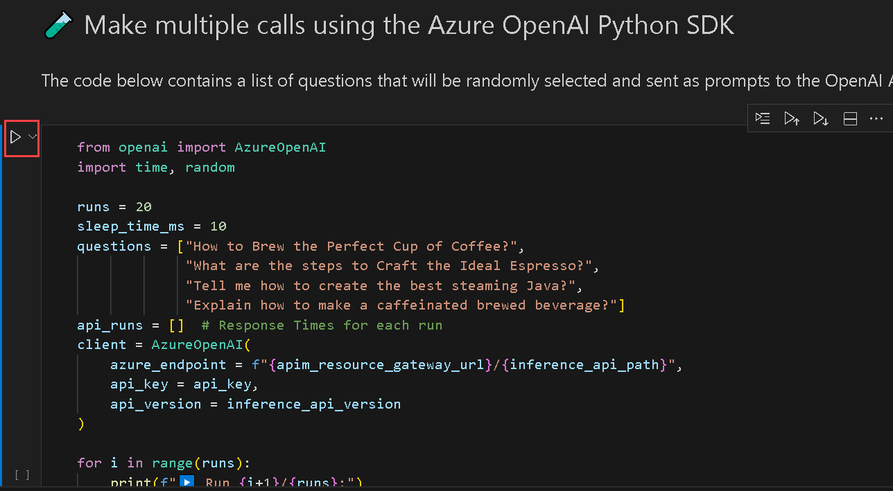

   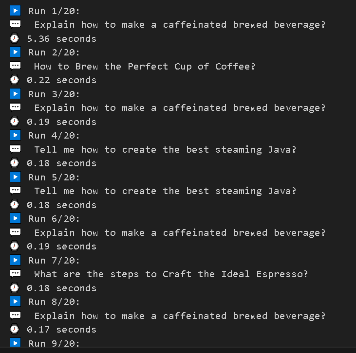

1. Run **🔍 Analyze Semantic Caching performance**. Response times from the multiple API calls are plotted on a bar graph to visualize caching efficiency. You’ll notice reduced latency after the first call, showing that semantic caching successfully retrieves results from the cache instead of querying the backend repeatedly

   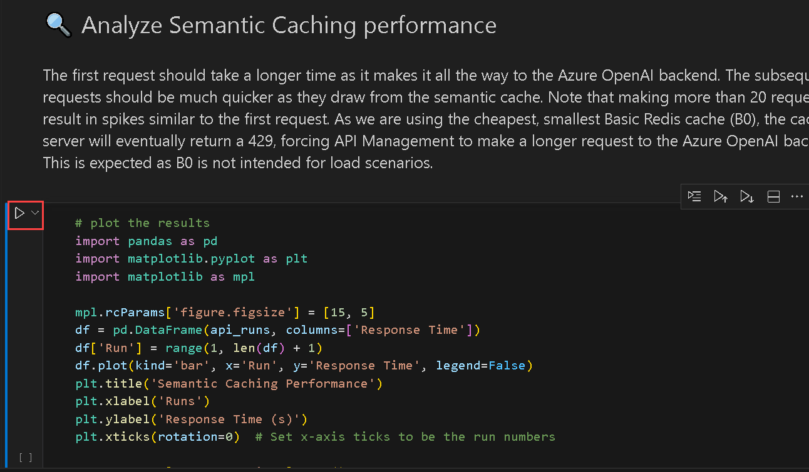

   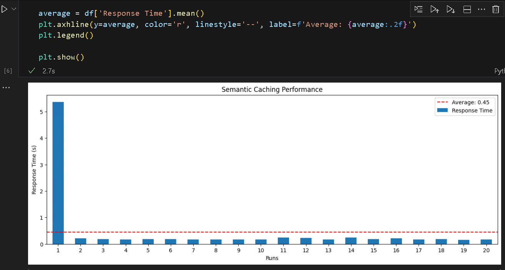

1. Run **🔍 Show Redis Cache information**. This part connects to the Redis cache and displays key metrics like cache hits, misses, and evictions. A higher number of cache hits indicates effective reuse of responses, confirming that semantic caching is optimizing API performance.

    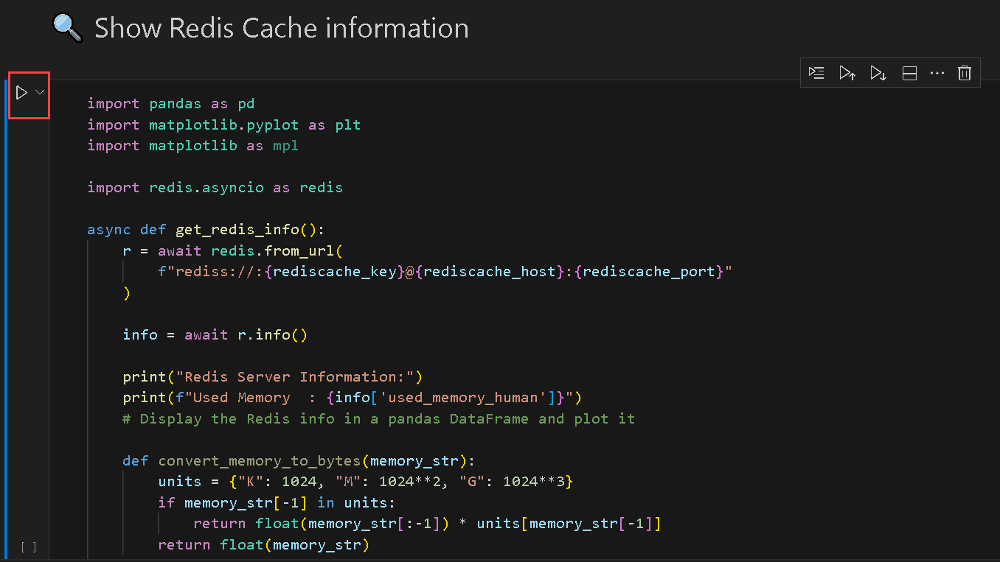.

   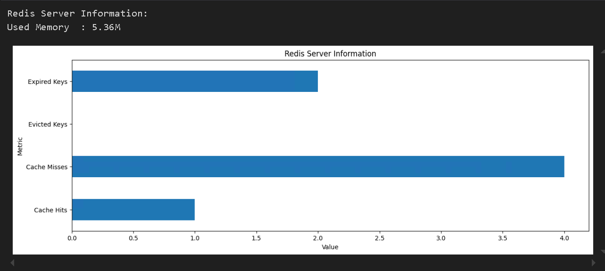

## Summary 

In this exercise, you explored how semantic caching improves response efficiency by reusing results for similar prompts. By implementing it in the AI Gateway, you achieved faster responses, reduced costs, and a more scalable Azure OpenAI solution.
