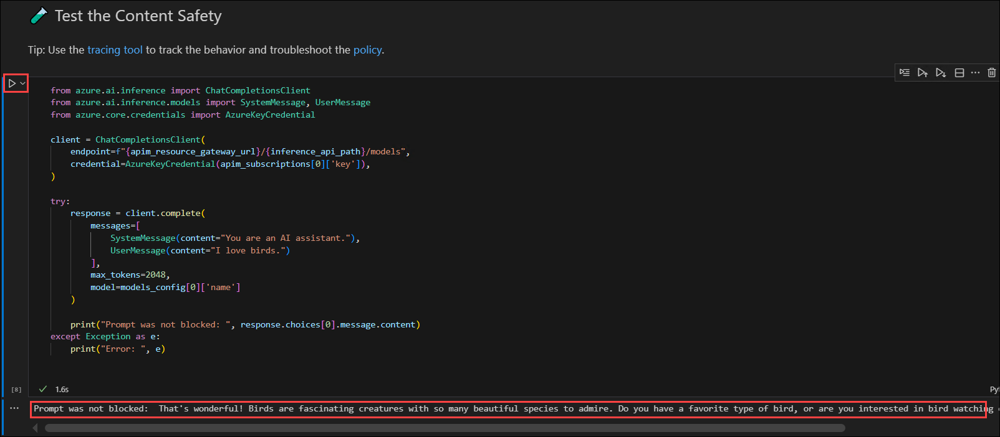

# Exercise 5: Content Safety & Filtering 

Objective: Implement content safety measures to screen user inputs and AI outputs, ensuring compliance and safe interactions. 

## Task 1: Review content safety capabilities and configuration in AI Foundry

> **Azure AI Content Safety detects** harmful user-generated and AI-generated content in applications and services. The features in Azure AI Content Safety can help make sure that product reviews, forum posts, and images align with Contoso Camping Store's content guidelines.

   - Azure AI Content Safety offers a suite of features for monitoring and moderating content in real time:

       - **Text moderation:** Detects and filters out harmful content in text, such as hate speech, violence, or inappropriate language.

       - **Image moderation:** Analyzes images to identify and block content that might be considered unsafe or offensive.

       - **Multimodal content analysis:** Works across various types of content to help ensure a comprehensive strategy for content safety.

       - **Groundedness detection:** Detects and blocks incorrect information in model outputs. It helps ensure that the text responses of large language models are factual and accurate, based on the provided source materials.

       - **Prompt shields:** Analyze large language model (LLM) inputs to detect user prompt attacks and document attacks.

       - **Protected material detection:** Identifies and blocks outputs that could potentially violate copyrights. It scans for matches against an index of third-party text content, including songs, news articles, recipes, and selected web content.

These features are built on AI models that can detect a wide range of potential risks, threats, and quality problems. Identifying these problems helps you ensure a safe and inclusive environment for all users of the Contoso Camping Store website.

https://learn.microsoft.com/en-us/training/modules/moderate-content-detect-harm-azure-ai-content-safety-studio/7-exercise-groundedness-detection

## Task 2: Specify content filters at request time using headers. 

## Task 3: Apply content safety enforcement rules in API Management. 

In this task, you will configure and validate the Content Safety policy in the AI Gateway environment using Visual Studio Code and Azure API Management (APIM). You will initialize environment variables, deploy resources using Bicep, and test how the Content Safety service filters unsafe prompts before reaching the backend model.

1. In Visual Studio Code, expand **lab (1)** folder and select **content-safety (2)**, and finally click on **content-safety.ipynb (3)**.

    

1. Once the notebook opens, take a few minutes to review the sections and understand the sequence of steps, initialization, deployment, and testing.

1. Scroll down to **Initialize notebook variables** cell and enter the following details:

   - **Q2a-APIM-RG-<inject key="DeploymentID" enableCopy="false"/>**

   - **foundry4-<inject key="DeploymentID" enableCopy="false"/>**

   - **apim-<inject key="DeploymentID" enableCopy="false"/>**

1. Run the cell **Initialize notebook variables**. This cell imports necessary Python utilities and environment setup scripts. Configures resource names using your Azure subscription ID. Sets region, AI Foundry configuration, model details, and deployment parameters.

    

    >**Note:** Ensure that the correct name is entered in each respective section.

1. Next, scroll down to **Verify the Azure CLI and the connected Azure subscription** section. **Run** the cell to validate Azure CLI installation. This confirms that you are signed into the correct Azure account, display details like User Email, Tenant ID, and Subscription ID and ensures the deployment will occur in the intended Azure environment.

    

1. Next, go to **Create deployment using 🦾 Bicep** and **Run** the cell to automatically deploy all required resources, including Azure API Management, Azure OpenAI, and Azure AI Content Safety. The Bicep template ensures declarative and repeatable deployment of these services within the specified resource group.

    

1. Once the deployment process is complete, scroll down to **Get the deployment outputs** and **Run** the cell to retrieve important information such as the APIM Service ID, Gateway URL, Content Safety Endpoint, and Subscription Key. These outputs will be used in subsequent steps to test and validate content safety behavior.

    

1. Next, scroll to **Test the Content Safety** section and **Run** the cell to send test prompts through API Management. This verifies how the Content Safety policy filters unsafe input before sending it to the backend model. You will observe that safe prompts return responses successfully, while unsafe prompts are blocked with a 403 Forbidden status code.

    

## Summary