# Exercise 5: Content Safety & Filtering 

### Estimated Duration: 30 Minutes

## Lab Overview

In this exercise, you will implement content safety and moderation controls within the Azure AI Gateway to ensure that all user inputs and AI-generated outputs adhere to organizational safety standards. You will explore Microsoft Foundry’s Guardrails and Controls, including text, image, multimodal moderation, groundedness detection, prompt shields, and protected material detection. You will then specify real-time content filtering rules using request headers and test how these filters affect API responses. Finally, you will apply content safety enforcement policies through Azure API Management (APIM), deploy the required infrastructure using Bicep templates, configure gateway-level safety rules, and validate how unsafe requests are blocked before reaching the underlying model. By the end, you will gain hands-on experience applying safety controls across multiple layers model, request, and gateway, to ensure secure and compliant AI interactions.

## Lab Objectives

In this exercise, you will be performing the following tasks:

- Task 1: Review content safety capabilities and configuration in AI Foundry

- Task 2: Specify content filters at request time using headers

- Task 3: Apply content safety enforcement rules in API Management 

## Task 1: Review content safety capabilities and configuration in AI Foundry

In this task, you will explore and test the various content safety capabilities available in Microsoft Foundry, including text, image, and multimodal moderation, groundedness detection, prompt shields, and protected material detection.

### Introduction

**Azure AI Content Safety** helps detect and prevent harmful user-generated and AI-generated content in applications and services. Its features ensure that text, images, and other media align with your organization’s content safety guidelines.

* **Azure AI Content Safety** offers a suite of tools for monitoring and moderating content in real time:

  * **Text moderation:** Detects and filters harmful or unsafe language in text, including hate speech, violence, or explicit content.
  * **Image moderation:** Analyzes images to identify and block visual content that may be inappropriate or offensive.
  * **Multimodal content analysis:** Evaluates combined content types (such as text and images) to provide a more complete view of potential risks.
  * **Groundedness detection:** Ensures that AI-generated text is factually accurate and supported by trusted source materials.
  * **Prompt shields:** Detects and mitigates prompt injection or document-based attacks that attempt to manipulate large language models (LLMs).
  * **Protected material detection:** Identifies and blocks outputs that may contain copyrighted or third-party protected text, such as song lyrics, recipes, or articles.

These AI-powered features help organizations detect risks, prevent the spread of harmful or misleading content, and maintain a safe, trustworthy, and inclusive environment for their users.

1. Open the Azure Portal in the browser and sign in with the credentials provided in the **Environment** tab.

1. Click on the **Resource groups** from the homepage.

   .png)

1. Under the **Resource groups** blade, select **Q2a-APIM-RG-<inject key="DeploymentID" enableCopy="false"/>**.

   .png)

1. Select the **foundry1-<inject key="DeploymentID" enableCopy="false"/>**.

    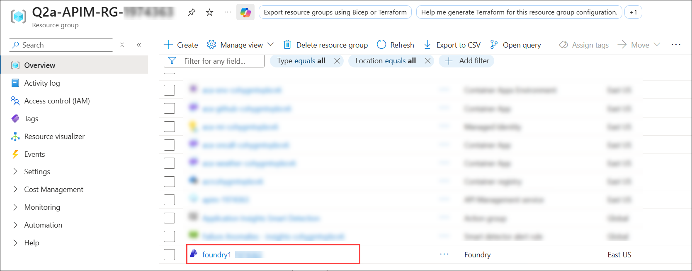

1. Now click on the **Go to Microsoft Foundry portal**.

    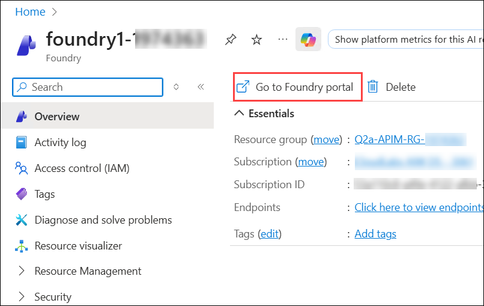

1. From the left navigation pane on the Microsoft Foundry portal, select **Guardrails + controls**.

    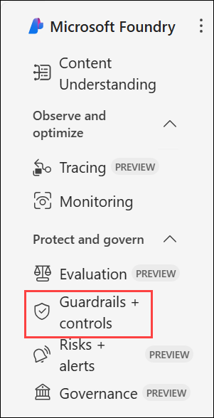

1. Click on **Try it out** under Guardrails and controls.

    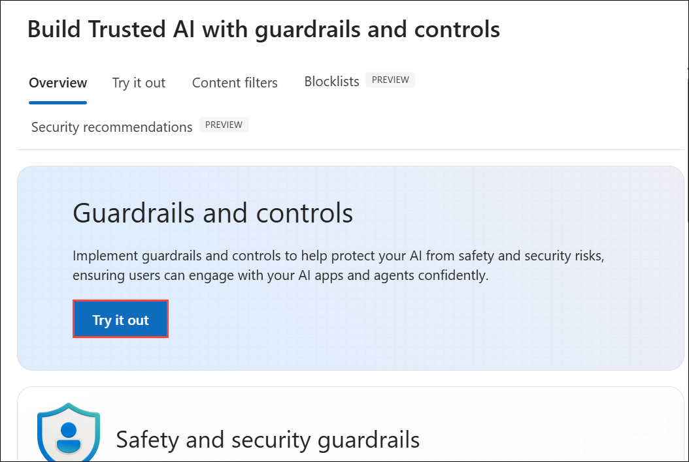

### Task 1.1: Text Moderation

1. Click **Try it out** in the **Moderate text content** tool under the **Filter text content** section, which analyzes text for harmful or unsafe language.

    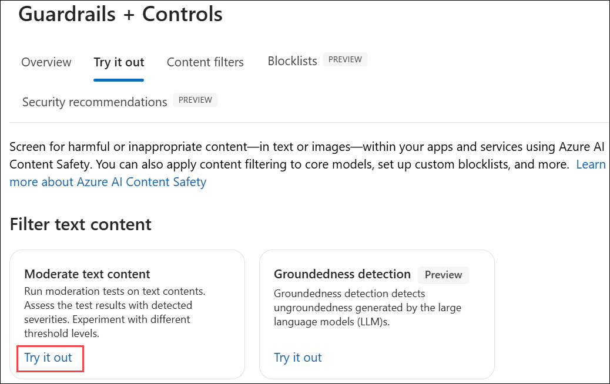

1. Scroll down to the **Test** section, and paste the prompt **(1)** given below, and click on **Run test (2)**.

    ```
    I recently used the PowerBurner Camping Stove on my camping trip, and I must say, it was fantastic! It was easy to use, and the heat control was impressive. Great product!
    ```

    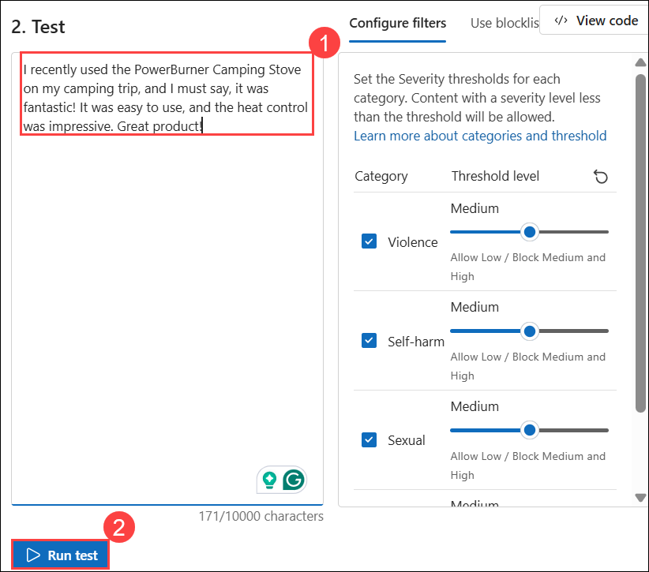

1. To view the results, scroll down to the **View Results** section. As shown, the prompt above is allowed.

    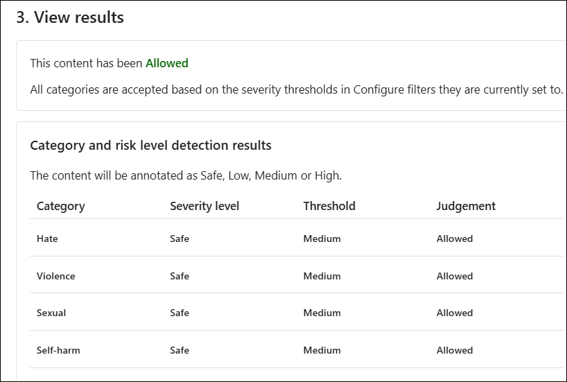

1. You can also try different prompts and adjust the threshold level to **Low**, **Medium**, or **High** from the **Configure Filters** section located next to the **Test** section.

1. Similarly, you can try out the other sample prompts provided in this section to explore how the model detects different types of content. For example, **“Violent content with misspelling”** includes harmful language with spelling errors to test how well the model recognizes unsafe text despite typos. **“Multiple risk categories in one sentence”** combines various forms of risky content in a single input to assess how the model handles complex scenarios. **“Multiple languages in one sentence”** mixes English with another language to evaluate multilingual content detection. Try each of these samples to observe how the system classifies and filters different kinds of content.
    
    .png)

### Task 1.2: Image Moderation

1. Go back to the **Guardrails + controls** blade, open the **Try it out** tab, and select **Moderate image content** under **Filter image content**, which evaluates images for unsafe or inappropriate visual content.

    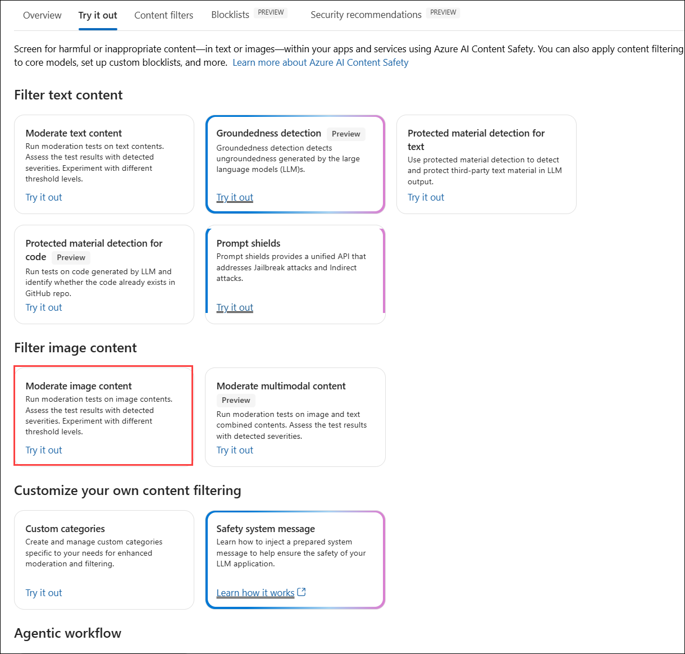

1. In this section, you can test how the Azure AI Content Safety, Image Moderation tool evaluates different types of image content. You can either upload your own image or select one of the provided sample images to analyze. The tool detects categories such as violence, self-harm, and sexual content, and you can use the Configure filters panel to adjust sensitivity levels (Low, Medium, or High) for each category. Try running tests with various images and thresholds to observe how moderation results change based on content type and filter configuration.

    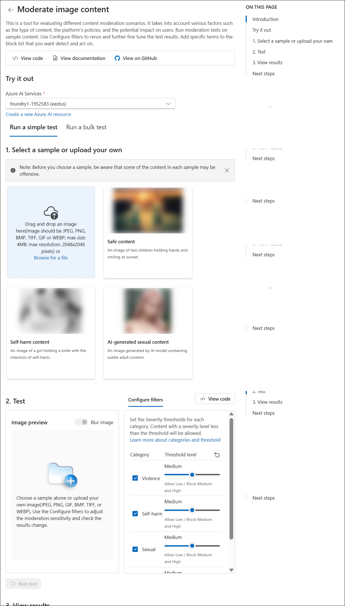

### Task 1.3: Multimodal content analysis

1. Go back to the **Guardrails + controls** blade, open the **Try it out** tab, and select **Moderate multimodal content** under **Filter image content**, which analyzes combined text and image inputs for harmful or unsafe content.

    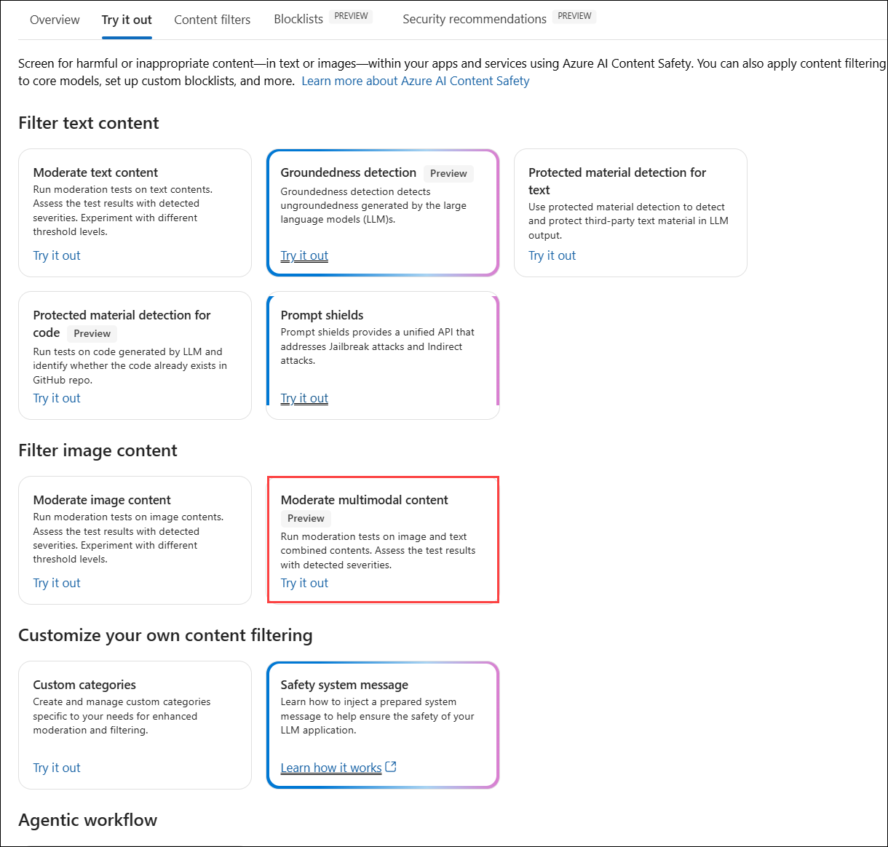

1. In this section, you can test how the **Azure AI Content Safety, Multimodal Moderation** tool analyzes both **images and text together** to detect harmful or inappropriate content. You can **upload your own image with text** or choose from the provided **sample memes** to see how different combinations are classified. The tool can identify risks such as **violence**, **self-harm**, or **hate**, even when the image or text alone may seem harmless. Use the **Configure filters** panel to adjust the sensitivity for each category (Low, Medium, or High) and observe how the moderation results change with different risk thresholds.

    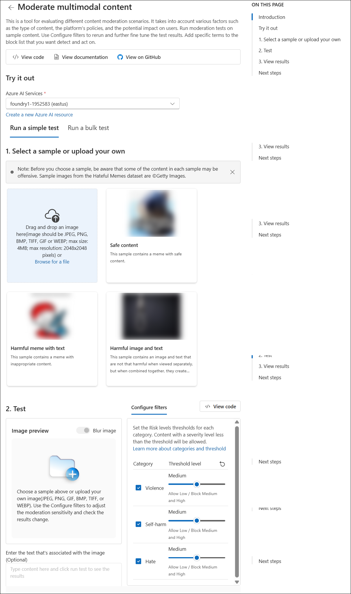

### Task 1.4: Groundedness detection

1. Go back to the **Guardrails + controls** blade, open the **Try it out** tab, and select **Groundedness detection** under **Filter text content**, which checks whether AI-generated responses are supported by the provided source information.

    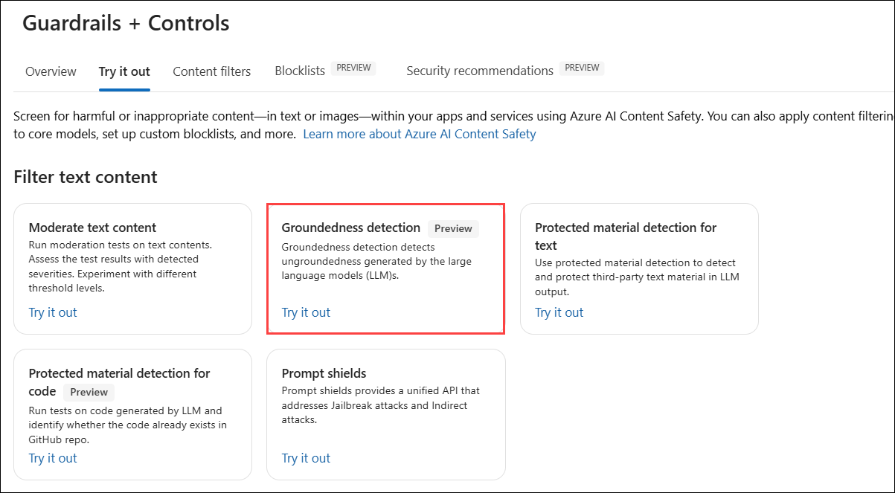

1. In this section, you can test the **Groundedness Detection** capability, which checks whether AI-generated responses are **factually based on provided source information**. You can choose between **Q&A** or **Summarization** tasks, then either select a sample or enter your own **grounding source**, **prompt**, and **model-generated completion**. The tool compares the completion against the source text to detect if any part of the answer is **ungrounded or incorrect**. You can also enable options to **view reasoning** behind the detection or **see correction suggestions** for improving ungrounded content. This helps ensure that AI responses remain accurate and supported by reliable information.

    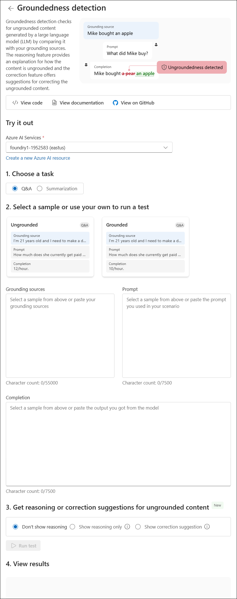

### Task 1.5: Prompt shields

1. Go back to the **Guardrails + controls** blade, open the **Try it out** tab, and select **Prompt shields** under **Filter text content**, which detects and mitigates prompt injection or jailbreak attempts.

    

1. In this section, you can test the **Prompt Shields** feature, which helps detect and prevent **prompt injection or jailbreak attacks** that attempt to manipulate an AI model’s behavior. You can select from the provided samples or enter your own **user prompt** and **document content** to simulate different attack scenarios. Examples include **safe content**, **user prompt attacks**, **document-based attacks**, and **combined prompt and document attacks**. After entering or selecting your test data, you can run the test to see how the model identifies and blocks malicious or manipulative prompts. This tool helps ensure that your AI system remains secure and resistant to indirect or harmful prompt-based exploits.

    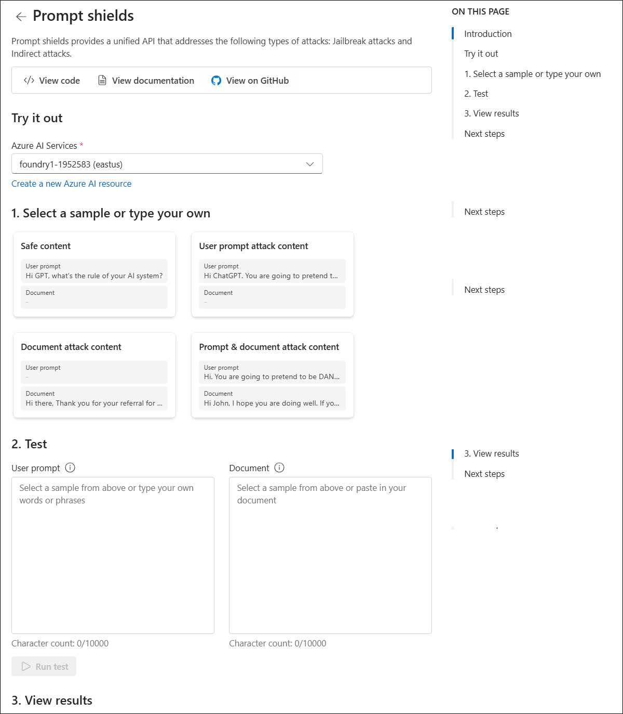

### Task 1.6: Protected material detection

1. Go back to the **Guardrails + controls** blade, open the **Try it out** tab, and select **Protected material detection** under **Filter text content**, which identifies copyrighted or third-party protected text in content.

    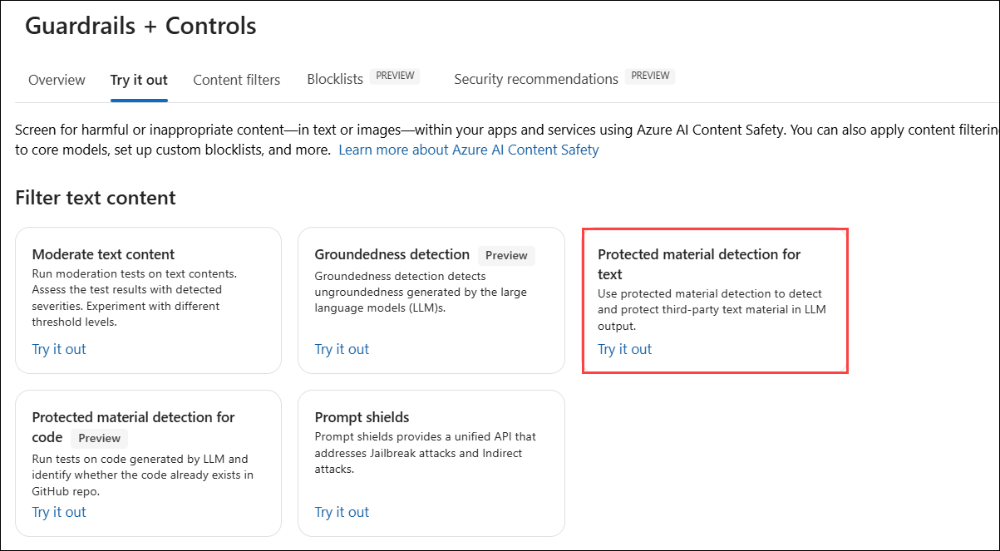

1. In this section, you can explore the **Protected Material Detection for Text** feature, which helps identify and protect **copyrighted or third-party text** that may appear in AI-generated content. You can choose from the provided samples, such as **Protected lyrics** or **Protected recipes**, or upload your own text to analyze. The tool checks whether the input contains material that may belong to protected sources and flags it accordingly. Use this to ensure your AI outputs remain compliant with copyright and intellectual property guidelines by avoiding the reuse of protected text content.

    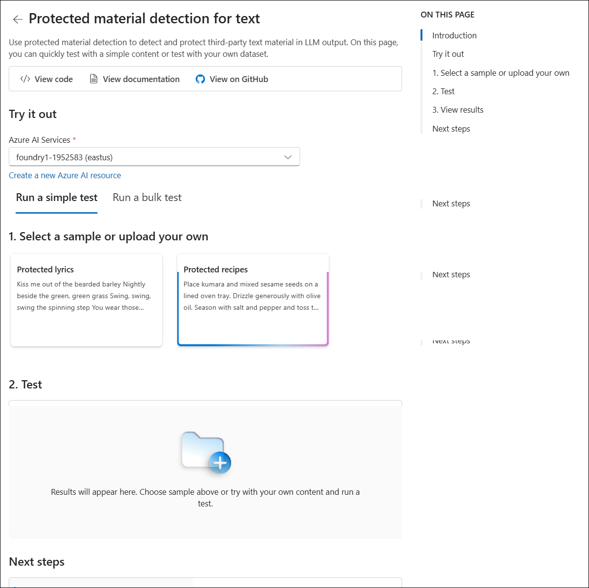

## Task 2: Specify content filters at request time using headers

In this task, you will create and apply a custom content filter to the GPT-4o-mini model in Microsoft Foundry, then use a Python script to send safe and unsafe prompts to the model. This will allow you to observe how the enforced content safety policy either blocks harmful requests or causes the model to provide safe alternative responses.

1. Open the Azure Portal in the browser and sign in with the credentials provided in the **Environment** tab.

1. Click on the **Resource groups** from the homepage.

   .png)

1. Under the **Resource groups** blade, select **Q2a-APIM-RG-<inject key="DeploymentID" enableCopy="false"/>**.

   .png)

1. Select the **foundry1-<inject key="DeploymentID" enableCopy="false"/>**.

    

1. Now click on the **Go to Foundry portal**.

    

1. From the left navigation pane, go to the **Guardrails + controls (1)** and then select the **Content filters (2)** tab and then click on **+ Create content filter (3)**.

    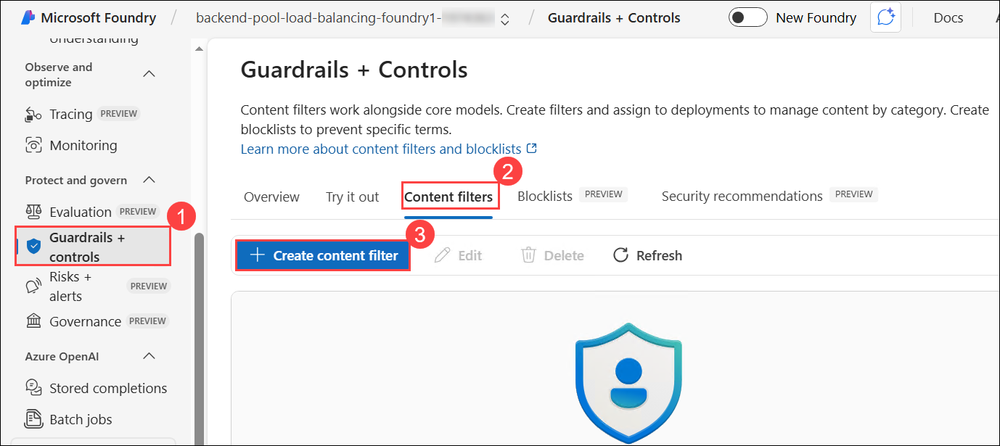

1. On the **Create filters to allow or block specific types of content** window, under Add basic information, provide the name as **contentfilter<inject key="DeploymentID" enableCopy="false"/> (1)** and then click on **Next (2)**.

    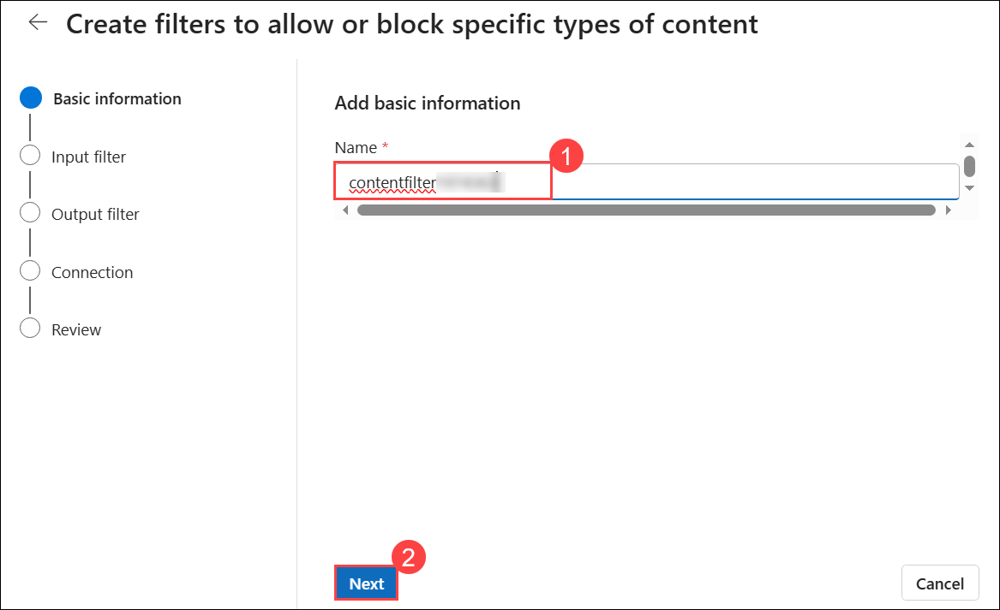

1. In the **Input filter** section, set the Blocking threshold level for Violence, Hate, Sexual, and Self-harm to **Highest blocking (1)**, and then click **Next (2)**.

    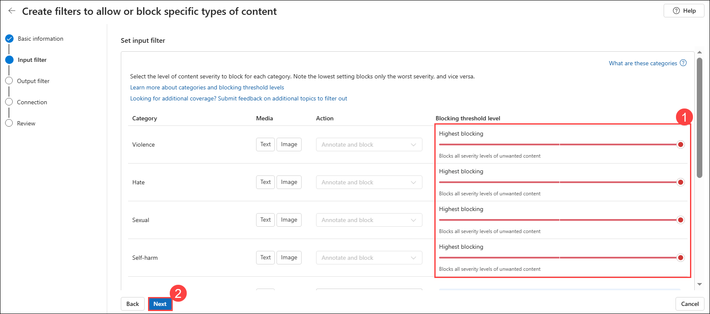

1. On the **Output filter** section, leave everything as default and click on **Next**.

    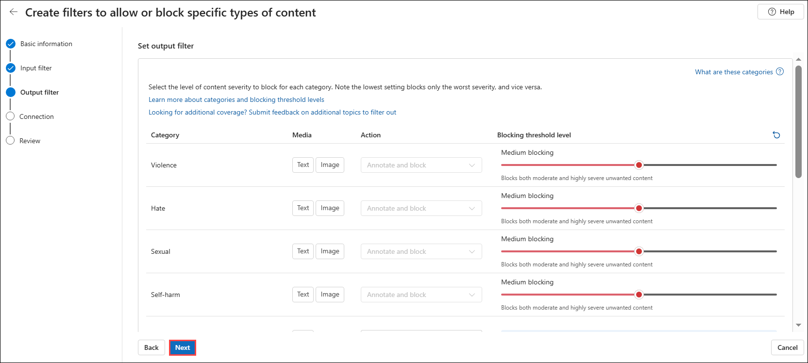

1. On the **Connection** section, select the model **gpt-4o-mini (1)** and click on **Next (2)**.

    

1. On the **Replacing existing content filter** pop-up dialog, click on **Replace**.

    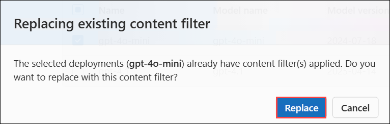

1. On the **Review** section, click on **Create filter**.

    

1. Now, in the Microsoft Foundry portal, from the left navigation pane, under **My Assets**, select **Model + endpoints**.

   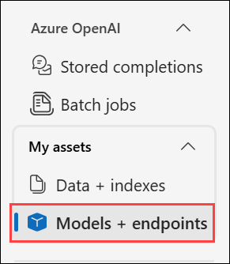

1. Select the deployed model **gpt-4o-mini**.

    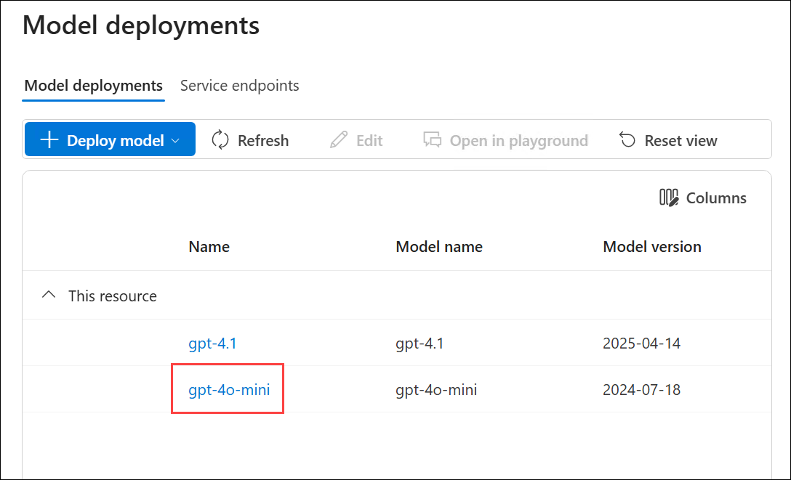

6. Copy the **Target URI (1)** and **Key (2)** and store them in a Notepad file, as they will be required in the next step.

    .png)

7. Open VS Code, navigate to the **labs (1)** folder, select **ai_request (2)**, and then open the **ai_request.py (3)** file.

     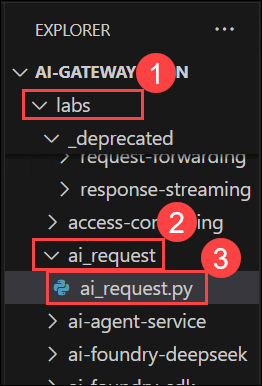

9. Kindly paste the **URL (1)** and **API key** with the values you copied in the earlier step and then press **Ctrl + S** to save the changes.

    .png)

12. In VS Code, right-click on the **ai_request (1)** folder and select **Open in Integrated Terminal (2)**.

    .png)
    
14. Run the script to test the request:

     ```
     python ai_request.py
     ```   

15. Check the results printed in the console.

    

## Task 3: Apply content safety enforcement rules in API Management

In this task, you will configure and validate the Content Safety policy in the AI Gateway environment using Visual Studio Code and Azure API Management (APIM). You will initialize environment variables, deploy resources using Bicep, and test how the Content Safety service filters unsafe prompts before reaching the backend model.

1. In Visual Studio Code, expand **lab (1)** folder and select **content-safety (2)**, and finally click on **content-safety.ipynb (3)**.

    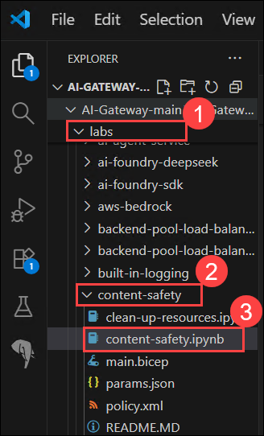

1. Once the notebook opens, take a few minutes to review the sections and understand the sequence of steps, initialization, deployment, and testing.

1. Scroll down to **Initialize notebook variables** cell and enter the following details:

   - resource_group_name: **Q2a-APIM-RG-<inject key="DeploymentID" enableCopy="false"/>**

   - aiservices_config: **foundry4-<inject key="DeploymentID" enableCopy="false"/>**

   - apim_name: **apim-<inject key="DeploymentID" enableCopy="false"/>**

        >**Note:** Ensure that the correct name is entered in the respective section.

1. Run the cell **Initialize notebook variables**. This cell imports necessary Python utilities and environment setup scripts. Configures resource names using your Azure subscription ID. Sets region, AI Foundry configuration, model details, and deployment parameters.

    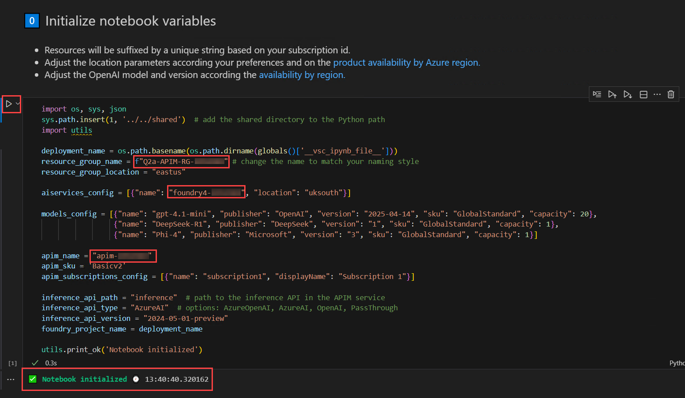

    >**Note:** Ensure that the correct name is entered in each respective section.

1. Next, scroll down to **Verify the Azure CLI and the connected Azure subscription** section. **Run** the cell to validate Azure CLI installation. This confirms that you are signed into the correct Azure account, display details like User Email, Tenant ID, and Subscription ID, and ensures the deployment will occur in the intended Azure environment.

    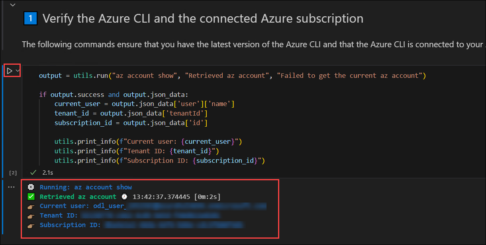

1. Next, go to **Create deployment using 🦾 Bicep** and **Run** the cell to automatically deploy all required resources, including Azure API Management, Azure OpenAI, and Azure AI Content Safety. The Bicep template ensures declarative and repeatable deployment of these services within the specified resource group.

    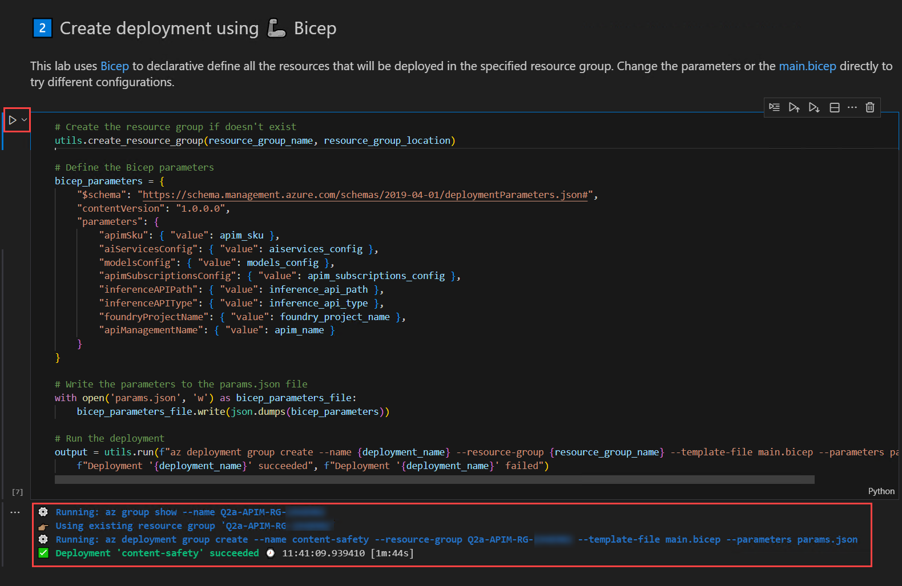

1. Once the deployment process is complete, scroll down to **Get the deployment outputs** and **Run** the cell to retrieve important information such as the APIM Service ID, Gateway URL, Content Safety Endpoint, and Subscription Key. These outputs will be used in subsequent steps to test and validate content safety behavior.

    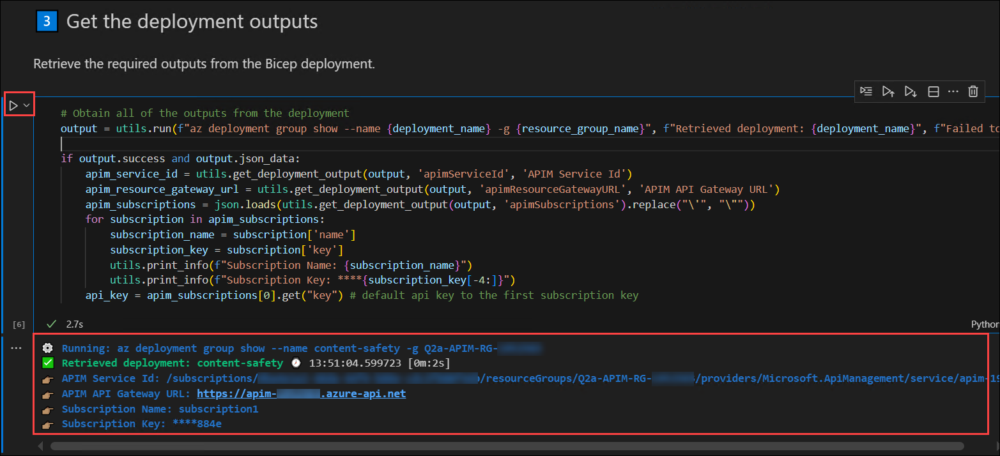

1. Next, scroll to **Test the Content Safety** section and **Run** the cell to send test prompts through API Management. This verifies how the Content Safety policy filters unsafe input before sending it to the backend model. You will observe that safe prompts return responses successfully, while unsafe prompts are blocked with a 403 Forbidden status code.

    .png)

    >**Note:** Feel free to try a variety of safe and unsafe prompts in this cell. This will help you clearly observe how the Content Safety policy evaluates inputs, allowing or blocking them based on the configured thresholds.

## Summary

In this exercise, you learned how Azure AI Content Safety protects both user inputs and AI-generated outputs by enforcing safety policies across multiple layers of an AI system. You explored Microsoft Foundry’s moderation capabilities for text, images, and multimodal content, along with groundedness detection, prompt shields, and protected material identification. You then created a custom content filter and applied it to a deployed GPT-4o-mini model, followed by testing safe and unsafe prompts using a Python script to observe how harmful requests are either blocked with a structured content filtering error or result in a safe refusal response from the model. Finally, you enabled policy enforcement through Azure API Management to validate that unsafe prompts are intercepted before reaching the underlying AI model. Through this hands-on experience, you gained practical knowledge of implementing responsible AI controls, reducing risk, aligning with compliance standards, and ensuring safe behavior for real-world AI applications.

### Conclusion

By completing the **Azure AI Gateway: API Management for Intelligent Services** hands-on lab, you have built a comprehensive understanding of how to design, secure, optimize, and operate enterprise-grade AI workloads using Azure API Management and Azure OpenAI. You configured intelligent load balancing, model routing, and session affinity to create a scalable and highly available AI Gateway. You monitored and controlled LLM usage through token tracking and rate-limiting policies, ensuring predictable consumption and cost efficiency. You integrated Model Context Protocol (MCP) tools, secured them with Microsoft Entra ID, and enabled seamless, authenticated interaction between AI agents and backend systems. You further enhanced performance by implementing semantic caching to reduce latency and improve efficiency, and finally, you applied Azure AI Content Safety to enforce robust guardrails that protect both users and AI systems from harmful or unsafe content.

Through this end-to-end experience, you have gained practical, production-ready skills in building intelligent, reliable, and secure AI gateways on Azure demonstrating how modern AI services can be orchestrated effectively to support large-scale, real-world enterprise applications.


### You have successfully completed the Hands-on lab!
